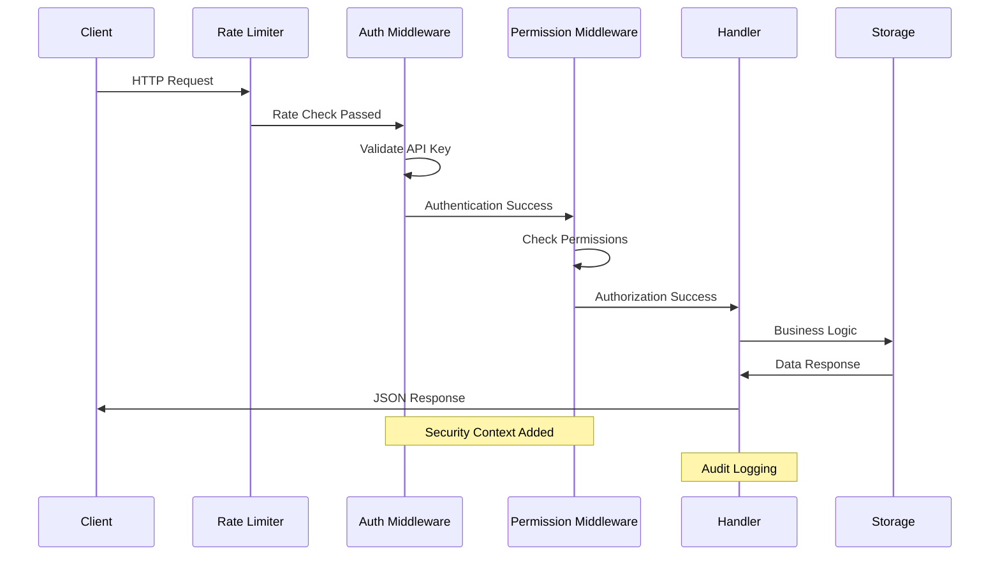

# Update Service Architecture

## Overview

The updater service is designed to be queried by desktop applications to check for and download updates. The service acts as a metadata provider, referencing externally hosted download files rather than hosting the files directly. This design allows for efficient distribution via CDNs while maintaining a lightweight, scalable update service.

## Core Design Principles

1. **Stateless Design**: The service doesn't store user-specific data, only release metadata
2. **External Storage**: Download files are hosted separately (CDN/object storage)
3. **Flexible Storage**: Support multiple storage backends for metadata
4. **Version Agnostic**: Support semantic versioning and custom version schemes
5. **Platform Aware**: Handle different OS/architecture combinations
6. **Caching Ready**: Designed for CDN caching and local performance caching
7. **Extensible**: Plugin-like architecture for different storage backends

## Architecture Components

### 1. API Layer (`internal/api/`)
Handles HTTP requests and responses for update checks.

**Responsibilities:**
- REST/HTTP handlers for update checks
- Version comparison endpoints
- Health checks and monitoring
- Request validation and authentication
- Rate limiting and security

### 2. Update Management (`internal/update/`)
Core business logic for version comparison and update determination.

**Responsibilities:**
- Version comparison logic (semantic versioning)
- Update availability determination
- Release metadata management
- Platform/architecture filtering
- Update requirement rules (critical vs optional updates)

### 3. Storage Layer (`internal/storage/`)
Abstraction for release metadata persistence and retrieval.

**Responsibilities:**
- Release metadata storage interface
- Configuration management
- Caching for performance
- Support for multiple backends (JSON, database, external APIs)

### 4. Models (`internal/models/`)
Data structures and domain objects.

**Responsibilities:**
- Application metadata structures
- Version information schemas
- Update response formats
- Configuration schemas
- Validation rules

### 5. External Integration (`internal/external/`)
Integration with external services and validation of external resources.

**Responsibilities:**
- Download URL validation
- External file metadata retrieval
- CDN integration helpers
- Checksum verification

## API Design

### Core Endpoints

#### Check for Updates
```
GET /api/v1/updates/{app_id}/check?current_version=1.2.3&platform=windows&arch=amd64
```

#### Get Latest Version Info
```
GET /api/v1/updates/{app_id}/latest?platform=windows&arch=amd64
```

#### List All Releases
```
GET /api/v1/updates/{app_id}/releases
```

#### Register New Release (Admin)
```
POST /api/v1/updates/{app_id}/register
```

### Request/Response Format

#### Update Check Request
Parameters can be provided via query params or headers:
- `current_version`: Current application version
- `platform`: Target platform (windows, linux, darwin)
- `arch`: Architecture (amd64, arm64, 386)

#### Update Check Response
```json
{
  "update_available": true,
  "latest_version": "1.3.0",
  "download_url": "https://releases.example.com/app/1.3.0/app-windows-amd64.exe",
  "checksum": "sha256:abc123...",
  "checksum_type": "sha256",
  "file_size": 15728640,
  "release_notes": "Bug fixes and improvements",
  "release_date": "2024-02-14T10:00:00Z",
  "required": false,
  "minimum_version": "1.0.0"
}
```

## Directory Structure

```
.
├── cmd/
│   └── updater/               # Main application entry point
│       ├── main.go
│       ├── server.go
│       └── config.go
├── internal/
│   ├── api/                   # HTTP handlers and routing
│   │   ├── handlers.go
│   │   ├── middleware.go
│   │   ├── routes.go
│   │   └── validators.go
│   ├── update/                # Core update logic
│   │   ├── service.go
│   │   ├── version.go
│   │   └── comparator.go
│   ├── storage/               # Data persistence
│   │   ├── interface.go
│   │   ├── json.go
│   │   ├── database.go
│   │   └── cache.go
│   ├── models/                # Data structures
│   │   ├── release.go
│   │   ├── application.go
│   │   ├── version.go
│   │   └── config.go
│   ├── external/              # External service integration
│   │   ├── validator.go
│   │   └── metadata.go
│   ├── config/                # Configuration management
│   │   ├── config.go
│   │   └── loader.go
│   └── middleware/            # HTTP middleware
│       ├── auth.go
│       ├── logging.go
│       └── ratelimit.go
├── pkg/
│   ├── version/               # Version comparison utilities
│   │   ├── semver.go
│   │   └── custom.go
│   └── client/                # Go client library for apps
│       ├── client.go
│       └── types.go
├── docs/
│   ├── api.md                 # API documentation
│   ├── ARCHITECTURE.md        # This file
│   └── deployment.md          # Deployment guide
├── scripts/
│   ├── build.sh               # Build scripts
│   └── deploy.sh              # Deployment scripts
├── configs/
│   ├── config.yaml            # Default configuration
│   └── releases.json          # Sample release metadata
└── examples/
    ├── client/                # Example client implementations
    └── config/                # Example configurations
```

## Data Models

### Application
```go
type Application struct {
    ID          string            `json:"id"`
    Name        string            `json:"name"`
    Description string            `json:"description"`
    Platforms   []string          `json:"platforms"`
    Config      ApplicationConfig `json:"config"`
}
```

### Release
```go
type Release struct {
    ID           string            `json:"id"`
    ApplicationID string           `json:"application_id"`
    Version      string            `json:"version"`
    Platform     string            `json:"platform"`
    Architecture string            `json:"architecture"`
    DownloadURL  string            `json:"download_url"`
    Checksum     string            `json:"checksum"`
    ChecksumType string            `json:"checksum_type"`
    FileSize     int64             `json:"file_size"`
    ReleaseNotes string            `json:"release_notes"`
    ReleaseDate  time.Time         `json:"release_date"`
    Required     bool              `json:"required"`
    MinimumVersion string          `json:"minimum_version,omitempty"`
    Metadata     map[string]string `json:"metadata,omitempty"`
}
```

## Security Architecture

### Overview

The updater service implements a comprehensive multi-layered security architecture following defense-in-depth principles. The security model protects against unauthorized access, data tampering, and service abuse while maintaining high availability and performance.

### Security Flow Diagram



### Security Layers

#### 1. Network Security Layer
- **TLS/HTTPS Enforcement**: All communications encrypted in transit
- **CORS Protection**: Configurable origin validation prevents unauthorized cross-origin requests
- **Trusted Proxy Support**: Proper client IP detection through reverse proxies

#### 2. Authentication Layer
- **API Key Authentication**: Bearer token-based authentication system
- **Key Management**: Support for multiple keys with individual enable/disable
- **Secure Key Storage**: Environment variable and secure configuration support

#### 3. Authorization Layer
- **Permission-Based Access Control**: Granular permissions per API key
- **Endpoint Protection**: Different permission requirements per endpoint
- **Principle of Least Privilege**: Minimal permissions by default

#### 4. Application Security Layer
- **Input Validation**: Comprehensive validation of all request data
- **Output Sanitization**: Secure error messages without information leakage
- **SQL Injection Prevention**: Parameterized queries and input sanitization

#### 5. Operational Security Layer
- **Rate Limiting**: Per-IP request throttling with configurable limits
- **Audit Logging**: Comprehensive security event logging
- **Health Monitoring**: Service health checks and metrics

### Permission Model

#### Permission Types

| Permission | Scope | Endpoints | Description |
|------------|-------|-----------|-------------|
| `read` | Query Operations | `GET /api/v1/updates/*` | Access to update checking and release information |
| `write` | Release Management | `POST /api/v1/updates/*/register` | Ability to register new releases |
| `admin` | Full Access | All endpoints | Complete administrative access |

#### Permission Matrix

```
Endpoint                                | read | write | admin
---------------------------------------|------|-------|-------
GET  /api/v1/updates/{app}/check       |  ✓   |   ✓   |   ✓
GET  /api/v1/updates/{app}/latest      |  ✓   |   ✓   |   ✓
GET  /api/v1/updates/{app}/releases    |  ✓   |   ✓   |   ✓
POST /api/v1/updates/{app}/register    |  ✗   |   ✓   |   ✓
GET  /health                           |  ✓   |   ✓   |   ✓
```

#### Permission Inheritance
- `admin` permission grants access to all operations
- `write` permission includes all `read` operations
- Permissions are cumulative, not exclusive

### Security Configuration

#### Production Security Settings

```yaml
server:
  tls_enabled: true
  tls_cert_file: "/etc/ssl/certs/updater.pem"
  tls_key_file: "/etc/ssl/private/updater.key"

  cors:
    enabled: true
    allowed_origins: ["https://api.yourdomain.com"]
    allowed_methods: ["GET", "POST"]
    allowed_headers: ["Authorization", "Content-Type"]
    max_age: 86400

security:
  enable_auth: true
  api_keys:
    - key: "${ADMIN_API_KEY}"
      name: "Production Admin"
      permissions: ["admin"]
      enabled: true
    - key: "${RELEASE_API_KEY}"
      name: "Release Publisher"
      permissions: ["write"]
      enabled: true
    - key: "${MONITORING_API_KEY}"
      name: "Monitoring System"
      permissions: ["read"]
      enabled: true

  rate_limit:
    enabled: true
    requests_per_minute: 120
    requests_per_hour: 2000
    burst_size: 20
    cleanup_interval: 300s

  trusted_proxies:
    - "10.0.0.0/8"
    - "172.16.0.0/12"
    - "192.168.0.0/16"
```

### Threat Mitigation

#### Identified Threats and Countermeasures

1. **Unauthorized Release Injection**
   - **Threat**: Malicious actors registering fake releases
   - **Mitigation**: API key authentication + write permission requirement
   - **Detection**: Audit logging of all release operations

2. **API Key Compromise**
   - **Threat**: Stolen or leaked API keys
   - **Mitigation**: Permission scoping + key rotation + rate limiting
   - **Detection**: Unusual usage pattern monitoring

3. **Denial of Service**
   - **Threat**: Service overwhelm through request flooding
   - **Mitigation**: Rate limiting + connection limits + graceful degradation
   - **Detection**: Request rate monitoring and alerting

4. **Version Downgrade Attack**
   - **Threat**: Forcing clients to use vulnerable versions
   - **Mitigation**: Checksum validation + version constraint enforcement
   - **Detection**: Checksum mismatch logging

### Security Monitoring

#### Security Event Logging

All security-relevant events are logged with structured JSON format:

```json
{
  "timestamp": "2024-01-15T10:30:00Z",
  "level": "WARN",
  "component": "auth",
  "event": "permission_denied",
  "message": "Insufficient permissions for endpoint",
  "client_ip": "192.168.1.100",
  "api_key_name": "Monitoring System",
  "endpoint": "/api/v1/updates/myapp/register",
  "required_permission": "write",
  "user_permissions": ["read"],
  "request_id": "req_123456"
}
```

#### Monitored Security Events

- Authentication failures and successes
- Authorization failures (insufficient permissions)
- Rate limit violations
- Suspicious request patterns
- Admin operations (release registration)
- Configuration changes
- Health check failures

### Authentication & Authorization

#### API Key Format

```http
GET /api/v1/updates/myapp/check HTTP/1.1
Host: updater.example.com
Authorization: Bearer <base64-encoded-api-key>
Content-Type: application/json
```

#### Authentication Flow

1. **Request Reception**: Extract Authorization header
2. **Format Validation**: Verify Bearer token format
3. **Key Lookup**: Find matching API key in configuration
4. **Status Check**: Verify key is enabled
5. **Context Enhancement**: Add key information to request context

#### Authorization Flow

1. **Endpoint Mapping**: Determine required permission for endpoint
2. **Permission Check**: Verify API key has required permission
3. **Access Grant**: Proceed with request processing
4. **Audit Log**: Record authorization decision

### Data Integrity

#### Checksum Validation

- **SHA256 Checksums**: All releases must include SHA256 checksums
- **Validation**: Optional checksum verification before serving
- **Storage**: Checksums stored alongside release metadata
- **Transmission**: Checksums included in API responses

#### HTTPS Enforcement

- **TLS Configuration**: Modern TLS versions (1.2+) required
- **Certificate Management**: Support for Let's Encrypt and custom certificates
- **Header Security**: Security headers (HSTS, CSP) configurable
- **Redirect**: HTTP to HTTPS redirects in production

### Privacy Protection

#### Data Minimization

- **No Personal Data**: Service doesn't collect personally identifiable information
- **Minimal Logging**: Only necessary operational data logged
- **Retention Policies**: Configurable log retention periods
- **Anonymization**: IP addresses can be anonymized in logs

#### Analytics

- **Disabled by Default**: Analytics collection disabled by default
- **Opt-in**: Explicit configuration required for analytics
- **Aggregated Only**: No individual user tracking
- **Configurable**: Granular control over collected metrics

## Configuration Management

### Environment Variables
- `UPDATER_PORT`: Server port (default: 8080)
- `UPDATER_CONFIG_PATH`: Path to configuration file
- `UPDATER_STORAGE_TYPE`: Storage backend type (json, database)
- `UPDATER_LOG_LEVEL`: Logging level (debug, info, warn, error)

### Configuration File Structure
```yaml
server:
  port: 8080
  read_timeout: 30s
  write_timeout: 30s

storage:
  type: json
  path: ./data/releases.json
  cache_ttl: 300s

security:
  api_keys:
    - key: "admin-key-123"
      permissions: ["read", "write"]
  rate_limit:
    requests_per_minute: 60

logging:
  level: info
  format: json
```

## Performance Considerations

### Caching Strategy
- In-memory caching of frequently requested releases
- HTTP cache headers for CDN optimization
- Configurable cache TTL per endpoint

### Scalability
- Stateless design enables horizontal scaling
- Database connection pooling
- Efficient indexing on version and platform fields

## Deployment Options

### Standalone Binary
- Single executable with embedded configuration
- Suitable for small deployments
- File-based storage backend

### Containerized Deployment
- Docker container with external configuration
- Kubernetes deployment with ConfigMaps
- External database backend

### Serverless
- AWS Lambda or similar for API handlers
- DynamoDB or similar for metadata storage
- CloudFront for caching

## Future Enhancements

1. **Metrics & Monitoring**
   - Prometheus metrics endpoint
   - Health check endpoints
   - Request tracing

2. **Advanced Features**
   - Delta updates support
   - Rollback functionality
   - A/B testing for releases

3. **Security Enhancements**
   - Release signing and verification
   - OAuth2/JWT authentication
   - Audit logging

4. **Storage Backends**
   - PostgreSQL support
   - Redis caching
   - S3-compatible object storage

## Testing Strategy

### Unit Tests
- Core update logic validation
- Version comparison algorithms
- Configuration parsing

### Integration Tests
- API endpoint functionality
- Storage backend integration
- External service validation

### End-to-End Tests
- Complete update check workflows
- Client library integration
- Performance benchmarking