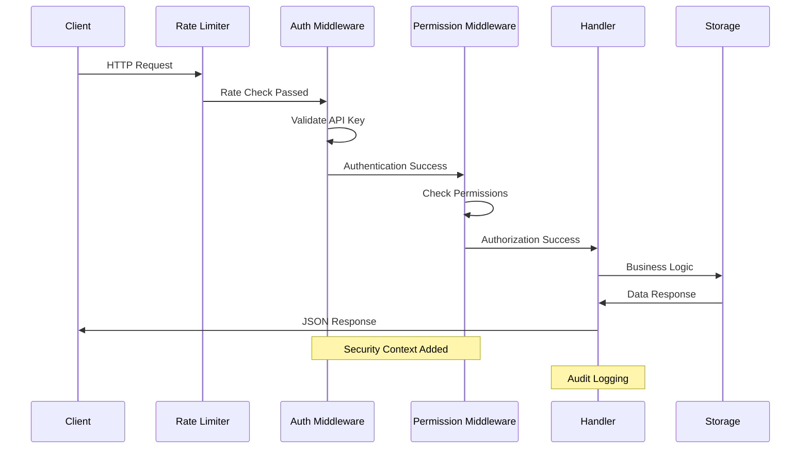

# Update Service Architecture

## Overview

The updater service is designed to be queried by desktop applications to check for and download updates. The service acts as a metadata provider, referencing externally hosted download files rather than hosting the files directly. This design allows for efficient distribution via CDNs while maintaining a lightweight, scalable update service.

## Core Design Principles

1. **Stateless Design**: The service doesn't store user-specific data, only release metadata
2. **External Storage**: Download files are hosted separately (CDN/object storage)
3. **Flexible Storage**: Support multiple storage backends for metadata
4. **Version Agnostic**: Support semantic versioning and custom version schemes
5. **Platform Aware**: Handle different OS/architecture combinations
6. **Caching Ready**: Designed for CDN caching and local performance caching
7. **Extensible**: Plugin-like architecture for different storage backends

## Architecture Components

### 1. API Layer (`internal/api/`) ✅ **COMPLETE**
Fully implemented HTTP API with production-ready features and comprehensive security.

**Core Components:**
- **Handlers** (`handlers.go`): HTTP request/response processing for all endpoints
- **Middleware** (`middleware.go`): Security, authentication, and request processing pipeline
- **Routes** (`routes.go`): URL routing, CORS, rate limiting, and middleware orchestration

**Implemented Endpoints:**
- `GET /api/v1/updates/{app_id}/check` - Check for updates (public)
- `POST /api/v1/check` - Check for updates via JSON body (public)
- `GET /api/v1/updates/{app_id}/latest` - Get latest version (public)
- `GET /api/v1/latest` - Get latest version with query params (public)
- `GET /api/v1/updates/{app_id}/releases` - List releases (protected: read permission)
- `POST /api/v1/updates/{app_id}/register` - Register new release (protected: write permission)
- `GET /health` - Health check (public with enhanced details for authenticated users)
- `GET /api/v1/health` - Versioned health check alias (public)

**Security Features:**
- API key authentication with Bearer token format
- Role-based authorization (read/write/admin permissions with hierarchy)
- Rate limiting with configurable requests per minute
- CORS support with configurable origins, methods, and headers
- Request validation and structured error responses
- Audit logging for all security-sensitive operations
- Protection against common vulnerabilities (SQL injection, path traversal, etc.)

**Error Handling:**
- Structured ServiceError types with HTTP status code mapping
- Consistent JSON error response format
- Panic recovery middleware with proper logging
- Request/response logging for debugging and monitoring

### 2. Update Management (`internal/update/`) ✅ **COMPLETE**
Fully implemented business logic for version comparison and update determination.

**Core Components:**
- **Service** (`service.go`): Main business logic implementation
- **Interface** (`interface.go`): Service contract definition
- **Errors** (`errors.go`): Structured error types with HTTP status mapping

**Implemented Operations:**
- `CheckForUpdate()` - Intelligent update availability determination
- `GetLatestVersion()` - Latest version retrieval with platform filtering
- `ListReleases()` - Release listing with filtering, sorting, and pagination
- `RegisterRelease()` - New release registration with validation

**Features:**
- Semantic versioning support with pre-release handling
- Platform and architecture awareness
- Update requirement rules (critical vs optional updates)
- Minimum version enforcement
- Pre-release filtering (configurable inclusion/exclusion)
- Release metadata management with validation
- Structured error responses with proper HTTP status codes

### 3. Storage Layer (`internal/storage/`) ✅ **COMPLETE**
Multi-provider persistence layer with a unified interface and factory-based provider creation.

**Core Components:**
- **Interface** (`interface.go`): `Storage` interface with 9 data operations + `Ping()` + `Close()`
- **Factory** (`factory.go`): Factory pattern for creating providers by type string
- **Type Conversions** (`dbconvert.go`): Shared database-to-model conversion helpers

**Storage Providers:**
- **JSON** (`json.go`): File-based storage using JSON, suitable for development and small deployments
- **Memory** (`memory.go`): In-memory storage for testing and ephemeral use
- **PostgreSQL** (`postgres.go`): Production database backend using sqlc-generated queries
- **SQLite** (`sqlite.go`): Lightweight database backend using sqlc-generated queries

**Database Layer (`sqlc/`):**
- `schema/postgres/`, `schema/sqlite/`: Migration-friendly schemas (`001_initial.sql`, `002_add_indexes.sql`)
- `queries/postgres/`, `queries/sqlite/`: Engine-specific SQL query definitions
- `postgres/`, `sqlite/`: sqlc-generated type-safe Go code

**Key Patterns:**
- `context.Context` on all operations for cancellation and timeout support
- Copy-on-return to prevent callers from mutating cached data
- `Ping()` method on all providers for health check integration
- `Close()` for clean resource release (database connections, file handles)

### 4. Models (`internal/models/`) ✅ **COMPLETE**
Data structures, domain objects, and validation logic.

**Core Files:**
- **Application** (`application.go`): Application metadata, platform support, configuration
- **Release** (`release.go`): Release metadata, checksum validation, filtering
- **Request** (`request.go`): API request types with validation
- **Response** (`response.go`): API response types with helper constructors
- **Config** (`config.go`): Service configuration schemas with defaults and validation

**Key Design Decisions:**
- Version comparison uses `github.com/Masterminds/semver/v3` directly (no separate version model)
- All models include comprehensive validation methods
- Response types use `omitempty` to minimize payload size
- Configuration provides `NewDefaultConfig()` with safe production defaults

### 5. Observability (`internal/observability/`) ✅ **COMPLETE**
OpenTelemetry-based instrumentation for metrics, tracing, and storage monitoring.

**Core Components:**
- **SDK Setup** (`observability.go`): OpenTelemetry TracerProvider and MeterProvider initialization
- **Metrics Server** (`metrics.go`): Prometheus HTTP metrics server on a separate port
- **Instrumented Storage** (`storage.go`): `InstrumentedStorage` wrapper that adds operation-level metrics and tracing to any `Storage` implementation

**Exporters:**
- Prometheus (pull-based metrics)
- stdout (development/debugging)
- OTLP gRPC (for collectors like Jaeger, Grafana Tempo)

**Infrastructure:**
- `docker-compose.observability.yml`: Local Prometheus + Grafana stack
- `configs/dev-observability.yaml`: Development configuration for the observability stack
- `docker/prometheus/prometheus.yml`: Prometheus scrape configuration
- `docker/grafana/provisioning/datasources/datasources.yml`: Grafana auto-provisioning

### 6. Logging (`internal/logger/`) ✅ **COMPLETE**
Structured logging using Go's standard `log/slog` package.

**Core Components:**
- **Logger Setup** (`logger.go`): Configurable logger initialization with format, level, and output options

**Features:**
- JSON and text output formats
- Configurable log levels (debug, info, warn, error)
- File output with configurable permissions
- Security audit events tagged with `"event", "security_audit"`

## API Design

### Core Endpoints

#### Check for Updates
```
GET /api/v1/updates/{app_id}/check?current_version=1.2.3&platform=windows&architecture=amd64
```

#### Get Latest Version Info
```
GET /api/v1/updates/{app_id}/latest?platform=windows&architecture=amd64
```

#### List All Releases
```
GET /api/v1/updates/{app_id}/releases
```

#### Register New Release (Admin)
```
POST /api/v1/updates/{app_id}/register
```

### Request/Response Format

#### Update Check Request
Parameters can be provided via query params or headers:
- `current_version`: Current application version
- `platform`: Target platform (windows, linux, darwin)
- `architecture`: Architecture (amd64, arm64, 386)

#### Update Check Response
```json
{
  "update_available": true,
  "latest_version": "1.3.0",
  "current_version": "1.2.3",
  "download_url": "https://releases.example.com/app/1.3.0/app-windows-amd64.exe",
  "checksum": "abc123def456...",
  "checksum_type": "sha256",
  "file_size": 15728640,
  "release_notes": "Bug fixes and improvements",
  "release_date": "2024-02-14T10:00:00Z",
  "required": false,
  "minimum_version": "1.0.0"
}
```

## Directory Structure

```
.
├── cmd/
│   └── updater/
│       └── updater.go                # Server initialization and entry point
├── internal/
│   ├── api/                          # HTTP handlers, middleware, routing
│   │   ├── handlers.go
│   │   ├── handlers_test.go
│   │   ├── middleware.go
│   │   ├── routes.go
│   │   └── security_test.go
│   ├── config/                       # Configuration loading
│   │   ├── config.go
│   │   └── config_test.go
│   ├── integration/                  # Integration tests
│   │   └── integration_test.go
│   ├── logger/                       # Structured logging (log/slog)
│   │   ├── logger.go
│   │   └── logger_test.go
│   ├── models/                       # Data models and validation
│   │   ├── application.go
│   │   ├── application_test.go
│   │   ├── config.go
│   │   ├── config_test.go
│   │   ├── release.go
│   │   ├── release_test.go
│   │   ├── request.go
│   │   ├── request_test.go
│   │   ├── response.go
│   │   └── response_test.go
│   ├── observability/                # OpenTelemetry instrumentation
│   │   ├── metrics.go
│   │   ├── metrics_test.go
│   │   ├── observability.go
│   │   ├── observability_test.go
│   │   ├── storage.go
│   │   └── storage_test.go
│   ├── storage/                      # Multi-provider persistence
│   │   ├── dbconvert.go
│   │   ├── dbconvert_test.go
│   │   ├── factory.go
│   │   ├── factory_test.go
│   │   ├── interface.go
│   │   ├── json.go
│   │   ├── json_test.go
│   │   ├── memory.go
│   │   ├── memory_test.go
│   │   ├── postgres.go
│   │   ├── postgres_test.go
│   │   ├── sqlite.go
│   │   ├── sqlite_schema.sql
│   │   ├── sqlite_test.go
│   │   └── sqlc/
│   │       ├── postgres/             # Generated PostgreSQL queries
│   │       │   ├── applications.sql.go
│   │       │   ├── db.go
│   │       │   ├── models.go
│   │       │   └── releases.sql.go
│   │       ├── queries/              # SQL query definitions
│   │       │   ├── postgres/
│   │       │   │   ├── applications.sql
│   │       │   │   └── releases.sql
│   │       │   └── sqlite/
│   │       │       ├── applications.sql
│   │       │       └── releases.sql
│   │       ├── schema/               # Database migrations
│   │       │   ├── postgres/
│   │       │   │   ├── 001_initial.sql
│   │       │   │   └── 002_add_indexes.sql
│   │       │   └── sqlite/
│   │       │       ├── 001_initial.sql
│   │       │       └── 002_add_indexes.sql
│   │       └── sqlite/               # Generated SQLite queries
│   │           ├── applications.sql.go
│   │           ├── db.go
│   │           ├── models.go
│   │           └── releases.sql.go
│   └── update/                       # Business logic
│       ├── errors.go
│       ├── interface.go
│       ├── service.go
│       └── service_test.go
├── configs/
│   ├── dev-observability.yaml        # Local observability stack config
│   └── security-examples.yaml        # Security configuration examples
├── data/
│   └── releases.json                 # Default release metadata
├── deployments/
│   └── kubernetes/
│       └── deployment.yaml           # Kubernetes manifest
├── docker/
│   ├── grafana/
│   │   └── provisioning/
│   │       └── datasources/
│   │           └── datasources.yml
│   ├── nginx/
│   │   └── nginx.conf
│   └── prometheus/
│       └── prometheus.yml
├── docs/                             # MkDocs documentation site
├── examples/
│   ├── config.yaml                   # Example application config
│   └── releases.json                 # Example release data
├── scripts/
│   └── docker-build.sh               # Docker build script
├── Dockerfile                        # Multi-stage container build
├── Makefile                          # Build automation
├── docker-compose.yml                # Application stack
├── docker-compose.observability.yml  # Observability stack (Prometheus, Grafana)
├── mkdocs.yml                        # Documentation site config
├── sqlc.yaml                         # SQL code generation config
├── go.mod
└── go.sum
```

## Data Models

### Application
```go
type Application struct {
    ID          string            `json:"id"`
    Name        string            `json:"name"`
    Description string            `json:"description"`
    Platforms   []string          `json:"platforms"`
    Config      ApplicationConfig `json:"config"`
}
```

### Release
```go
type Release struct {
    ID           string            `json:"id"`
    ApplicationID string           `json:"application_id"`
    Version      string            `json:"version"`
    Platform     string            `json:"platform"`
    Architecture string            `json:"architecture"`
    DownloadURL  string            `json:"download_url"`
    Checksum     string            `json:"checksum"`
    ChecksumType string            `json:"checksum_type"`
    FileSize     int64             `json:"file_size"`
    ReleaseNotes string            `json:"release_notes"`
    ReleaseDate  time.Time         `json:"release_date"`
    Required     bool              `json:"required"`
    MinimumVersion string          `json:"minimum_version,omitempty"`
    Metadata     map[string]string `json:"metadata,omitempty"`
}
```

## Security Architecture

### Overview

The updater service implements a comprehensive multi-layered security architecture following defense-in-depth principles. The security model protects against unauthorized access, data tampering, and service abuse while maintaining high availability and performance.

### Security Flow Diagram



### Security Layers

#### 1. Network Security Layer ✅ **IMPLEMENTED**
- **TLS/HTTPS Enforcement**: All communications encrypted in transit
- **CORS Protection**: `corsMiddleware` with configurable origin validation prevents unauthorized cross-origin requests
- **OPTIONS Request Handling**: Proper CORS preflight request handling with 204 No Content responses
- **Trusted Proxy Support**: `getClientIP` function provides proper client IP detection through reverse proxies

#### 2. Authentication Layer ✅ **IMPLEMENTED**
- **API Key Authentication**: Bearer token-based authentication system (`authMiddleware`)
- **Key Management**: Support for multiple keys with individual enable/disable
- **Optional Authentication**: `OptionalAuth` middleware for endpoints that enhance data based on auth status
- **Secure Key Storage**: Environment variable and secure configuration support
- **Context Propagation**: Security context passed through request lifecycle

#### 3. Authorization Layer ✅ **IMPLEMENTED**
- **Permission-Based Access Control**: Granular permissions per API key (read/write/admin)
- **Permission Hierarchy**: Admin includes write, write includes read permissions
- **Endpoint Protection**: `RequirePermission` middleware enforces different permission requirements
- **Principle of Least Privilege**: Minimal permissions by default
- **Security Context**: `SecurityContext` type for permission validation

#### 4. Application Security Layer ✅ **IMPLEMENTED**
- **Input Validation**: Comprehensive validation of all request data with structured error responses
- **Output Sanitization**: Secure error messages without information leakage using `ServiceError` types
- **Request Size Limits**: Protection against large payload attacks
- **Header Injection Protection**: Validation of HTTP headers for malicious content
- **Path Traversal Protection**: URL path validation and sanitization
- **JSON Parsing Security**: Secure JSON parsing with error handling

#### 5. Operational Security Layer ✅ **IMPLEMENTED**
- **Rate Limiting**: Per-IP request throttling with configurable limits (`rateLimitMiddleware`)
- **Audit Logging**: Comprehensive security event logging with client IP identification
- **Health Monitoring**: Service health checks with authenticated enhanced details
- **Panic Recovery**: `recoveryMiddleware` handles panics gracefully
- **Request Logging**: `loggingMiddleware` for request/response monitoring
- **Client IP Detection**: `getClientIP` function with proxy support (X-Forwarded-For, X-Real-IP)

### Permission Model

#### Permission Types

| Permission | Scope | Endpoints | Description |
|------------|-------|-----------|-------------|
| `read` | Query Operations | `GET /api/v1/updates/*` | Access to update checking and release information |
| `write` | Release Management | `POST /api/v1/updates/*/register` | Ability to register new releases |
| `admin` | Full Access | All endpoints | Complete administrative access |

#### Permission Matrix

```
Endpoint                                | read | write | admin
---------------------------------------|------|-------|-------
GET  /api/v1/updates/{app}/check       |  ✓   |   ✓   |   ✓
GET  /api/v1/updates/{app}/latest      |  ✓   |   ✓   |   ✓
GET  /api/v1/updates/{app}/releases    |  ✓   |   ✓   |   ✓
POST /api/v1/updates/{app}/register    |  ✗   |   ✓   |   ✓
GET  /health                           |  ✓   |   ✓   |   ✓
```

#### Permission Inheritance
- `admin` permission grants access to all operations
- `write` permission includes all `read` operations
- Permissions are cumulative, not exclusive

### Security Configuration

#### Production Security Settings

```yaml
server:
  tls_enabled: true
  tls_cert_file: "/etc/ssl/certs/updater.pem"
  tls_key_file: "/etc/ssl/private/updater.key"

  cors:
    enabled: true
    allowed_origins: ["https://api.yourdomain.com"]
    allowed_methods: ["GET", "POST"]
    allowed_headers: ["Authorization", "Content-Type"]
    max_age: 86400

security:
  enable_auth: true
  api_keys:
    - key: "${ADMIN_API_KEY}"
      name: "Production Admin"
      permissions: ["admin"]
      enabled: true
    - key: "${RELEASE_API_KEY}"
      name: "Release Publisher"
      permissions: ["write"]
      enabled: true
    - key: "${MONITORING_API_KEY}"
      name: "Monitoring System"
      permissions: ["read"]
      enabled: true

  rate_limit:
    enabled: true
    requests_per_minute: 120
    requests_per_hour: 2000
    burst_size: 20
    cleanup_interval: 300s

  trusted_proxies:
    - "10.0.0.0/8"
    - "172.16.0.0/12"
    - "192.168.0.0/16"
```

### Threat Mitigation

#### Identified Threats and Countermeasures

1. **Unauthorized Release Injection**
   - **Threat**: Malicious actors registering fake releases
   - **Mitigation**: API key authentication + write permission requirement
   - **Detection**: Audit logging of all release operations

2. **API Key Compromise**
   - **Threat**: Stolen or leaked API keys
   - **Mitigation**: Permission scoping + key rotation + rate limiting
   - **Detection**: Unusual usage pattern monitoring

3. **Denial of Service**
   - **Threat**: Service overwhelm through request flooding
   - **Mitigation**: Rate limiting + connection limits + graceful degradation
   - **Detection**: Request rate monitoring and alerting

4. **Version Downgrade Attack**
   - **Threat**: Forcing clients to use vulnerable versions
   - **Mitigation**: Checksum validation + version constraint enforcement
   - **Detection**: Checksum mismatch logging

### Security Monitoring

#### Security Event Logging

All security-relevant events are logged with structured JSON format:

```json
{
  "timestamp": "2024-01-15T10:30:00Z",
  "level": "WARN",
  "component": "auth",
  "event": "permission_denied",
  "message": "Insufficient permissions for endpoint",
  "client_ip": "192.168.1.100",
  "api_key_name": "Monitoring System",
  "endpoint": "/api/v1/updates/myapp/register",
  "required_permission": "write",
  "user_permissions": ["read"],
  "request_id": "req_123456"
}
```

#### Monitored Security Events

- Authentication failures and successes
- Authorization failures (insufficient permissions)
- Rate limit violations
- Suspicious request patterns
- Admin operations (release registration)
- Configuration changes
- Health check failures

### Authentication & Authorization

#### API Key Format

```http
GET /api/v1/updates/myapp/check HTTP/1.1
Host: updater.example.com
Authorization: Bearer <base64-encoded-api-key>
Content-Type: application/json
```

#### Authentication Flow

1. **Request Reception**: Extract Authorization header
2. **Format Validation**: Verify Bearer token format
3. **Key Lookup**: Find matching API key in configuration
4. **Status Check**: Verify key is enabled
5. **Context Enhancement**: Add key information to request context

#### Authorization Flow

1. **Endpoint Mapping**: Determine required permission for endpoint
2. **Permission Check**: Verify API key has required permission
3. **Access Grant**: Proceed with request processing
4. **Audit Log**: Record authorization decision

### Data Integrity

#### Checksum Validation

- **SHA256 Checksums**: All releases must include SHA256 checksums
- **Validation**: Optional checksum verification before serving
- **Storage**: Checksums stored alongside release metadata
- **Transmission**: Checksums included in API responses

#### HTTPS Enforcement

- **TLS Configuration**: Modern TLS versions (1.2+) required
- **Certificate Management**: Support for Let's Encrypt and custom certificates
- **Header Security**: Security headers (HSTS, CSP) configurable
- **Redirect**: HTTP to HTTPS redirects in production

### Privacy Protection

#### Data Minimization

- **No Personal Data**: Service doesn't collect personally identifiable information
- **Minimal Logging**: Only necessary operational data logged
- **Retention Policies**: Configurable log retention periods
- **Anonymization**: IP addresses can be anonymized in logs

#### Analytics

- **Disabled by Default**: Analytics collection disabled by default
- **Opt-in**: Explicit configuration required for analytics
- **Aggregated Only**: No individual user tracking
- **Configurable**: Granular control over collected metrics

## Configuration Management

### Environment Variables

Configuration is loaded from a YAML file (via `-config` CLI flag) and overridden by environment variables.

**Server:**
- `UPDATER_PORT`: Server port (default: 8080)
- `UPDATER_HOST`: Bind address (default: "")
- `UPDATER_READ_TIMEOUT`: HTTP read timeout (default: 30s)
- `UPDATER_WRITE_TIMEOUT`: HTTP write timeout (default: 30s)
- `UPDATER_IDLE_TIMEOUT`: HTTP idle timeout (default: 120s)
- `UPDATER_TLS_ENABLED`: Enable TLS (default: false)
- `UPDATER_TLS_CERT_FILE`: Path to TLS certificate
- `UPDATER_TLS_KEY_FILE`: Path to TLS private key

**CORS:**
- `UPDATER_CORS_ENABLED`: Enable CORS middleware (default: false)
- `UPDATER_CORS_ALLOWED_ORIGINS`: Comma-separated allowed origins
- `UPDATER_CORS_ALLOWED_METHODS`: Comma-separated allowed methods
- `UPDATER_CORS_ALLOWED_HEADERS`: Comma-separated allowed headers
- `UPDATER_CORS_MAX_AGE`: Preflight cache duration in seconds

**Storage:**
- `UPDATER_STORAGE_TYPE`: Storage backend (json, memory, postgres, sqlite)
- `UPDATER_STORAGE_PATH`: File path for JSON storage
- `UPDATER_DATABASE_DSN`: Database connection string
- `UPDATER_DATABASE_DRIVER`: Database driver (postgres, sqlite)
- `UPDATER_DATABASE_MAX_OPEN_CONNS`: Maximum open database connections
- `UPDATER_DATABASE_MAX_IDLE_CONNS`: Maximum idle database connections

**Security:**
- `UPDATER_ENABLE_AUTH`: Enable API key authentication (default: false)
- `UPDATER_JWT_SECRET`: JWT signing secret
- `UPDATER_API_KEYS`: API keys (format: `key:name:perm1,perm2;key2:name2:perm`)
- `UPDATER_RATE_LIMIT_ENABLED`: Enable rate limiting (default: false)
- `UPDATER_RATE_LIMIT_RPM`: Requests per minute
- `UPDATER_RATE_LIMIT_RPH`: Requests per hour
- `UPDATER_RATE_LIMIT_BURST`: Burst size

**Logging:**
- `UPDATER_LOG_LEVEL`: Log level (debug, info, warn, error)
- `UPDATER_LOG_FORMAT`: Output format (json, text)
- `UPDATER_LOG_OUTPUT`: Output destination (stdout, stderr, file)
- `UPDATER_LOG_FILE_PATH`: Log file path (when output is file)
- `UPDATER_LOG_MAX_SIZE`: Max log file size in MB
- `UPDATER_LOG_MAX_BACKUPS`: Max number of old log files
- `UPDATER_LOG_MAX_AGE`: Max age of old log files in days
- `UPDATER_LOG_COMPRESS`: Compress rotated log files

**Cache:**
- `UPDATER_CACHE_ENABLED`: Enable caching (default: false)
- `UPDATER_CACHE_TYPE`: Cache type (memory, redis)
- `UPDATER_CACHE_TTL`: Cache TTL duration
- `UPDATER_REDIS_ADDR`: Redis address
- `UPDATER_REDIS_PASSWORD`: Redis password
- `UPDATER_REDIS_DB`: Redis database number
- `UPDATER_REDIS_POOL_SIZE`: Redis connection pool size
- `UPDATER_MEMORY_CACHE_MAX_SIZE`: Memory cache max entries
- `UPDATER_MEMORY_CACHE_CLEANUP_INTERVAL`: Memory cache cleanup interval

**Metrics:**
- `UPDATER_METRICS_ENABLED`: Enable Prometheus metrics (default: false)
- `UPDATER_METRICS_PATH`: Metrics endpoint path (default: /metrics)
- `UPDATER_METRICS_PORT`: Metrics server port (default: 9090)

### Configuration File Structure
```yaml
server:
  port: 8080
  host: ""
  read_timeout: 30s
  write_timeout: 30s
  idle_timeout: 120s
  tls_enabled: false
  tls_cert_file: ""
  tls_key_file: ""
  cors:
    enabled: false
    allowed_origins: ["*"]
    allowed_methods: ["GET", "POST"]
    allowed_headers: ["Authorization", "Content-Type"]
    max_age: 86400

storage:
  type: json
  path: ./data/releases.json
  database:
    dsn: ""
    driver: ""
    max_open_conns: 25
    max_idle_conns: 5

security:
  enable_auth: false
  api_keys:
    - key: "admin-key-123"
      name: "Admin"
      permissions: ["read", "write"]
      enabled: true
  rate_limit:
    enabled: false
    requests_per_minute: 60
    requests_per_hour: 1000
    burst_size: 10
  trusted_proxies:
    - "10.0.0.0/8"
    - "172.16.0.0/12"

cache:
  enabled: false
  type: memory
  ttl: 300s

metrics:
  enabled: false
  path: /metrics
  port: 9090

logging:
  level: info
  format: json
  output: stdout
```

## Performance Considerations

### Caching Strategy
- In-memory caching of frequently requested releases
- HTTP cache headers for CDN optimization
- Configurable cache TTL per endpoint

### Scalability
- Stateless design enables horizontal scaling
- Database connection pooling
- Efficient indexing on version and platform fields

## Deployment Options

### Standalone Binary
- Single executable with embedded configuration
- Suitable for small deployments
- File-based storage backend

### Containerized Deployment
- Docker container with external configuration
- Kubernetes deployment with ConfigMaps
- External database backend

### Serverless
- AWS Lambda or similar for API handlers
- DynamoDB or similar for metadata storage
- CloudFront for caching

## Completed Enhancements

The following features have been implemented since the initial architecture design:

- **Prometheus metrics** -- `internal/observability/metrics.go`, exposed on a dedicated port
- **Health check endpoints** -- `GET /health` and `GET /api/v1/health` with storage ping and auth-enhanced details
- **Request tracing** -- OpenTelemetry integration via `internal/observability/observability.go`
- **Audit logging** -- Security events logged in middleware with `"event", "security_audit"` tags
- **PostgreSQL support** -- `internal/storage/postgres.go` with sqlc-generated queries
- **SQLite support** -- `internal/storage/sqlite.go` with sqlc-generated queries

## Future Enhancements

1. **Advanced Features**
   - Delta updates support
   - Rollback functionality
   - A/B testing for releases

2. **Security Enhancements**
   - Release signing and verification
   - OAuth2/JWT authentication

3. **Storage Backends**
   - Redis caching
   - S3-compatible object storage

## Testing Strategy

### Unit Tests
- **Table-driven tests** with co-located `*_test.go` files alongside source
- **Memory provider** (`memory.go`) used as a fast fake for storage tests
- **Concurrency tests** to verify thread safety of shared state
- Coverage across all packages: models, update logic, API handlers, storage providers, config, logger, observability

### Integration Tests
- Dedicated `internal/integration/` package for cross-layer tests
- API endpoint testing with full middleware stack
- Storage backend integration with real providers

### Test Patterns
- Consistent use of `t.Run()` subtests for grouped test cases
- `t.Helper()` for shared assertion functions
- `t.Parallel()` where test isolation permits