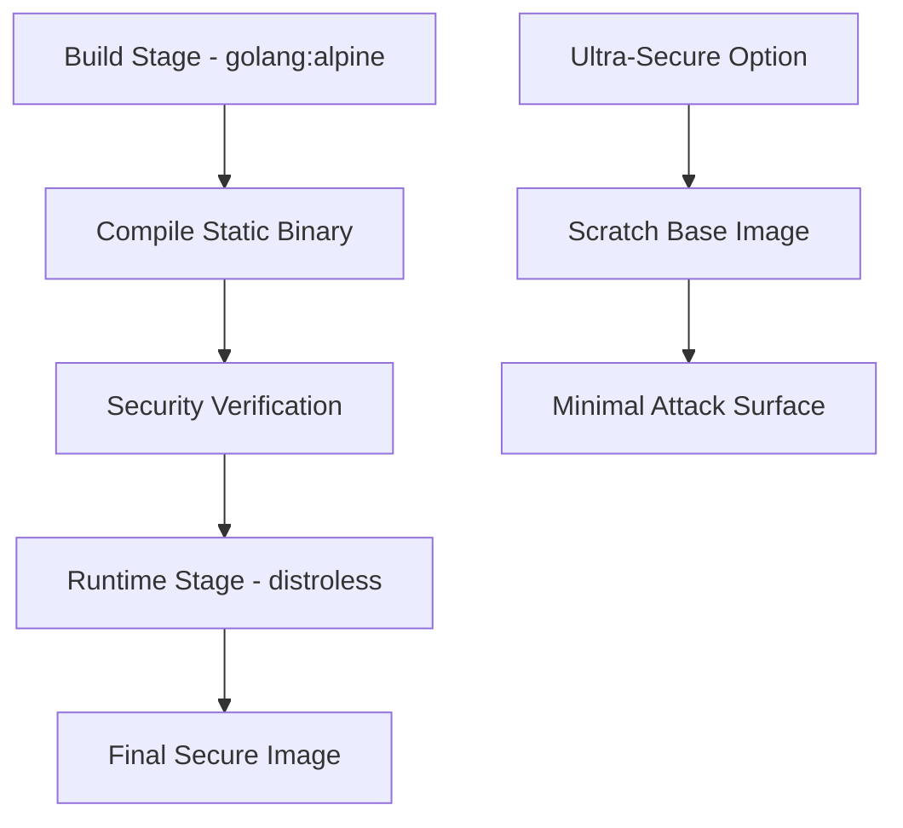

# Container Security Guide

## Overview

This document provides comprehensive guidance for securely deploying the updater service using Docker containers. It covers container security best practices, deployment configurations, and monitoring strategies.

## Docker Security Architecture

### Multi-Stage Build Security

The updater service uses a multi-stage Docker build process to minimize the attack surface:



### Security Features

**Base Image Security:**
- **Distroless**: Default option with minimal OS components
- **Scratch**: Ultra-secure option with zero OS footprint
- **Non-root user**: Runs as UID 65532 (distroless) or 1001 (scratch)
- **Static binary**: No dynamic dependencies

**Build Security:**
- **Multi-stage build**: Separates build tools from runtime
- **Static linking**: Eliminates runtime dependencies
- **Binary verification**: Confirms static linking and security
- **Minimal packages**: Only essential build dependencies

## Docker Images Explained

### Standard Secure Image (Dockerfile)

```dockerfile
# Uses distroless base for balance of security and functionality
FROM gcr.io/distroless/static-debian12:nonroot
```

**Features:**
- Minimal Debian-based runtime
- Pre-configured non-root user
- SSL certificates included
- Timezone data available
- Health check support

**Use Cases:**
- Production deployments
- Development environments
- CI/CD pipelines

### Ultra-Secure Image (Dockerfile.secure)

```dockerfile
# Uses scratch base for maximum security
FROM scratch
```

**Features:**
- Zero OS components
- Minimal possible attack surface
- Requires external monitoring
- Maximum security posture

**Use Cases:**
- High-security environments
- Zero-trust architectures
- Compliance-critical deployments

## Deployment Configurations

### Development Deployment

**Quick Start:**
```bash
# Build and run development container
docker build -t updater:dev .
docker run -p 8080:8080 \
  --read-only \
  --tmpfs /tmp:noexec,nosuid,size=10m \
  --cap-drop=ALL \
  --security-opt=no-new-privileges:true \
  -e UPDATER_CONFIG_SECTION=development \
  updater:dev
```

**Docker Compose Development:**
```bash
# Start development environment
docker-compose up -d

# View logs
docker-compose logs -f updater

# Stop environment
docker-compose down
```

### Production Deployment

**Security-Hardened Run Command:**
```bash
docker run -d \
  --name updater-prod \
  -p 8080:8080 \
  --restart=always \
  --read-only \
  --tmpfs /tmp:noexec,nosuid,nodev,size=5m \
  --cap-drop=ALL \
  --security-opt=no-new-privileges:true \
  --security-opt=seccomp:unconfined \
  --memory=256m \
  --cpus="1.0" \
  --env-file=.env.prod \
  --volume=./config.yaml:/app/config.yaml:ro \
  --volume=updater-data:/app/data:noexec,nosuid \
  updater:secure
```

**Production Docker Compose:**
```bash
# Deploy production stack
docker-compose -f docker-compose.prod.yml up -d

# Check health
docker-compose -f docker-compose.prod.yml ps
```

## Security Configurations

### Container Security Options

**Essential Security Flags:**

| Flag | Purpose | Impact |
|------|---------|--------|
| `--read-only` | Read-only root filesystem | Prevents runtime modification |
| `--cap-drop=ALL` | Drop all capabilities | Minimal privileges |
| `--security-opt=no-new-privileges` | Prevent privilege escalation | Enhanced security |
| `--tmpfs /tmp:noexec,nosuid` | Secure temporary storage | Prevents execution from tmp |

**Advanced Security Options:**

```bash
# AppArmor (if available)
--security-opt=apparmor:docker-default

# SELinux (if available)
--security-opt=label:type:container_runtime_t

# Custom Seccomp Profile
--security-opt=seccomp:/path/to/custom-profile.json
```

### Resource Limits

**Production Resource Configuration:**
```yaml
deploy:
  resources:
    limits:
      memory: 256m      # Maximum memory usage
      cpus: '1.0'       # Maximum CPU usage
    reservations:
      memory: 128m      # Guaranteed memory
      cpus: '0.5'       # Guaranteed CPU
```

**Explanation:**
- **Memory Limit**: Prevents container from consuming excessive memory
- **CPU Limit**: Prevents CPU starvation of other containers
- **Reservations**: Guarantees minimum resources

### Network Security

**Isolated Networks:**
```yaml
networks:
  updater-network:
    driver: bridge
    ipam:
      config:
        - subnet: 172.20.0.0/16
    driver_opts:
      com.docker.network.bridge.enable_icc: "false"
```

**Port Exposure Best Practices:**
```yaml
ports:
  - "127.0.0.1:8080:8080"  # Bind to localhost only
  # Never: - "8080:8080"   # Binds to all interfaces
```

## Volume Security

### Secure Volume Mounting

**Configuration Files (Read-Only):**
```bash
--volume ./config.yaml:/app/config.yaml:ro
```

**Data Persistence (Secure Options):**
```bash
--volume updater-data:/app/data:noexec,nosuid,nodev
```

**TLS Certificates (Read-Only):**
```bash
--volume ./certs:/etc/ssl/certs:ro
```

### Volume Security Options

| Option | Purpose |
|--------|---------|
| `ro` | Read-only mount |
| `noexec` | Prevent execution |
| `nosuid` | Ignore suid bits |
| `nodev` | No device files |

## Environment Variables Security

### Secure Secret Management

**Environment File (.env.prod):**
```bash
# Production secrets (never commit to git)
PRODUCTION_ADMIN_API_KEY=your-secure-key-here
PRODUCTION_MONITORING_API_KEY=your-monitoring-key
DATABASE_URL=your-database-connection
```

**Docker Secrets (Swarm Mode):**
```bash
# Create secrets
echo "admin-api-key-value" | docker secret create admin_api_key -

# Use in service
docker service create \
  --name updater \
  --secret admin_api_key \
  --env ADMIN_API_KEY_FILE=/run/secrets/admin_api_key \
  updater:secure
```

**Kubernetes Secrets:**
```yaml
apiVersion: v1
kind: Secret
metadata:
  name: updater-secrets
type: Opaque
stringData:
  admin-api-key: "your-secure-key"
  database-url: "your-db-connection"
```

## Health Checks and Monitoring

### Container Health Checks

**Dockerfile Health Check:**
```dockerfile
HEALTHCHECK --interval=30s --timeout=3s --start-period=5s --retries=3 \
    CMD ["/usr/local/bin/updater", "-health-check"] || exit 1
```

**Docker Run Health Check:**
```bash
docker run \
  --health-cmd="wget --no-verbose --tries=1 --spider http://localhost:8080/health || exit 1" \
  --health-interval=30s \
  --health-timeout=3s \
  --health-retries=3 \
  updater:secure
```

### Monitoring and Logging

**Structured Logging:**
```yaml
logging:
  driver: "json-file"
  options:
    max-size: "10m"
    max-file: "5"
    labels: "service=updater,environment=production"
```

**Log Shipping to External Systems:**
```yaml
logging:
  driver: "fluentd"
  options:
    fluentd-address: "localhost:24224"
    tag: "docker.updater"
```

## Kubernetes Security

### Security Context

**Pod Security Context:**
```yaml
apiVersion: v1
kind: Pod
spec:
  securityContext:
    runAsNonRoot: true
    runAsUser: 65532
    runAsGroup: 65532
    fsGroup: 65532
    seccompProfile:
      type: RuntimeDefault
  containers:
  - name: updater
    securityContext:
      allowPrivilegeEscalation: false
      readOnlyRootFilesystem: true
      capabilities:
        drop:
        - ALL
      runAsNonRoot: true
      runAsUser: 65532
```

### Network Policies

**Restrict Network Access:**
```yaml
apiVersion: networking.k8s.io/v1
kind: NetworkPolicy
metadata:
  name: updater-network-policy
spec:
  podSelector:
    matchLabels:
      app: updater
  policyTypes:
  - Ingress
  - Egress
  ingress:
  - from:
    - namespaceSelector:
        matchLabels:
          name: ingress-system
    ports:
    - protocol: TCP
      port: 8080
  egress:
  - to: []
    ports:
    - protocol: TCP
      port: 443  # HTTPS only
```

## Security Scanning

### Image Vulnerability Scanning

**Trivy Scanning:**
```bash
# Scan for vulnerabilities
trivy image updater:latest

# Scan with specific severity
trivy image --severity HIGH,CRITICAL updater:latest

# Generate report
trivy image --format json --output report.json updater:latest
```

**Docker Scout (if available):**
```bash
# Quick vulnerability check
docker scout quickview updater:latest

# Detailed recommendations
docker scout recommendations updater:latest
```

### CI/CD Security Integration

**GitHub Actions Security Scanning:**
```yaml
name: Security Scan
on: [push]
jobs:
  security:
    runs-on: ubuntu-latest
    steps:
      - uses: actions/checkout@v4
      - name: Build image
        run: docker build -t updater:${{ github.sha }} .
      - name: Scan image
        uses: aquasecurity/trivy-action@master
        with:
          image-ref: 'updater:${{ github.sha }}'
          format: 'sarif'
          output: 'trivy-results.sarif'
      - name: Upload results
        uses: github/codeql-action/upload-sarif@v2
        with:
          sarif_file: 'trivy-results.sarif'
```

## Runtime Security

### Container Runtime Security

**Runtime Protection:**
- **gVisor**: Sandboxed container runtime
- **Kata Containers**: VM-based container isolation
- **Firecracker**: MicroVM-based security

**gVisor Example:**
```bash
# Install runsc
docker run --runtime=runsc -p 8080:8080 updater:secure
```

### Runtime Monitoring

**Falco Security Monitoring:**
```yaml
# Falco rule for suspicious activity
- rule: Unexpected Network Connection
  desc: Detect unexpected outbound connections
  condition: >
    spawned_process and container.name="updater" and
    fd.type=ipv4 and not fd.sport in (8080)
  output: >
    Suspicious network connection from updater container
    (container=%container.name pid=%proc.pid cmd=%proc.cmdline)
  priority: WARNING
```

## Compliance and Standards

### Security Standards Compliance

**CIS Docker Benchmark:**
- ✅ Use distroless or minimal base images
- ✅ Run containers as non-root users
- ✅ Use read-only root filesystems
- ✅ Limit container capabilities
- ✅ Implement proper secrets management

**NIST Container Security:**
- ✅ Image security and vulnerability management
- ✅ Runtime security and monitoring
- ✅ Network segmentation and policies
- ✅ Logging and monitoring

### Audit Logging

**Container Security Events:**
```json
{
  "timestamp": "2024-01-15T10:30:00Z",
  "event": "container_start",
  "container": "updater-prod",
  "image": "updater:secure",
  "security_options": [
    "no-new-privileges:true",
    "read-only:true"
  ],
  "user": "65532:65532",
  "capabilities": []
}
```

## Incident Response

### Container Security Incidents

**Immediate Response:**
1. **Isolate Container**: Stop network traffic
2. **Preserve Evidence**: Export logs and filesystem
3. **Assess Impact**: Check for data access or modification
4. **Remediate**: Update image and redeploy

**Container Forensics:**
```bash
# Export container filesystem
docker export $CONTAINER_ID > container-evidence.tar

# Export container logs
docker logs $CONTAINER_ID > container-logs.txt

# Inspect container configuration
docker inspect $CONTAINER_ID > container-config.json
```

## Best Practices Summary

### Development
- ✅ Use security-focused base images
- ✅ Implement health checks
- ✅ Test with security constraints
- ✅ Scan images regularly

### Production
- ✅ Use read-only containers
- ✅ Implement resource limits
- ✅ Use external secret management
- ✅ Monitor security events

### Maintenance
- ✅ Regular image updates
- ✅ Security patch management
- ✅ Vulnerability scanning
- ✅ Security audit reviews

This comprehensive container security guide ensures your updater service deployment maintains the highest security standards across all deployment scenarios.