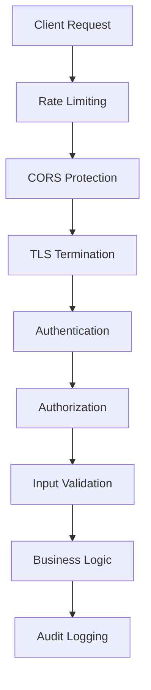

# Security Documentation

## Overview

The updater service implements a comprehensive security model designed to protect against common attack vectors while providing flexible access control for administrative operations. This document outlines the security architecture, configuration, and best practices for secure deployment.

## Security Architecture

### Defense in Depth Strategy

The service implements multiple layers of security protection:



### Security Layers

1. **Network Security**
   - TLS/HTTPS enforcement
   - CORS protection with configurable origins
   - Trusted proxy configuration

2. **Authentication Layer**
   - API key-based authentication
   - Bearer token format validation
   - Key rotation and management

3. **Authorization Layer**
   - Permission-based access control
   - Endpoint-specific permission requirements
   - Principle of least privilege

4. **Application Security**
   - Input validation and sanitization
   - SQL injection prevention
   - Path traversal protection

5. **Operational Security**
   - Rate limiting and DDoS protection
   - Comprehensive audit logging
   - Security event monitoring

## Authentication & Authorization

### API Key Authentication

The service uses API keys for authentication with a Bearer token format:

```http
Authorization: Bearer <api-key>
```

### Permission Model

The authorization system implements role-based permissions:

| Permission | Description | Endpoints |
|------------|-------------|-----------|
| `read` | Query update information | `GET /api/v1/updates/*` |
| `write` | Register new releases | `POST /api/v1/updates/*/register` |
| `admin` | Full administrative access | All endpoints |

### Permission Hierarchy

- `admin` permission grants access to all operations
- `write` permission includes `read` operations
- `read` permission grants only query access

## API Key Management

API keys are stored in the service database, not in the configuration file.

### Bootstrap Key

The `security.bootstrap_key` config field (or `UPDATER_BOOTSTRAP_KEY` env var)
seeds a single `admin`-permission key into an empty database on first startup.
This key is the entry point for all subsequent key management.

```yaml
security:
  enable_auth: true
  bootstrap_key: "${UPDATER_BOOTSTRAP_KEY}"
```

Generate a bootstrap key:

```bash
openssl rand -base64 32
```

### Key Format

Generated keys use the format `upd_<44-char base64url>`, providing 256 bits of
entropy. The raw key value is returned exactly once — at creation time — and is
never stored. Only the SHA-256 hex digest (`key_hash`) and an 8-character
display prefix are persisted.

### Key Lifecycle (REST API)

| Method | Path | Description |
|--------|------|-------------|
| `GET` | `/api/v1/admin/keys` | List all keys (hash and raw key never returned) |
| `POST` | `/api/v1/admin/keys` | Create a key; raw value returned once in response |
| `PATCH` | `/api/v1/admin/keys/{id}` | Update name, permissions, or enabled status |
| `DELETE` | `/api/v1/admin/keys/{id}` | Permanently revoke a key |

All key management endpoints require `admin` permission. The admin UI at
`/admin/keys` and `/admin/keys/new` provides a browser-based interface for the
same operations.

### Permission Model

| Permission | Grants access to |
|------------|-----------------|
| `read` | Read-only query endpoints |
| `write` | `read` + release and application creation |
| `admin` | `write` + updates, deletes, and key management |
| `*` | Alias for `admin` — full access |

Permissions are cumulative: `admin` includes `write`, `write` includes `read`.

### Security Best Practices

1. **Key Rotation**: Rotate keys regularly (recommended: every 90 days). Create
   the replacement key before revoking the old one for zero-downtime rotation.

2. **Least Privilege**: Assign the minimum permission required. Read-only
   integrations should use `read`; release publishers should use `write`.

3. **Bootstrap Key Storage**: Store the bootstrap key in a secret manager
   (HashiCorp Vault, AWS Secrets Manager, Kubernetes Secrets). Never commit it
   to version control.

4. **Revocation**: Revoke compromised keys immediately via `DELETE
   /api/v1/admin/keys/{id}` or the `/admin/keys` UI.

## Configuration Security

### Proxy Layer

Rate limiting, CORS, and TLS are enforced by the reverse proxy in front of the service.
See [Reverse Proxy](reverse-proxy.md) for nginx and Traefik configuration examples.

## Threat Model

### Identified Threats

| Threat | Impact | Mitigation |
|--------|--------|------------|
| **Unauthorized Release Injection** | Critical | Permission-based authorization, API key validation |
| **DDoS/Resource Exhaustion** | High | Rate limiting, connection limits |
| **API Key Compromise** | High | Key rotation, permission scoping, audit logging |
| **Man-in-the-Middle** | High | TLS enforcement, HSTS headers |
| **Version Downgrade Attack** | Medium | Checksum validation, version constraints |
| **Information Disclosure** | Medium | Error message sanitization, access logging |

### Attack Scenarios & Defenses

#### 1. Malicious Release Injection
**Scenario**: Attacker attempts to register malicious releases

**Defense**:
- API key authentication required
- `write` permission enforcement
- Input validation on all release data
- Audit logging of all release operations

#### 2. API Key Compromise
**Scenario**: API key is stolen or leaked

**Defense**:
- Permission scoping limits damage
- Rate limiting prevents mass operations
- Audit logging enables detection
- Key rotation capability for quick response

#### 3. DDoS Attack
**Scenario**: Service overwhelmed by requests

**Defense**:
- Per-IP rate limiting
- Request size limits
- Connection timeouts
- Graceful degradation

## Production Security Configuration

### HTTPS/TLS Configuration

```yaml
server:
  tls_enabled: true
  tls_cert_file: "/etc/ssl/certs/updater.pem"
  tls_key_file: "/etc/ssl/private/updater.key"

  # Security headers
  cors:
    enabled: true
    allowed_origins: ["https://yourdomain.com"]
    allowed_methods: ["GET", "POST"]
    max_age: 86400
```

## Security Monitoring & Logging

### Security Events

The service logs the following security-relevant events:

- **Authentication Events**
  - API key validation attempts (success/failure)
  - Invalid authentication format attempts
  - Disabled key usage attempts

- **Authorization Events**
  - Permission validation failures
  - Unauthorized endpoint access attempts
  - Admin operation attempts without proper permissions

- **Rate Limiting Events**
  - Rate limit violations by IP
  - Sustained attack patterns
  - Burst limit exceeded events

- **Operational Events**
  - Release registration operations
  - Configuration changes
  - Service startup/shutdown

### Log Format

```json
{
  "timestamp": "2024-01-15T10:30:00Z",
  "level": "WARN",
  "event": "auth_failure",
  "message": "Invalid API key attempted",
  "client_ip": "192.168.1.100",
  "endpoint": "/api/v1/updates/myapp/register",
  "user_agent": "curl/7.68.0",
  "request_id": "req_123456"
}
```

### Monitoring Alerts

Set up alerts for:
- Multiple authentication failures from same IP
- Admin operations outside business hours
- Unusual API usage patterns
- Rate limit violations
- Service error rate increases

## Incident Response

### Security Incident Procedures

1. **Immediate Response**
   - Identify compromised API keys
   - Disable affected keys immediately
   - Review audit logs for unauthorized operations

2. **Investigation**
   - Analyze access patterns
   - Identify affected releases/applications
   - Determine attack timeline and scope

3. **Recovery**
   - Generate new API keys
   - Update affected systems
   - Verify system integrity
   - Update security configurations

4. **Post-Incident**
   - Document lessons learned
   - Update security procedures
   - Enhance monitoring rules

### Emergency API Key Revocation

Revoke a key immediately via the REST API (requires an active `admin` key):

```bash
# Permanently delete a key by ID
curl -X DELETE https://updater.example.com/api/v1/admin/keys/<key-id> \
  -H "Authorization: Bearer <admin-api-key>"

# Or disable without deleting (can be re-enabled later)
curl -X PATCH https://updater.example.com/api/v1/admin/keys/<key-id> \
  -H "Authorization: Bearer <admin-api-key>" \
  -H "Content-Type: application/json" \
  -d '{"enabled": false}'
```

Key IDs are visible in `GET /api/v1/admin/keys` or the `/admin/keys` admin UI.

## Security Testing

### Security Validation Checklist

- [ ] API authentication required for admin endpoints
- [ ] Permission validation enforced
- [ ] Rate limiting functional
- [ ] Input validation preventing injection
- [ ] Error messages don't leak sensitive information
- [ ] HTTPS enforced in production
- [ ] Security headers configured
- [ ] Audit logging captures security events

### Penetration Testing

Recommended security tests:

```bash
# Test authentication bypass
curl -X POST http://localhost:8080/api/v1/updates/test/register \
  -H "Content-Type: application/json" \
  -d '{"version":"1.0.0"}'

# Test invalid API key
curl -X POST http://localhost:8080/api/v1/updates/test/register \
  -H "Authorization: Bearer invalid-key" \
  -H "Content-Type: application/json" \
  -d '{"version":"1.0.0"}'

# Test insufficient permissions
curl -X POST http://localhost:8080/api/v1/updates/test/register \
  -H "Authorization: Bearer read-only-key" \
  -H "Content-Type: application/json" \
  -d '{"version":"1.0.0"}'
```

## Compliance & Standards

### Security Standards Alignment

- **OWASP Top 10**: Protection against common web vulnerabilities
- **NIST Cybersecurity Framework**: Risk-based security approach
- **ISO 27001**: Information security management practices

### Data Protection

- **No Personal Data**: Service doesn't collect or store personal information
- **Minimal Data Collection**: Only necessary operational data
- **Data Retention**: Configurable log retention periods
- **Privacy by Design**: Default configurations prioritize privacy

## Security Development Guidelines

### Secure Coding Practices

1. **Input Validation**
   - Validate all inputs at API boundaries
   - Use allowlists instead of blocklists
   - Sanitize data before processing

2. **Error Handling**
   - Don't expose internal system information
   - Log detailed errors securely
   - Return generic error messages to clients

3. **Authentication**
   - Always verify API keys for admin operations
   - Check permissions before processing requests
   - Use secure comparison functions

### Code Review Security Checklist

- [ ] New endpoints have appropriate authentication
- [ ] Permission checks implemented for admin operations
- [ ] Input validation implemented
- [ ] Error handling doesn't leak information
- [ ] Security logging added for sensitive operations
- [ ] Tests cover security scenarios

## Security Contact Information

For security issues and responsible disclosure:

- **Security Email**: security@yourcompany.com
- **Response Time**: 24-48 hours for initial response
- **Encryption**: PGP key available on company website

### Responsible Disclosure

We appreciate security researchers who help improve our security. Please:

1. Report vulnerabilities privately first
2. Allow reasonable time for fixes
3. Avoid accessing or modifying user data
4. Don't perform DDoS or destructive testing

## Appendix

### Security References

- [OWASP API Security Top 10](https://owasp.org/www-project-api-security/)
- [NIST Cybersecurity Framework](https://www.nist.gov/cyberframework)
- [Go Security Best Practices](https://golang.org/doc/security)

### Security Tools

- **Static Analysis**: `gosec`, `govulncheck`
- **Dependency Scanning**: `nancy`, `snyk`
- **Penetration Testing**: `burp suite`, `owasp zap`
- **Monitoring**: `prometheus`, `grafana`