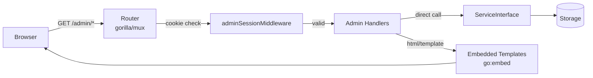

# Admin UI

The updater service ships with a browser-based admin interface at `/admin`. It is
server-rendered using Go's `html/template` package with HTMX for inline delete
actions, styled with Tailwind CSS (Play CDN). No JavaScript build step is required.

## Access

Navigate to `http://localhost:8080/admin` in a browser. You will be redirected to
the login page.

## Authentication

Enter an API key with `admin` permission on the login page. After a successful
login the browser receives an HttpOnly, SameSite=Strict `admin_session` cookie
scoped to `/admin`. Subsequent requests are authenticated automatically via this
cookie — the key is never re-entered per request and is never visible to JavaScript.

In development mode (auth disabled) any non-empty string is accepted as the key.

## Pages

| Path | Description |
|------|-------------|
| `/admin/login` | Login form |
| `/admin/applications` | Application list with inline delete |
| `/admin/applications/new` | Create application form |
| `/admin/applications/{id}` | Application detail and release list |
| `/admin/applications/{id}/edit` | Edit application form |
| `/admin/applications/{id}/releases/new` | Register a release |
| `/admin/keys` | API key list with enable/disable toggle (HTMX) and revoke button |
| `/admin/keys/new` | Create key form; raw key displayed exactly once on success |
| `/admin/health` | Service health dashboard |

## Architecture

Templates are embedded via `go:embed` at compile time. HTMX is loaded from the
unpkg CDN; an internet connection is required for the interactive delete behaviour.
Core page navigation works without JavaScript.

## Development Login

When running locally with the default `docker-compose.yml` configuration, log in
with the key `dev-admin-key-12345678901234567890` set in the `DEV_ADMIN_API_KEY`
environment variable.

## Flash Messages

After create, edit, or delete actions the UI redirects with `?flash=<message>&flash_type=<success|error>`
query parameters. The target page reads these parameters and displays a brief
notification banner, which disappears on the next navigation.
