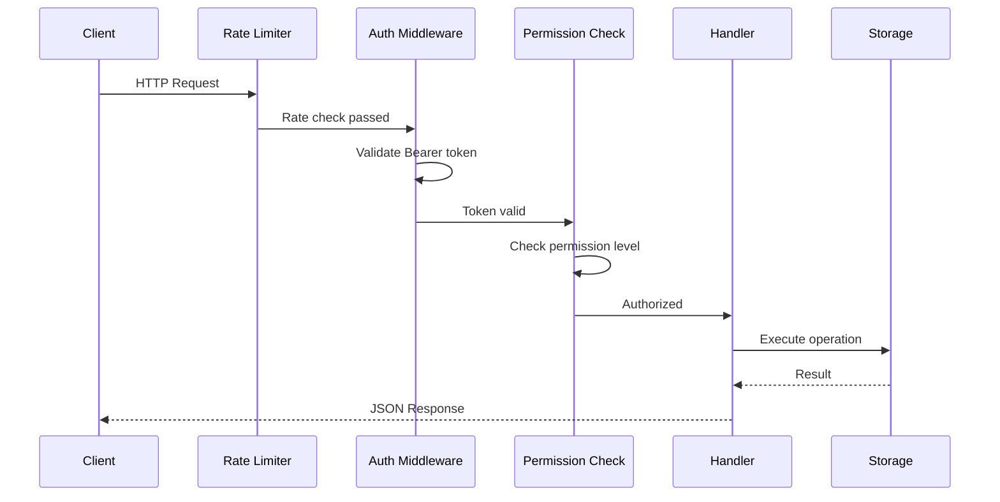

# API Reference

## Overview

The updater service exposes a RESTful JSON API under the `/api/v1` prefix. Clients query the API to check for software updates, retrieve release information, and manage applications. All request and response bodies use `application/json`. Timestamps follow RFC 3339 format, and versions follow semantic versioning.

## Authentication

Protected endpoints require a Bearer token in the `Authorization` header:

```http
Authorization: Bearer <api-key>
```

API keys are configured on the server with one or more permission levels. The permission hierarchy is cumulative:

| Level | Includes | Description |
|-------|----------|-------------|
| `read` | read | Query releases, list applications |
| `write` | read, write | Register releases, create applications |
| `admin` | read, write, admin | Update and delete applications, delete releases |

Public endpoints (update checks, latest version, health) do not require authentication. When authentication is disabled in the server configuration, all endpoints are accessible without a token.

## Request Flow



## Endpoints Summary

| Method | Path | Auth | Description |
|--------|------|------|-------------|
| `GET` | `/api/v1/updates/{app_id}/check` | Public | Check for available updates |
| `POST` | `/api/v1/check` | Public | Check for updates (JSON body) |
| `GET` | `/api/v1/updates/{app_id}/latest` | Public | Get latest version |
| `GET` | `/api/v1/latest` | Public | Get latest version (query params) |
| `GET` | `/api/v1/updates/{app_id}/releases` | read | List releases for an application |
| `POST` | `/api/v1/updates/{app_id}/register` | write | Register a new release |
| `DELETE` | `/api/v1/updates/{app_id}/releases/{version}/{platform}/{arch}` | admin | Delete a specific release |
| `GET` | `/api/v1/applications` | read | List all applications |
| `GET` | `/api/v1/applications/{app_id}` | read | Get application details |
| `POST` | `/api/v1/applications` | write | Create an application |
| `PUT` | `/api/v1/applications/{app_id}` | admin | Update an application |
| `DELETE` | `/api/v1/applications/{app_id}` | admin | Delete an application |
| `GET` | `/health` | Public | Health check |
| `GET` | `/api/v1/health` | Public | Health check (versioned alias) |

---

## Update Endpoints

### Check for Updates (GET)

Check whether a newer version is available for a specific application, platform, and architecture.

**Request**

```
GET /api/v1/updates/{app_id}/check?current_version={version}&platform={platform}&architecture={arch}
```

| Parameter | In | Required | Description |
|-----------|------|----------|-------------|
| `app_id` | path | yes | Application identifier |
| `current_version` | query | yes | Client's current semantic version |
| `platform` | query | yes | Target OS (`windows`, `linux`, `darwin`, `android`, `ios`) |
| `architecture` | query | yes | Target architecture (`amd64`, `arm64`, `386`, `arm`) |
| `allow_prerelease` | query | no | Include pre-release versions (default `false`) |
| `include_metadata` | query | no | Include release metadata in response (default `false`) |

**Response -- update available (200)**

```json
{
  "update_available": true,
  "latest_version": "2.1.0",
  "current_version": "2.0.0",
  "download_url": "https://releases.example.com/app/2.1.0/app-windows-amd64.exe",
  "checksum": "e3b0c44298fc1c149afbf4c8996fb92427ae41e4649b934ca495991b7852b855",
  "checksum_type": "sha256",
  "file_size": 15728640,
  "release_notes": "Performance improvements and bug fixes",
  "release_date": "2026-02-10T12:00:00Z",
  "required": false,
  "minimum_version": "1.0.0"
}
```

**Response -- no update (200)**

```json
{
  "update_available": false,
  "current_version": "2.1.0",
  "required": false
}
```

### Check for Updates (POST)

Alternative endpoint that accepts the update check parameters as a JSON body instead of query parameters.

**Request**

```
POST /api/v1/check
Content-Type: application/json
```

```json
{
  "application_id": "my-app",
  "current_version": "2.0.0",
  "platform": "windows",
  "architecture": "amd64",
  "allow_prerelease": false,
  "include_metadata": false
}
```

**Response**

Same as the GET variant above.

### Get Latest Version (GET with path)

Retrieve the latest release for a given application, platform, and architecture.

**Request**

```
GET /api/v1/updates/{app_id}/latest?platform={platform}&architecture={arch}
```

| Parameter | In | Required | Description |
|-----------|------|----------|-------------|
| `app_id` | path | yes | Application identifier |
| `platform` | query | yes | Target OS |
| `architecture` | query | yes | Target architecture |
| `allow_prerelease` | query | no | Include pre-release versions (default `false`) |
| `include_metadata` | query | no | Include release metadata (default `false`) |

**Response (200)**

```json
{
  "version": "2.1.0",
  "download_url": "https://releases.example.com/app/2.1.0/app-windows-amd64.exe",
  "checksum": "e3b0c44298fc1c149afbf4c8996fb92427ae41e4649b934ca495991b7852b855",
  "checksum_type": "sha256",
  "file_size": 15728640,
  "release_notes": "Performance improvements and bug fixes",
  "release_date": "2026-02-10T12:00:00Z",
  "required": false,
  "metadata": {}
}
```

### Get Latest Version (query params)

Compatibility alias that accepts the application ID as a query parameter.

```
GET /api/v1/latest?application_id={app_id}&platform={platform}&architecture={arch}
```

Response format is the same as the path-based variant.

### List Releases

List releases for an application with filtering, sorting, and pagination.

**Requires**: `read` permission.

**Request**

```
GET /api/v1/updates/{app_id}/releases
```

| Parameter | In | Required | Description |
|-----------|------|----------|-------------|
| `app_id` | path | yes | Application identifier |
| `platform` | query | no | Filter by platform |
| `architecture` | query | no | Filter by architecture |
| `version` | query | no | Filter by exact version |
| `required` | query | no | Filter by required flag |
| `limit` | query | no | Page size (default `50`) |
| `offset` | query | no | Page offset (default `0`) |
| `sort_by` | query | no | Sort field: `version`, `release_date`, `platform`, `architecture`, `created_at` (default `release_date`) |
| `sort_order` | query | no | `asc` or `desc` (default `desc`) |

**Response (200)**

```json
{
  "releases": [
    {
      "id": "rel-001",
      "version": "2.1.0",
      "platform": "windows",
      "architecture": "amd64",
      "download_url": "https://releases.example.com/app/2.1.0/app-windows-amd64.exe",
      "checksum": "e3b0c44298fc1c149afbf4c8996fb924...",
      "checksum_type": "sha256",
      "file_size": 15728640,
      "release_notes": "Performance improvements",
      "release_date": "2026-02-10T12:00:00Z",
      "required": false,
      "minimum_version": "1.0.0"
    }
  ],
  "total_count": 1,
  "page": 1,
  "page_size": 50,
  "has_more": false
}
```

### Register Release

Register a new release for an application.

**Requires**: `write` permission.

**Request**

```
POST /api/v1/updates/{app_id}/register
Content-Type: application/json
Authorization: Bearer <api-key>
```

```json
{
  "application_id": "my-app",
  "version": "2.1.0",
  "platform": "windows",
  "architecture": "amd64",
  "download_url": "https://releases.example.com/app/2.1.0/app-windows-amd64.exe",
  "checksum": "e3b0c44298fc1c149afbf4c8996fb92427ae41e4649b934ca495991b7852b855",
  "checksum_type": "sha256",
  "file_size": 15728640,
  "release_notes": "Performance improvements and bug fixes",
  "required": false,
  "minimum_version": "1.0.0",
  "metadata": {
    "build_number": "1234",
    "commit_sha": "abc123"
  }
}
```

| Field | Type | Required | Description |
|-------|------|----------|-------------|
| `application_id` | string | yes | Target application |
| `version` | string | yes | Semantic version |
| `platform` | string | yes | Target platform |
| `architecture` | string | yes | Target architecture |
| `download_url` | string | yes | External download URL |
| `checksum` | string | yes | File integrity hash |
| `checksum_type` | string | yes | Hash algorithm (e.g. `sha256`) |
| `file_size` | integer | no | File size in bytes |
| `release_notes` | string | no | Human-readable changelog |
| `required` | boolean | no | Force-update flag (default `false`) |
| `minimum_version` | string | no | Minimum version required to apply this update |
| `metadata` | object | no | Arbitrary key-value metadata |

**Response (201)**

```json
{
  "id": "rel-001",
  "message": "Release registered successfully",
  "created_at": "2026-02-16T10:00:00Z"
}
```

---

## Release Management

### Delete Release

Delete a specific release identified by application, version, platform, and architecture.

**Requires**: `admin` permission.

**Request**

```
DELETE /api/v1/updates/{app_id}/releases/{version}/{platform}/{arch}
Authorization: Bearer <api-key>
```

| Parameter | In | Required | Description |
|-----------|------|----------|-------------|
| `app_id` | path | yes | Application identifier |
| `version` | path | yes | Semantic version of the release |
| `platform` | path | yes | Platform of the release |
| `arch` | path | yes | Architecture of the release |

**Response (200)**

```json
{
  "id": "rel-001",
  "message": "Release deleted successfully"
}
```

**Error responses**

| Status | Code | Condition |
|--------|------|-----------|
| 401 | `UNAUTHORIZED` | Missing or invalid API key |
| 403 | `FORBIDDEN` | Insufficient permissions (requires admin) |
| 404 | `NOT_FOUND` | Release not found |

---

## Application Management

### List Applications

Retrieve a paginated list of all registered applications.

**Requires**: `read` permission.

**Request**

```
GET /api/v1/applications?limit=50&offset=0
Authorization: Bearer <api-key>
```

| Parameter | In | Required | Description |
|-----------|------|----------|-------------|
| `limit` | query | no | Page size (default `50`) |
| `offset` | query | no | Page offset (default `0`) |

**Response (200)**

```json
{
  "applications": [
    {
      "id": "my-app",
      "name": "My Application",
      "description": "A desktop application",
      "platforms": ["windows", "linux", "darwin"],
      "created_at": "2026-01-01T00:00:00Z",
      "updated_at": "2026-02-01T00:00:00Z"
    }
  ],
  "total_count": 1,
  "page": 1,
  "page_size": 50,
  "has_more": false
}
```

### Get Application

Retrieve detailed information about a single application, including configuration and statistics.

**Requires**: `read` permission.

**Request**

```
GET /api/v1/applications/{app_id}
Authorization: Bearer <api-key>
```

| Parameter | In | Required | Description |
|-----------|------|----------|-------------|
| `app_id` | path | yes | Application identifier |

**Response (200)**

```json
{
  "id": "my-app",
  "name": "My Application",
  "description": "A desktop application",
  "platforms": ["windows", "linux", "darwin"],
  "config": {
    "auto_update": false,
    "update_interval": 3600,
    "required_update": false,
    "allow_prerelease": false,
    "analytics_enabled": false
  },
  "stats": {
    "total_releases": 12,
    "latest_version": "2.1.0",
    "latest_release_date": "2026-02-10T12:00:00Z",
    "platform_count": 3,
    "required_releases": 1
  },
  "created_at": "2026-01-01T00:00:00Z",
  "updated_at": "2026-02-01T00:00:00Z"
}
```

### Create Application

Register a new application in the update service.

**Requires**: `write` permission.

**Request**

```
POST /api/v1/applications
Content-Type: application/json
Authorization: Bearer <api-key>
```

```json
{
  "id": "my-app",
  "name": "My Application",
  "description": "A cross-platform desktop application",
  "platforms": ["windows", "linux", "darwin"],
  "config": {
    "auto_update": false,
    "update_interval": 3600,
    "required_update": false,
    "allow_prerelease": false,
    "analytics_enabled": false
  }
}
```

| Field | Type | Required | Description |
|-------|------|----------|-------------|
| `id` | string | yes | Unique identifier (alphanumeric, hyphens, underscores; max 100 chars) |
| `name` | string | yes | Human-readable name |
| `description` | string | no | Application description |
| `platforms` | array | yes | At least one supported platform (`windows`, `linux`, `darwin`, `android`, `ios`) |
| `config` | object | no | Application configuration (see below) |

**Application Config fields**

| Field | Type | Default | Description |
|-------|------|---------|-------------|
| `update_check_url` | string | `""` | Custom update check endpoint override |
| `auto_update` | boolean | `false` | Enable automatic updates |
| `update_interval` | integer | `3600` | Check interval in seconds |
| `required_update` | boolean | `false` | Force all updates |
| `min_version` | string | `""` | Minimum supported version (semver) |
| `max_version` | string | `""` | Maximum supported version (semver) |
| `allow_prerelease` | boolean | `false` | Include pre-release versions |
| `notification_url` | string | `""` | Webhook URL for update notifications |
| `analytics_enabled` | boolean | `false` | Enable usage analytics |
| `custom_fields` | object | `{}` | Arbitrary key-value metadata |

**Response (201)**

```json
{
  "id": "my-app",
  "message": "Application created successfully",
  "created_at": "2026-02-16T10:00:00Z"
}
```

### Update Application

Update an existing application's metadata and configuration. Only provided fields are updated; omitted fields remain unchanged.

**Requires**: `admin` permission.

**Request**

```
PUT /api/v1/applications/{app_id}
Content-Type: application/json
Authorization: Bearer <api-key>
```

```json
{
  "name": "My Application (Renamed)",
  "description": "Updated description",
  "platforms": ["windows", "linux", "darwin", "android"],
  "config": {
    "auto_update": true,
    "update_interval": 1800
  }
}
```

| Field | Type | Required | Description |
|-------|------|----------|-------------|
| `name` | string | no | New application name |
| `description` | string | no | New description |
| `platforms` | array | no | New platform list (at least one if provided) |
| `config` | object | no | Updated configuration |

**Response (200)**

```json
{
  "id": "my-app",
  "message": "Application updated successfully",
  "updated_at": "2026-02-16T11:00:00Z"
}
```

### Delete Application

Permanently delete an application and all associated data.

**Requires**: `admin` permission.

**Request**

```
DELETE /api/v1/applications/{app_id}
Authorization: Bearer <api-key>
```

| Parameter | In | Required | Description |
|-----------|------|----------|-------------|
| `app_id` | path | yes | Application identifier |

**Response (204)**

No body. A `204 No Content` status indicates success.

**Error responses**

| Status | Code | Condition |
|--------|------|-----------|
| 401 | `UNAUTHORIZED` | Missing or invalid API key |
| 403 | `FORBIDDEN` | Insufficient permissions (requires admin) |
| 404 | `NOT_FOUND` | Application not found |

---

## Health

### Health Check

Returns the service health status. When called with a valid authentication token, the response includes additional component details and metrics.

**Request**

```
GET /health
```

or

```
GET /api/v1/health
```

**Response -- basic (200)**

```json
{
  "status": "healthy",
  "timestamp": "2026-02-16T10:00:00Z"
}
```

**Response -- authenticated (200)**

When a valid Bearer token is provided, the response is enriched with component health and operational metrics:

```json
{
  "status": "healthy",
  "timestamp": "2026-02-16T10:00:00Z",
  "version": "1.0.0",
  "uptime": "48h32m15s",
  "components": {
    "storage": {
      "status": "healthy",
      "message": "Storage backend responding",
      "timestamp": "2026-02-16T10:00:00Z"
    }
  },
  "metrics": {
    "goroutines": 12,
    "memory_alloc_mb": 8.5
  }
}
```

Health status values:

| Status | Meaning |
|--------|---------|
| `healthy` | All systems operational |
| `degraded` | Partial functionality; some features may be slow or limited |
| `unhealthy` | Major issues affecting core functionality |
| `unknown` | Health status cannot be determined |

---

## Error Responses

All errors follow a consistent JSON structure:

```json
{
  "error": "error",
  "message": "Human-readable error description",
  "code": "ERROR_CODE",
  "details": {},
  "timestamp": "2026-02-16T10:00:00Z",
  "request_id": "req_abc123"
}
```

### Error Codes

| Code | HTTP Status | Description |
|------|-------------|-------------|
| `NOT_FOUND` | 404 | Requested resource does not exist |
| `APPLICATION_NOT_FOUND` | 404 | Application does not exist |
| `BAD_REQUEST` | 400 | Malformed request format |
| `INVALID_REQUEST` | 400 | Invalid request data or method |
| `VALIDATION_ERROR` | 422 | Input validation failed |
| `INTERNAL_ERROR` | 500 | Unexpected server-side error |
| `UNAUTHORIZED` | 401 | Authentication required or invalid credentials |
| `FORBIDDEN` | 403 | Insufficient permissions |
| `CONFLICT` | 409 | Resource already exists or state conflict |
| `SERVICE_UNAVAILABLE` | 503 | Service temporarily unavailable |

### Validation Errors

When input validation fails, a validation error response may include field-level details:

```json
{
  "error": "validation_error",
  "errors": {
    "platform": "invalid platform: bsd",
    "version": "invalid version format: not-semver"
  }
}
```

### Common Error Scenarios

| Scenario | Status | Code |
|----------|--------|------|
| Missing `Authorization` header on protected endpoint | 401 | `UNAUTHORIZED` |
| Invalid or expired API key | 401 | `UNAUTHORIZED` |
| Key lacks required permission | 403 | `FORBIDDEN` |
| Application not found | 404 | `APPLICATION_NOT_FOUND` |
| Release not found | 404 | `NOT_FOUND` |
| Invalid JSON body | 400 | `INVALID_REQUEST` |
| Wrong `Content-Type` header | 415 | `BAD_REQUEST` |
| Duplicate application ID | 409 | `CONFLICT` |
| Invalid semantic version string | 422 | `VALIDATION_ERROR` |
| Unsupported HTTP method | 405 | `INVALID_REQUEST` |
