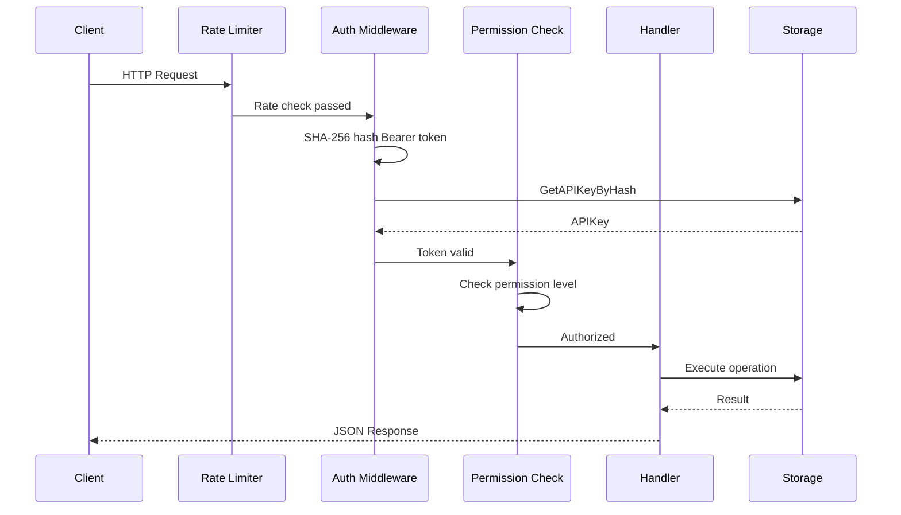

# API Reference

The interactive API reference is served directly by the running updater service.

## Swagger UI

Navigate to `/api/v1/docs` on your running instance:

```
http://localhost:8080/api/v1/docs
```

The Swagger UI is generated from the embedded OpenAPI 3.0.3 specification and
always reflects the exact endpoints and schemas of the running version.

## OpenAPI Specification

The raw OpenAPI YAML is available at:

```
http://localhost:8080/api/v1/openapi.yaml
```

You can also validate the specification locally without starting the service:

```bash
make openapi-validate
```

The specification source lives at `internal/api/openapi/openapi.yaml`.

## Authentication

Protected endpoints require a Bearer token in the `Authorization` header:

```http
Authorization: Bearer <api-key>
```

API keys are managed via the key management endpoints or the admin UI. The
permission hierarchy is cumulative:

| Level | Includes | Description |
|-------|----------|-------------|
| `read` | read | Query releases, list applications |
| `write` | read, write | Register releases, create applications |
| `admin` | read, write, admin | Update/delete resources, manage API keys |

## Request Flow



## Error Responses

All errors follow a consistent JSON structure:

```json
{
  "error": "error",
  "message": "Human-readable error description",
  "code": "ERROR_CODE",
  "details": {},
  "timestamp": "2026-02-16T10:00:00Z",
  "request_id": "req_abc123"
}
```

| Code | HTTP Status | Description |
|------|-------------|-------------|
| `NOT_FOUND` | 404 | Requested resource does not exist |
| `APPLICATION_NOT_FOUND` | 404 | Application does not exist |
| `BAD_REQUEST` | 400 | Malformed request format |
| `INVALID_REQUEST` | 400 | Invalid request data or method |
| `VALIDATION_ERROR` | 422 | Input validation failed |
| `INTERNAL_ERROR` | 500 | Unexpected server-side error |
| `UNAUTHORIZED` | 401 | Authentication required or invalid credentials |
| `FORBIDDEN` | 403 | Insufficient permissions |
| `CONFLICT` | 409 | Resource already exists or state conflict |
| `SERVICE_UNAVAILABLE` | 503 | Service temporarily unavailable |
