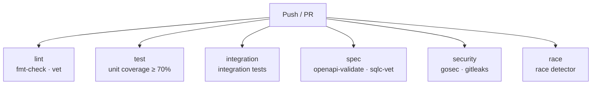

# CI Pipeline

The CI pipeline runs on every pull request and push to `main` using GitHub Actions. All six jobs run in parallel; any failure blocks the merge.

## Pipeline Overview



## Jobs

| Job | Steps | Equivalent make target(s) |
|-----|-------|--------------------------|
| `lint` | Format check, vet | `make fmt-check`, `make vet` |
| `test` | Unit test coverage with 70% threshold | `make cover` (unit only) |
| `integration` | Integration test suite | `make integration-test` |
| `spec` | OpenAPI spec validation, SQL schema validation | `make openapi-validate`, `make sqlc-vet` |
| `security` | Static security analysis, secret scanning | `make security`, `make secrets` |
| `race` | Data race detection | `go test -race ./...` |

## Job Details

### lint

Checks code quality without running tests. Both steps must pass.

- **Check formatting**: runs `gofmt -l` and fails if any files are unformatted. Equivalent to `make fmt-check`.
- **Vet**: runs `go vet ./...` to catch common correctness issues. Equivalent to `make vet`.

Uses `actions/setup-go` with automatic Go module caching.

### test

Runs the full test suite (unit and integration) and enforces a 70% line coverage threshold.

Coverage is measured across all packages except `cmd/` and generated code under `storage/sqlc/`, matching the `make cover` target exactly. The `integration` job runs the same integration tests independently for separate pass/fail reporting.

The threshold is hardcoded in the workflow. Raise it when coverage improves.

Uses `actions/setup-go` with automatic Go module caching.

### integration

Runs the integration test suite with the `integration` build tag:

```
go test -tags integration ./internal/integration/...
```

Equivalent to `make integration-test`.

Uses `actions/setup-go` with automatic Go module caching.

### spec

Validates schemas using Docker-based tools (Docker is available on GitHub Actions runners).

- **Validate OpenAPI spec**: runs `make openapi-validate`, which lints `internal/api/openapi/openapi.yaml` using Redocly CLI.
- **Validate SQL schemas**: runs `make sqlc-vet`, which validates SQL queries against the schema using sqlc.

No Go toolchain setup is required for this job.

### security

Runs two independent security checks.

- **gosec**: installs the gosec static analyser natively and runs it with `-severity high -confidence medium`. Fails if any High-severity, Medium-or-above-confidence findings are present. Equivalent to `make security`.
- **gitleaks**: scans the full git history for committed secrets using the `gitleaks/gitleaks-action` action (reads `.gitleaks.toml` for allow-listed entries). Equivalent to `make secrets`.

Requires `fetch-depth: 0` for gitleaks to scan full history.

### race

Runs the test suite with Go's race detector enabled:

```
go test -race ./...
```

The race detector requires CGO. This job uses `actions/setup-go` on the host runner (no Docker) because the `GO_DOCKER` macro in the Makefile sets `CGO_ENABLED=0`, which disables the race detector. There is no corresponding `make` target.

## Makefile Correspondence

The `lint`, `test`, and `integration` jobs run the same underlying commands as their Makefile equivalents, but natively (without the Docker wrapper) to benefit from `actions/setup-go` module caching. The `spec` job calls `make` targets directly because the tools (Redocly, sqlc) use separate Docker images for which native caching provides no benefit.

When updating a Makefile target's flags or command, update the corresponding CI step to match. Each CI step includes a comment noting the equivalent make target.

The Makefile's Docker-based approach remains the canonical local development path. Docker is the only local requirement; CI uses native Go for performance.

## Running Checks Locally

All CI checks have a direct `make` equivalent:

```bash
make fmt-check       # lint: format check
make vet             # lint: vet
make cover           # test: full coverage including integration tests
make integration-test # integration
make openapi-validate # spec: OpenAPI validation
make sqlc-vet        # spec: SQL schema validation
make security        # security: gosec
make secrets         # security: gitleaks
```

The `race` job has no make target; run `go test -race ./...` directly with Go installed locally (requires CGO).

## Branch Protection

Configure branch protection on `main` to require all six CI jobs to pass before merging. In the GitHub repository settings under **Branches**, add a protection rule for `main` with the following required status checks:

| Status check | Job |
|---|---|
| `lint` | Format and vet |
| `test` | Unit coverage |
| `integration` | Integration tests |
| `spec` | Schema validation |
| `security` | Security analysis |
| `race` | Race detection |

Also enable **Require branches to be up to date before merging** to ensure checks always run against the merged result.
