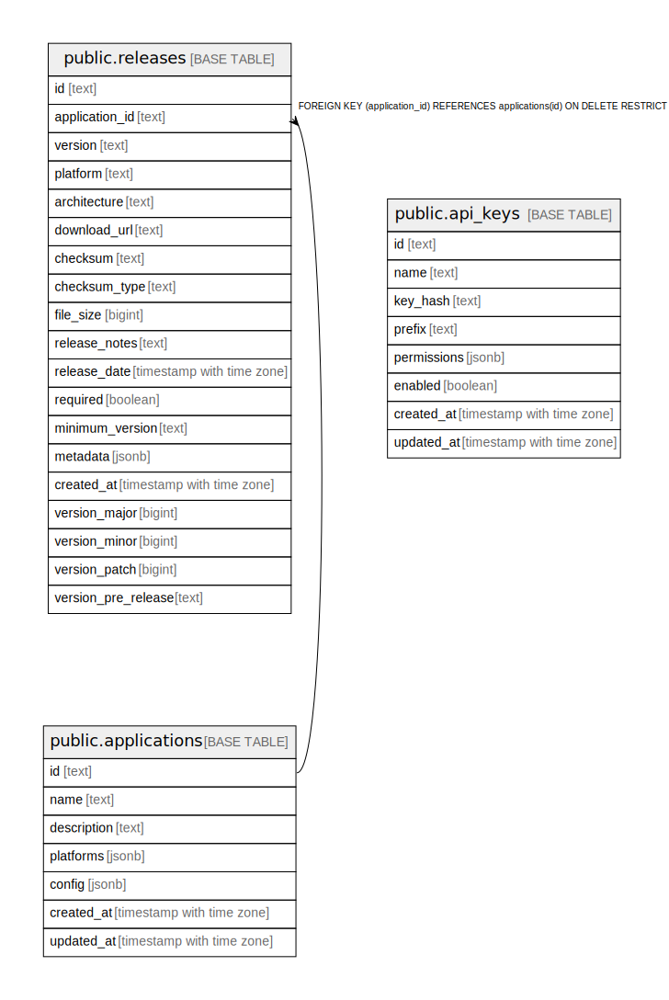

# updater

## Tables

| Name | Columns | Comment | Type |
| ---- | ------- | ------- | ---- |
| [public.applications](public.applications.md) | 7 |  | BASE TABLE |
| [public.releases](public.releases.md) | 15 |  | BASE TABLE |
| [public.api_keys](public.api_keys.md) | 8 |  | BASE TABLE |

## Stored procedures and functions

| Name | ReturnType | Arguments | Type |
| ---- | ------- | ------- | ---- |
| public.update_updated_at_column | trigger |  | FUNCTION |

## Relations

---

> Generated by [tbls](https://github.com/k1LoW/tbls)
