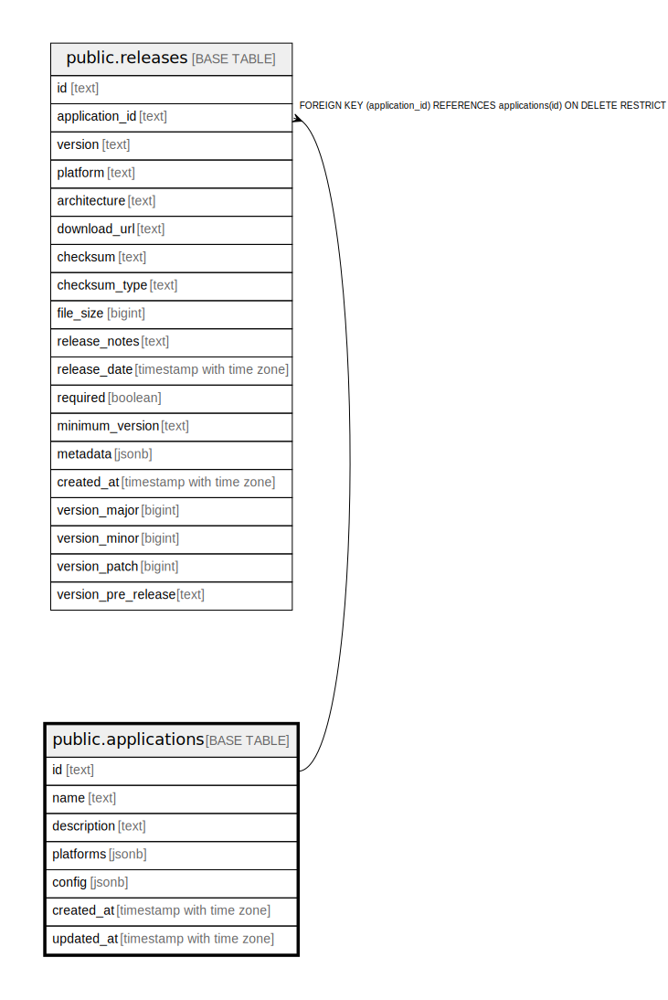

# public.applications

## Description

## Columns

| Name | Type | Default | Nullable | Children | Parents | Comment |
| ---- | ---- | ------- | -------- | -------- | ------- | ------- |
| id | text |  | false | [public.releases](public.releases.md) |  |  |
| name | text |  | false |  |  |  |
| description | text |  | true |  |  |  |
| platforms | jsonb | '[]'::jsonb | false |  |  |  |
| config | jsonb | '{}'::jsonb | false |  |  |  |
| created_at | timestamp with time zone | now() | false |  |  |  |
| updated_at | timestamp with time zone | now() | false |  |  |  |

## Constraints

| Name | Type | Definition |
| ---- | ---- | ---------- |
| applications_pkey | PRIMARY KEY | PRIMARY KEY (id) |

## Indexes

| Name | Definition |
| ---- | ---------- |
| applications_pkey | CREATE UNIQUE INDEX applications_pkey ON public.applications USING btree (id) |
| idx_applications_name | CREATE INDEX idx_applications_name ON public.applications USING btree (name) |
| idx_applications_platforms | CREATE INDEX idx_applications_platforms ON public.applications USING gin (platforms) |

## Triggers

| Name | Definition |
| ---- | ---------- |
| update_applications_updated_at | CREATE TRIGGER update_applications_updated_at BEFORE UPDATE ON public.applications FOR EACH ROW EXECUTE FUNCTION update_updated_at_column() |

## Relations

---

> Generated by [tbls](https://github.com/k1LoW/tbls)
