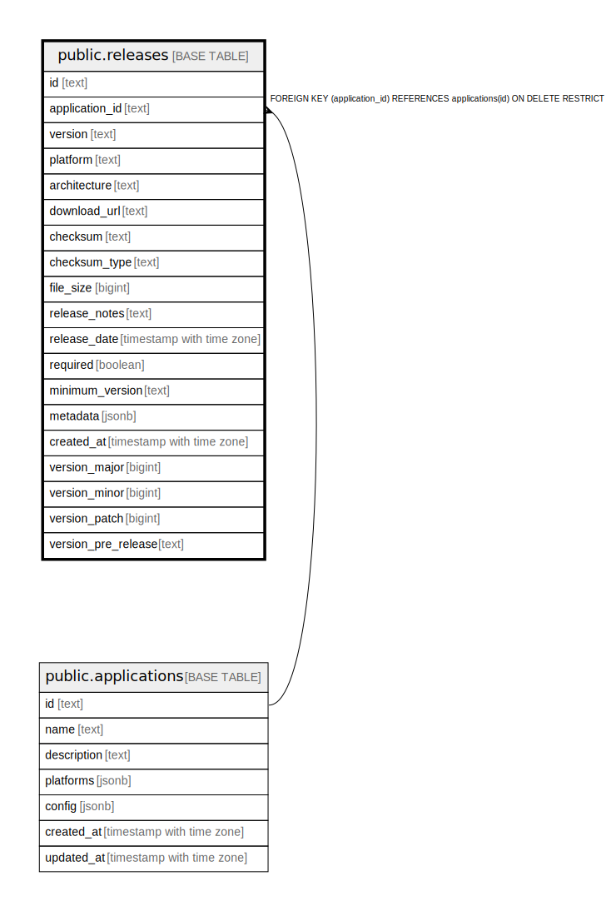

# public.releases

## Description

## Columns

| Name | Type | Default | Nullable | Children | Parents | Comment |
| ---- | ---- | ------- | -------- | -------- | ------- | ------- |
| id | text |  | false |  |  |  |
| application_id | text |  | false |  | [public.applications](public.applications.md) |  |
| version | text |  | false |  |  |  |
| platform | text |  | false |  |  |  |
| architecture | text |  | false |  |  |  |
| download_url | text |  | false |  |  |  |
| checksum | text |  | false |  |  |  |
| checksum_type | text | 'sha256'::text | false |  |  |  |
| file_size | bigint |  | false |  |  |  |
| release_notes | text |  | true |  |  |  |
| release_date | timestamp with time zone |  | false |  |  |  |
| required | boolean | false | false |  |  |  |
| minimum_version | text |  | true |  |  |  |
| metadata | jsonb | '{}'::jsonb | true |  |  |  |
| created_at | timestamp with time zone | now() | false |  |  |  |

## Constraints

| Name | Type | Definition |
| ---- | ---- | ---------- |
| releases_application_id_fkey | FOREIGN KEY | FOREIGN KEY (application_id) REFERENCES applications(id) ON DELETE RESTRICT |
| releases_pkey | PRIMARY KEY | PRIMARY KEY (id) |
| releases_application_id_version_platform_architecture_key | UNIQUE | UNIQUE (application_id, version, platform, architecture) |

## Indexes

| Name | Definition |
| ---- | ---------- |
| releases_pkey | CREATE UNIQUE INDEX releases_pkey ON public.releases USING btree (id) |
| releases_application_id_version_platform_architecture_key | CREATE UNIQUE INDEX releases_application_id_version_platform_architecture_key ON public.releases USING btree (application_id, version, platform, architecture) |
| idx_releases_app_platform_arch | CREATE INDEX idx_releases_app_platform_arch ON public.releases USING btree (application_id, platform, architecture) |
| idx_releases_version | CREATE INDEX idx_releases_version ON public.releases USING btree (version) |
| idx_releases_date | CREATE INDEX idx_releases_date ON public.releases USING btree (release_date DESC) |
| idx_releases_required | CREATE INDEX idx_releases_required ON public.releases USING btree (required) |
| idx_releases_required_date | CREATE INDEX idx_releases_required_date ON public.releases USING btree (required, release_date DESC) |
| idx_releases_metadata_gin | CREATE INDEX idx_releases_metadata_gin ON public.releases USING gin (metadata) |
| idx_releases_app_version | CREATE INDEX idx_releases_app_version ON public.releases USING btree (application_id, version) |

## Relations

---

> Generated by [tbls](https://github.com/k1LoW/tbls)
