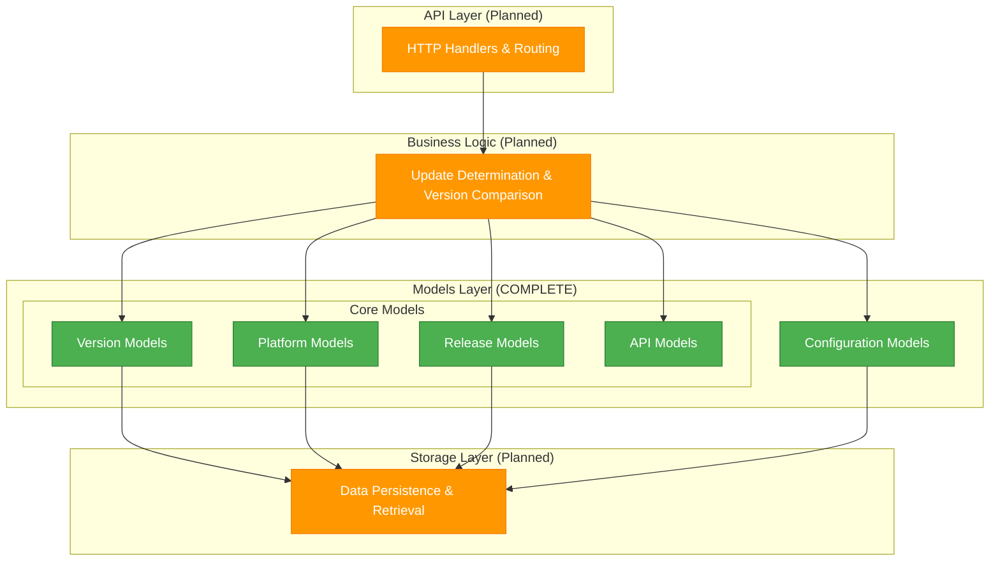

# Updater Service Documentation

Welcome to the comprehensive documentation for the Updater Service, a Go-based software update service designed to be queried by desktop applications for checking and downloading updates.

## Overview

The updater service acts as a metadata provider, referencing externally hosted download files rather than hosting the files directly. This design allows for efficient distribution via CDNs while maintaining a lightweight, scalable update service.

### Key Features

- **Semantic Versioning Support**: Full semantic versioning compliance with flexible parsing
- **Multi-Platform Support**: Windows, Linux, macOS, Android, and iOS compatibility
- **Security First**: Strong cryptographic checksums and comprehensive validation
- **Performance Optimized**: Caching-friendly design with efficient querying
- **Developer Friendly**: Comprehensive API documentation and client libraries

## Quick Navigation

### [Architecture Documentation](ARCHITECTURE.md)
Complete system design, API specification, and architectural decisions. Start here for system overview and design rationale.

### [Models Documentation](models/index.md)
Comprehensive documentation of all data models, organized by component:

- **[Version Models](models/version-models.md)** - Semantic versioning and comparison logic
- **[Platform Models](models/platform-models.md)** - Multi-platform support and application configuration
- **[Release Models](models/release-models.md)** - Release management with security validation
- **[API Models](models/api-models.md)** - HTTP request/response contracts
- **[Configuration Models](models/config-models.md)** - Service configuration and deployment

## Getting Started

### For API Integration
1. Review the [Architecture Documentation](ARCHITECTURE.md) for system overview
2. Study [API Models](models/api-models.md) for request/response contracts
3. Implement [Version Models](models/version-models.md) comparison logic
4. Handle [Platform Models](models/platform-models.md) compatibility

### For Service Deployment
1. Start with [Configuration Models](models/config-models.md) for setup options
2. Understand [Release Models](models/release-models.md) for data management
3. Review security considerations across all components

### For Development
1. Follow the build instructions in the project README
2. Use the provided Makefile commands for development workflow
3. Refer to model documentation for implementation guidance

## Development Status

| Component | Implementation | Documentation | Tests |
|-----------|----------------|---------------|-------|
| Models Layer | Complete | Complete | Planned |
| API Layer | Planned | Complete | Planned |
| Storage Layer | Planned | Complete | Planned |
| Business Logic | Planned | Complete | Planned |

## Architecture Overview

## Core Principles

### Security First
- Strong cryptographic validation (SHA256 checksums)
- Comprehensive input validation and sanitization
- Safe defaults with security-conscious configuration
- Privacy-first approach (analytics disabled by default)

### Performance & Scalability
- Memory-efficient struct design and field ordering
- Caching-friendly response structures
- Pagination support for large datasets
- Minimal external dependencies

### Developer Experience
- Clear error messages with actionable feedback
- Consistent naming following Go conventions
- Comprehensive examples and usage patterns
- Type safety to prevent runtime errors

### Extensibility
- Forward-compatible API design
- Extensible metadata systems
- Plugin-like configuration architecture
- Support for future enhancements

## API Endpoints

The service provides RESTful API endpoints for update management:

- `GET /api/v1/updates/{app_id}/check` - Check for available updates
- `GET /api/v1/updates/{app_id}/latest` - Get latest version information
- `GET /api/v1/updates/{app_id}/releases` - List all releases with filtering
- `POST /api/v1/updates/{app_id}/register` - Register new release (admin)

Detailed API documentation is available in the [Architecture Documentation](ARCHITECTURE.md).

## Configuration

The service supports flexible configuration for different deployment scenarios:

- **Development**: JSON file storage, permissive settings, debug logging
- **Production**: Database storage, security hardening, structured logging
- **Container**: Environment variable configuration, health checks

Full configuration options are documented in [Configuration Models](models/config-models.md).

## Support and Contributing

### Development Workflow
- Use provided Makefile commands for common tasks
- Follow Go conventions and security best practices
- Write comprehensive tests for all new functionality
- Update documentation for any changes

### Documentation Standards
- Include design rationale for major decisions
- Provide practical usage examples
- Document security considerations
- Explain performance implications

For more detailed development guidance, see the project's CLAUDE.md file and individual model documentation.