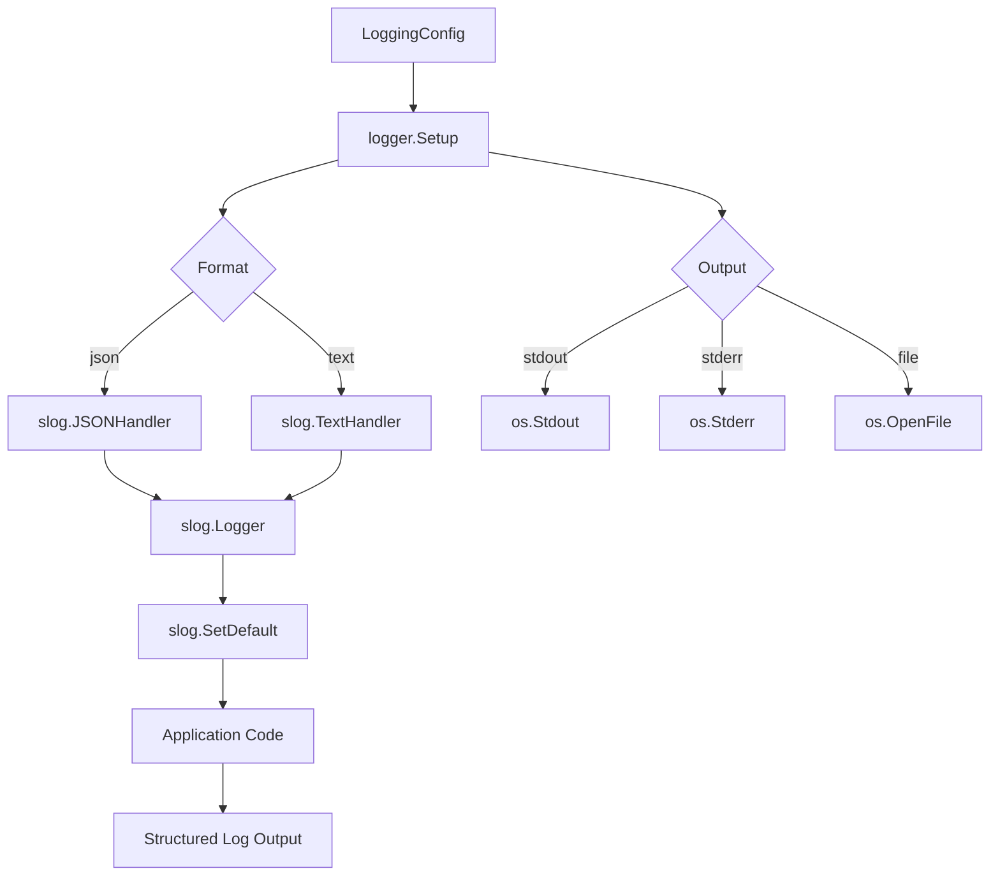
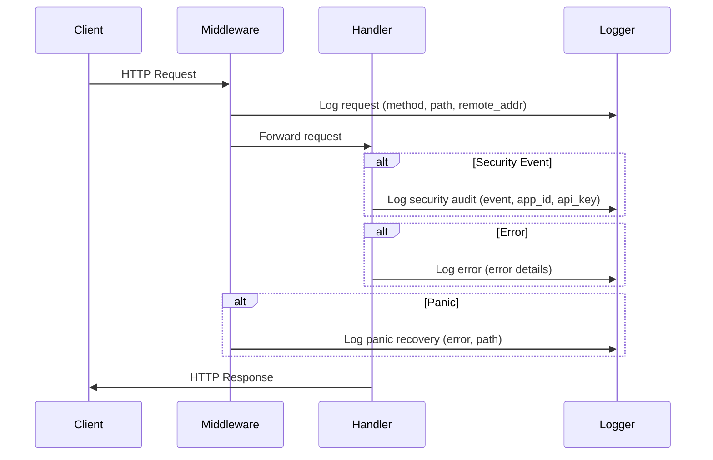

# Logging

The updater service uses Go's built-in `log/slog` package for structured logging throughout the application. This provides consistent, machine-parseable log output suitable for production environments.

## Architecture



## Configuration

Logging is configured through the `logging` section of the service configuration file.

### Configuration Fields

| Field | Type | Default | Description |
|-------|------|---------|-------------|
| `level` | string | `info` | Minimum log level to output |
| `format` | string | `json` | Output format (`json` or `text`) |
| `output` | string | `stdout` | Output destination (`stdout`, `stderr`, or `file`) |
| `file_path` | string | | File path when output is `file` |
| `max_size` | int | `100` | Maximum log file size in MB (for rotation) |
| `max_backups` | int | `3` | Maximum number of old log files to retain |
| `max_age` | int | `28` | Maximum days to retain old log files |
| `compress` | bool | `true` | Compress rotated log files |

### Example Configuration

```yaml
logging:
  level: info
  format: json
  output: stdout
```

```yaml
logging:
  level: debug
  format: text
  output: file
  file_path: /var/log/updater/service.log
  max_size: 100
  max_backups: 5
  max_age: 30
  compress: true
```

## Log Levels

| Level | Description | Use Case |
|-------|-------------|----------|
| `debug` | Detailed diagnostic information | Development and troubleshooting |
| `info` | General operational events | Normal operation monitoring |
| `warn` | Warning conditions | Security audit events, degraded operation |
| `error` | Error conditions | Failed operations, system errors |

## Structured Fields

All log messages include structured key-value pairs for consistent parsing and filtering.

### HTTP Request Logging

Every HTTP request is logged with the following fields:

| Field | Description |
|-------|-------------|
| `method` | HTTP method (GET, POST, etc.) |
| `path` | Request URL path |
| `remote_addr` | Client IP address |

### Security Audit Logging

Security-sensitive operations include the `event` field set to `security_audit`:

| Field | Description |
|-------|-------------|
| `event` | Always `security_audit` for security events |
| `app_id` | Application identifier |
| `api_key` | Name of the API key used |
| `client_ip` | Client IP address |
| `version` | Release version (when applicable) |
| `error` | Error details (when applicable) |

### Error Logging

Error logs include contextual information:

| Field | Description |
|-------|-------------|
| `error` | Error message or object |
| `path` | Request path (for panic recovery) |

## Output Formats

### JSON Format

Produces machine-parseable JSON output, suitable for log aggregation systems (ELK, Datadog, CloudWatch):

```json
{"time":"2026-02-15T10:30:00Z","level":"INFO","msg":"HTTP request","method":"GET","path":"/api/v1/updates/myapp/check","remote_addr":"192.168.1.1:54321"}
```

### Text Format

Produces human-readable text output, suitable for development:

```
time=2026-02-15T10:30:00Z level=INFO msg="HTTP request" method=GET path=/api/v1/updates/myapp/check remote_addr=192.168.1.1:54321
```

## Request Flow



## File Output

When using file output, log files are created with restricted permissions (`0600`) to prevent unauthorized access. The file is opened in append mode, preserving existing log entries across service restarts.

## Integration with Monitoring

The structured JSON output integrates directly with common log aggregation and monitoring tools:

- **ELK Stack**: Parse JSON logs directly with Filebeat/Logstash
- **Datadog**: Use JSON log format with automatic field extraction
- **CloudWatch**: JSON structured logs enable CloudWatch Insights queries
- **Grafana Loki**: Use JSON parser for label extraction
