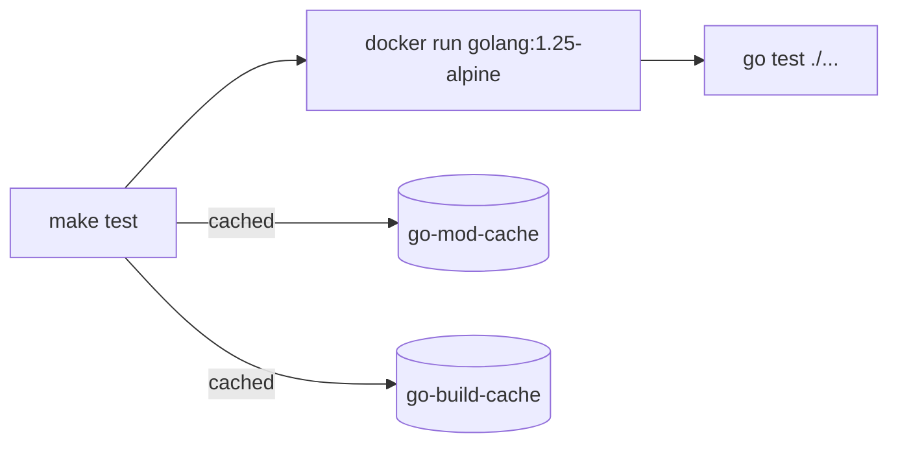

# Makefile

The project uses a split Makefile structure with Docker-first execution. Only Docker is required on the host -- no local Go, sqlc, or other tooling needed.

## Structure

```
Makefile              -- Shared variables, includes, auto-documenting help
make/
  go.mk              -- Go development (build, test, fmt, vet, clean, tidy, check)
  docs.mk            -- Documentation (docs-serve, docs-build, docs-clean)
  docker.mk          -- Docker operations (docker-build, docker-run, docker-dev, etc.)
  db.mk              -- Database (sqlc-generate, sqlc-vet)
```

The root `Makefile` includes all `make/*.mk` files automatically. To add a new category, create a new `.mk` file in `make/` -- no changes to the root Makefile needed.

## Docker-first Execution

All Go and database targets run inside Docker containers:



| Category | Container Image |
|----------|----------------|
| Go development | `golang:1.25-alpine` |
| Documentation | `squidfunk/mkdocs-material:latest` |
| Database (sqlc) | `sqlc/sqlc:latest` |
| Docker operations | Host Docker daemon |

## Prerequisites

- **Docker** -- the only local requirement
- **GNU Make** -- included with most systems (on Windows, use Git for Windows which provides `make` and `sh`)

## Caching

Two named Docker volumes persist caches between runs:

| Volume | Purpose |
|--------|---------|
| `updater-go-mod-cache` | Go module downloads |
| `updater-go-build-cache` | Go build cache |

To clear caches (e.g., after a Go version bump):

```bash
docker volume rm updater-go-mod-cache updater-go-build-cache
```

## Adding a New Target

1. Open the appropriate `make/*.mk` file (or create a new one for a new category)
2. Add a category header if creating a new file: `##@ Category Name`
3. Add the target with a `## Description` annotation:

```makefile
new-target: ## Description of what this target does
	command to run
```

4. The target automatically appears in `make help` output

## Available Targets

Run `make help` to see all available targets with descriptions.
