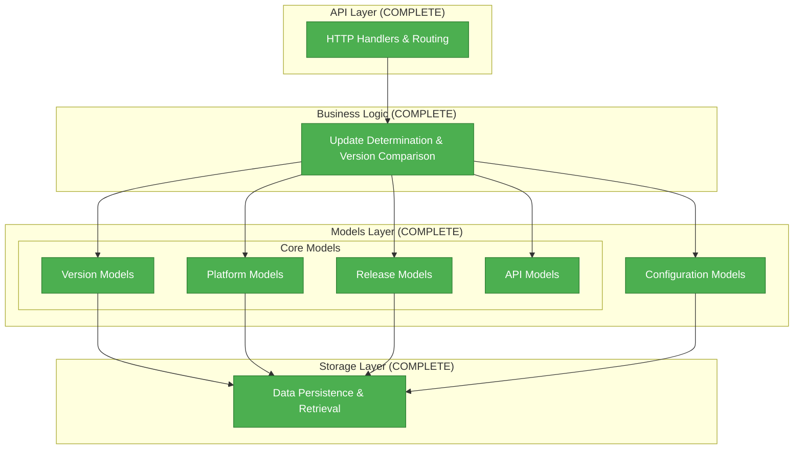

# Models Documentation Index

The updater service models provide a comprehensive type system for managing software updates, version control, and service configuration. This documentation is organized into focused components for easy navigation and understanding.

## Documentation Structure

### [Version Models](./version-models.md)
**Purpose:** Semantic versioning implementation and version comparison logic
**Content:** Version parsing, comparison operations, constraint checking
**Key Components:** `Version` struct, `VersionConstraint`, comparison methods
**Use Cases:** Update availability determination, compatibility checking

### [Platform & Application Models](./platform-models.md)
**Purpose:** Platform support, application metadata, and configuration management
**Content:** Platform/architecture constants, application settings, configuration schemas
**Key Components:** `Application` struct, `ApplicationConfig`, platform constants
**Use Cases:** Multi-platform support, application registration, update policies

### [Release Models](./release-models.md)
**Purpose:** Software release management with security and integrity verification
**Content:** Release metadata, checksum validation, filtering capabilities
**Key Components:** `Release` struct, `ReleaseFilter`, security validation
**Use Cases:** Release registration, integrity verification, release queries

### [API Models](./api-models.md)
**Purpose:** HTTP API request/response contracts and validation
**Content:** Request/response structures, error handling, validation strategies
**Key Components:** Request types, response types, error responses, validation
**Use Cases:** API endpoint implementation, client integration, error handling

### [Configuration Models](./config-models.md)
**Purpose:** Service configuration and operational settings
**Content:** Configuration structures, validation, defaults, deployment scenarios
**Key Components:** `Config` struct, component configurations, validation methods
**Use Cases:** Service deployment, environment configuration, operational tuning

## Quick Start Guide

### For API Integration
1. Start with [API Models](./api-models.md) for request/response contracts
2. Review [Version Models](./version-models.md) for version comparison logic
3. Check [Platform Models](./platform-models.md) for supported platforms

### For Service Deployment
1. Begin with [Configuration Models](./config-models.md) for setup
2. Understand [Release Models](./release-models.md) for data management
3. Review security considerations across all components

### For Client Development
1. Study [API Models](./api-models.md) for integration patterns
2. Implement [Version Models](./version-models.md) comparison logic
3. Handle [Platform Models](./platform-models.md) compatibility

## Architecture Overview

## Design Principles

### Security First
- Strong cryptographic validation (SHA256 checksums)
- Comprehensive input validation and sanitization
- Safe defaults with security-conscious configuration
- Privacy-first approach (analytics disabled by default)

### Developer Experience
- Clear error messages with actionable feedback
- Consistent naming following Go conventions
- Comprehensive examples and usage patterns
- Type safety to prevent runtime errors

### Performance & Scalability
- Memory-efficient struct design and field ordering
- Caching-friendly response structures
- Pagination support for large datasets
- Minimal external dependencies

### Extensibility
- Forward-compatible API design
- Extensible metadata systems
- Plugin-like configuration architecture
- Support for future enhancements

## Implementation Status

| Component | Status | Documentation | Tests | Notes |
|-----------|--------|---------------|-------|-------|
| Version Models | Complete | Complete | Complete | Semantic versioning support |
| Platform Models | Complete | Complete | Complete | Multi-platform support |
| Release Models | Complete | Complete | Complete | Security & integrity |
| API Models | Complete | Complete | Complete | Request/response contracts |
| Config Models | Complete | Complete | Complete | Service configuration |

## Related Documentation

- [Architecture Overview](../ARCHITECTURE.md) - Complete system design and API specification
- [Storage Providers](../storage.md) - Storage backend implementations and configuration
- [Security](../SECURITY.md) - Security architecture and threat mitigation
- [Observability](../observability.md) - Metrics, tracing, and monitoring
- [Logging](../logging.md) - Structured logging configuration

## Development Workflow

### Adding New Models
1. Implement the Go struct in appropriate `internal/models/*.go` file
2. Add comprehensive inline documentation
3. Include validation methods and business logic
4. Update relevant documentation file in `docs/models/`
5. Add usage examples and integration patterns
6. Write unit tests (following IMPORTANT guidelines)

### Modifying Existing Models
1. Ensure backward compatibility for API changes
2. Update inline documentation in Go files
3. Refresh relevant documentation file
4. Update examples if behavior changes
5. Add migration notes if breaking changes are unavoidable

### Documentation Standards
- Include design rationale for major decisions
- Provide practical usage examples
- Document security considerations
- Explain performance implications
- Cover common troubleshooting scenarios

---

**Tip:** Each documentation file is self-contained but cross-references related components. Start with the component most relevant to your use case, then explore related areas as needed.