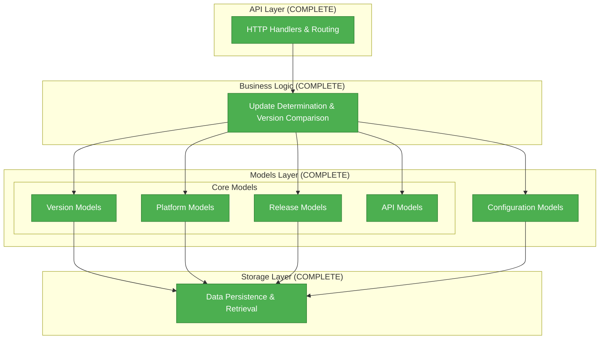

# Models Documentation Index

The updater service models provide a comprehensive type system for managing software updates, version control, and service configuration. This documentation is organized into focused components for easy navigation and understanding.

## Model Reference

The complete type reference for `internal/models` is auto-generated from Go doc
comments and always reflects the current code:

**[Model Reference (auto-generated)](./auto/models.md)**

Key types:

| Type | Description |
|------|-------------|
| `Application` | Application metadata, platform support, configuration |
| `ApplicationConfig` | Per-application update policy settings |
| `Release` | Release metadata, checksum validation, filtering |
| `ReleaseFilter` | Criteria for filtering release queries |
| `APIKey` | Storage-backed API key with permission checking |
| `Config` | Root service configuration with all sub-configs |
| `SecurityConfig` | Auth settings: bootstrap key, rate limiting, trusted proxies |
| `RateLimitConfig` | Two-tier token-bucket rate limiting (anonymous + authenticated) |
| Request types | `CheckUpdateRequest`, `RegisterReleaseRequest`, `CreateApplicationRequest`, etc. |
| Response types | `UpdateCheckResponse`, `LatestVersionResponse`, `HealthResponse`, etc. |

## Quick Start Guide

### For API Integration
1. Start with the [Model Reference](./auto/models.md) for request/response contracts
2. Review the `UpdateCheckRequest`, `RegisterReleaseRequest` types
3. Check platform and architecture constants in the reference

### For Service Deployment
1. Read the `Config`, `SecurityConfig`, and `RateLimitConfig` sections in the reference
2. See [Security](../SECURITY.md) for the API key management workflow

### For Client Development
1. Study request/response types in the [Model Reference](./auto/models.md)
2. Use the `Version` semver comparison helpers for local update checks

## Architecture Overview

## Design Principles

### Security First
- Strong cryptographic validation (SHA256 checksums)
- Comprehensive input validation and sanitization
- Safe defaults with security-conscious configuration
- Privacy-first approach (analytics disabled by default)

### Developer Experience
- Clear error messages with actionable feedback
- Consistent naming following Go conventions
- Comprehensive examples and usage patterns
- Type safety to prevent runtime errors

### Performance & Scalability
- Memory-efficient struct design and field ordering
- Caching-friendly response structures
- Pagination support for large datasets
- Minimal external dependencies

### Extensibility
- Forward-compatible API design
- Extensible metadata systems
- Plugin-like configuration architecture
- Support for future enhancements

## Implementation Status

| Component | Status | Documentation | Tests | Notes |
|-----------|--------|---------------|-------|-------|
| Version Models | Complete | Auto-generated | Complete | Semantic versioning support |
| Platform Models | Complete | Auto-generated | Complete | Multi-platform support |
| Release Models | Complete | Auto-generated | Complete | Security & integrity |
| API Models | Complete | Auto-generated | Complete | Request/response contracts |
| Config Models | Complete | Auto-generated | Complete | Service configuration |
| API Key Models | Complete | Auto-generated | Complete | Storage-backed key management |

## Related Documentation

- [Architecture Overview](../ARCHITECTURE.md) - Complete system design and API specification
- [Storage Providers](../storage.md) - Storage backend implementations and configuration
- [Security](../SECURITY.md) - Security architecture and threat mitigation
- [Observability](../observability.md) - Metrics, tracing, and monitoring
- [Logging](../logging.md) - Structured logging configuration

## Development Workflow

### Adding New Models
1. Implement the Go struct in appropriate `internal/models/*.go` file
2. Add exported Go doc comments on the type and each exported field
3. Include validation methods and business logic
4. Update this `index.md` overview table with the new type
5. Run `make docs-generate` to regenerate `docs/models/auto/models.md`
6. Write unit tests

### Modifying Existing Models
1. Ensure backward compatibility for API changes
2. Update Go doc comments to reflect the change
3. Run `make docs-generate` to regenerate the reference

### Documentation Standards
- Write Go doc comments in the source files — the reference is auto-generated from them
- Include design rationale in the Overview section of this file, not in Go doc comments
- Document security considerations in [Security](../SECURITY.md)

---

**Tip:** Each documentation file is self-contained but cross-references related components. Start with the component most relevant to your use case, then explore related areas as needed.