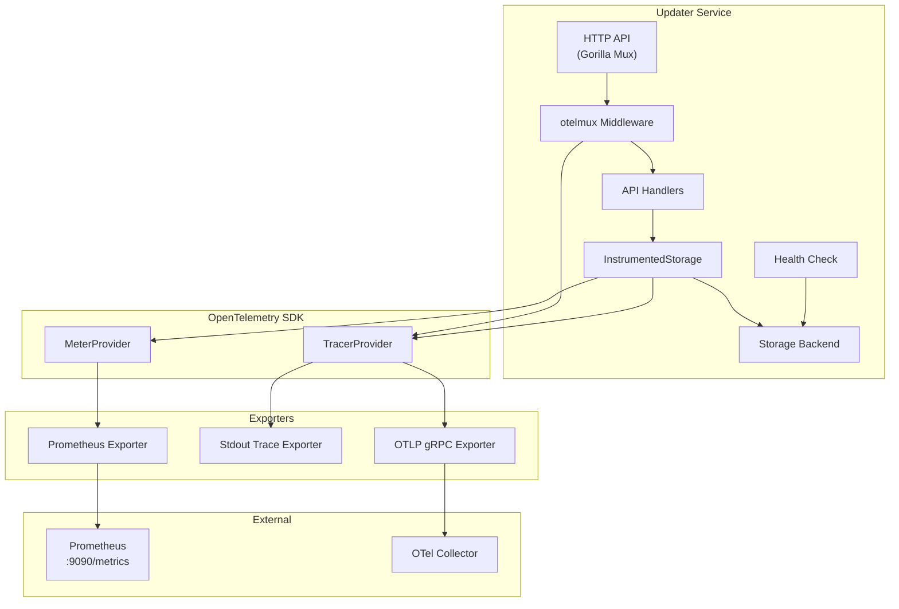
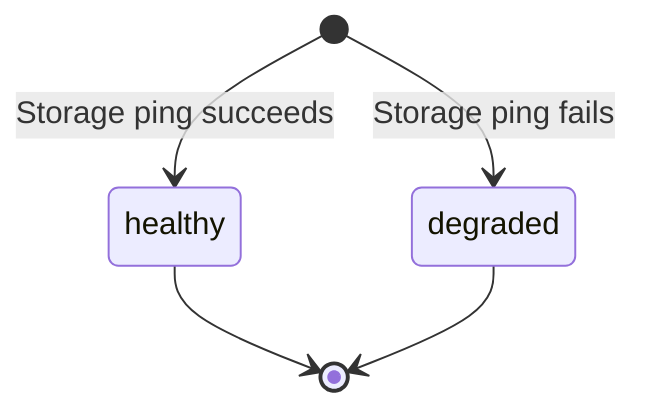
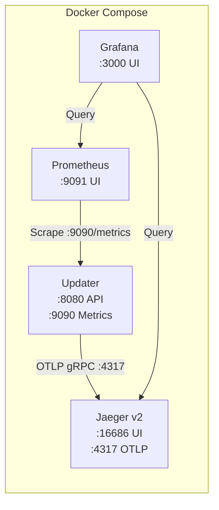

# Observability

The updater service provides a unified observability stack built on [OpenTelemetry](https://opentelemetry.io/), covering metrics collection, distributed tracing, and enhanced health checks with real storage connectivity verification.

## Architecture



## Configuration

Observability is configured through two sections in the configuration file: `metrics` and `observability`.

```yaml
metrics:
  enabled: true
  path: "/metrics"
  port: 9090

observability:
  service_name: "updater"
  service_version: "1.0.0"
  tracing:
    enabled: true
    exporter: "stdout"        # stdout | otlp
    sample_rate: 1.0
    otlp_endpoint: ""         # e.g., "localhost:4317"
```

### Configuration Reference

| Field | Type | Default | Description |
|-------|------|---------|-------------|
| `metrics.enabled` | bool | `true` | Enable Prometheus metrics collection |
| `metrics.path` | string | `/metrics` | HTTP path for Prometheus scraping |
| `metrics.port` | int | `9090` | Port for the metrics HTTP server |
| `observability.service_name` | string | `updater` | OpenTelemetry service name resource attribute |
| `observability.service_version` | string | `1.0.0` | OpenTelemetry service version resource attribute |
| `observability.tracing.enabled` | bool | `false` | Enable distributed tracing |
| `observability.tracing.exporter` | string | `stdout` | Trace exporter type: `stdout` or `otlp` |
| `observability.tracing.sample_rate` | float | `1.0` | Sampling rate (0.0 to 1.0) |
| `observability.tracing.otlp_endpoint` | string | `""` | OTLP gRPC collector endpoint (required when exporter is `otlp`) |

### Backward Compatibility

If the `observability` section is absent from the configuration, tracing defaults to disabled. Metrics configuration is unchanged from previous versions.

## Metrics

When metrics are enabled, the service starts a separate HTTP server on the configured port (default 9090) that serves Prometheus-format metrics.

### Available Metrics

#### HTTP Metrics (via otelmux)

Automatically collected for all API requests (excluding `/health` and `/metrics`):

- `http.server.request.duration` - Request duration histogram
- `http.server.active_requests` - Currently active requests gauge

#### Storage Metrics (via InstrumentedStorage)

Collected for every storage operation:

- `storage.operation.duration` - Operation duration histogram (seconds), labeled by `operation`
- `storage.operation.errors` - Error counter, labeled by `operation`

Storage operation labels include: `Applications`, `GetApplication`, `SaveApplication`, `Releases`, `GetRelease`, `SaveRelease`, `DeleteRelease`, `GetLatestRelease`, `GetReleasesAfterVersion`, `Ping`.

### Scraping

Configure Prometheus to scrape the metrics endpoint:

```yaml
scrape_configs:
  - job_name: 'updater'
    scrape_interval: 15s
    static_configs:
      - targets: ['localhost:9090']
```

## Tracing

When tracing is enabled, the service creates trace spans for:

1. **HTTP requests** -- Automatic spans via `otelmux` middleware for all API routes (health and metrics endpoints are filtered out)
2. **Storage operations** -- Spans for every storage method call via `InstrumentedStorage`, including attributes like `app_id`, `version`, `platform`, and `arch`

### Exporters

#### stdout

Prints trace spans to stdout in a human-readable format. Useful for development and debugging.

```yaml
observability:
  tracing:
    enabled: true
    exporter: "stdout"
```

#### OTLP gRPC

Exports traces to an OpenTelemetry Collector via gRPC. Use this for production deployments.

```yaml
observability:
  tracing:
    enabled: true
    exporter: "otlp"
    otlp_endpoint: "otel-collector:4317"
```

### Sampling

The `sample_rate` controls what fraction of traces are recorded:

- `1.0` -- Sample all traces (development)
- `0.1` -- Sample 10% of traces (production)
- `0.0` -- Disable sampling (no traces recorded)

## Health Checks

The `/health` endpoint performs real storage connectivity verification by calling `Ping()` on the storage backend.

### Storage Ping Behavior

| Storage Type | Ping Implementation |
|-------------|-------------------|
| Memory | Always returns nil (in-process) |
| JSON | Always returns nil (file verified at init) |
| PostgreSQL | Executes `db.PingContext()` on the connection pool |
| SQLite | Executes `db.PingContext()` on the database connection |

### Response States



- **healthy** -- All components operational, storage ping succeeded
- **degraded** -- API is operational but storage ping failed; the storage component is reported as `unhealthy`

### Example Response (healthy)

```json
{
  "status": "healthy",
  "timestamp": "2026-02-15T10:30:00Z",
  "version": "1.0.0",
  "components": {
    "storage": {
      "status": "healthy",
      "message": "Storage is operational",
      "timestamp": "2026-02-15T10:30:00Z"
    },
    "api": {
      "status": "healthy",
      "message": "API is operational",
      "timestamp": "2026-02-15T10:30:00Z"
    }
  }
}
```

### Example Response (degraded)

```json
{
  "status": "degraded",
  "timestamp": "2026-02-15T10:30:00Z",
  "version": "1.0.0",
  "components": {
    "storage": {
      "status": "unhealthy",
      "message": "Storage ping failed: connection refused",
      "timestamp": "2026-02-15T10:30:00Z"
    },
    "api": {
      "status": "healthy",
      "message": "API is operational",
      "timestamp": "2026-02-15T10:30:00Z"
    }
  }
}
```

## Local Development Stack

A Docker Compose-based observability stack is available for local development. It runs Jaeger, Prometheus, and Grafana alongside the updater service, providing trace visualization, metrics scraping, and dashboards without any external dependencies.

### Quick Start

```bash
make docker-obs-up
```

This starts all four services:

| Service | URL | Purpose |
|---------|-----|---------|
| Updater | `http://localhost:8080` | The update service API |
| Updater Metrics | `http://localhost:9090/metrics` | Prometheus-format metrics endpoint |
| Jaeger UI | `http://localhost:16686` | Trace visualization |
| Prometheus | `http://localhost:9091` | Metrics querying and scrape status |
| Grafana | `http://localhost:3000` | Dashboards (no login required) |

To stop the stack:

```bash
make docker-obs-down
```

### Architecture



The updater sends traces directly to Jaeger v2 via OTLP gRPC (no separate OpenTelemetry Collector required). Prometheus scrapes the updater's metrics endpoint every 15 seconds. Grafana is pre-configured with both Prometheus and Jaeger as datasources.

### Configuration

The observability stack uses `configs/dev-observability.yaml`, which configures:

- **Storage**: In-memory (no file or database dependencies)
- **Auth**: Disabled (simplifies local development)
- **Metrics**: Enabled on port 9090
- **Tracing**: OTLP exporter pointing to `jaeger:4317` with 100% sampling
- **Logging**: Debug level, text format

### Verifying Traces

1. Start the stack with `make docker-obs-up`
2. Send a request to the API:

    ```bash
    curl "http://localhost:8080/api/v1/updates/test-app/check?current_version=1.0.0&platform=windows&architecture=amd64"
    ```

3. Open the Jaeger UI at `http://localhost:16686`
4. Select the `updater` service and click **Find Traces**
5. Trace spans for the HTTP request and storage operations are visible

### Verifying Metrics

1. Open Prometheus at `http://localhost:9091`
2. Navigate to **Status > Targets** to confirm the updater target is in the `UP` state
3. Query metrics such as `storage_operation_duration_seconds_bucket` or `http_server_request_duration_seconds_bucket`

### Files

```
docker-compose.observability.yml           # Compose override (layered on docker-compose.yml)
configs/dev-observability.yaml             # Updater config with OTLP tracing
docker/prometheus/prometheus.yml           # Prometheus scrape configuration
docker/grafana/provisioning/
    datasources/datasources.yml            # Auto-provisioned Grafana datasources
```

## Package Structure

```
internal/observability/
    observability.go       # SDK setup: TracerProvider, MeterProvider, shutdown
    metrics.go             # Prometheus HTTP server on metrics port
    storage.go             # InstrumentedStorage wrapper with tracing and metrics
    observability_test.go  # Tests for SDK setup and shutdown
    metrics_test.go        # Tests for metrics server
    storage_test.go        # Tests for instrumented storage
```

## Graceful Shutdown

On application shutdown, the observability stack is cleaned up in order:

1. Metrics server is shut down (stops accepting scrape requests)
2. Main HTTP server is shut down (finishes in-flight requests)
3. OpenTelemetry providers are shut down (flushes pending spans and metrics)
4. Storage is closed

This ensures all telemetry data from in-flight requests is exported before the providers are destroyed.
