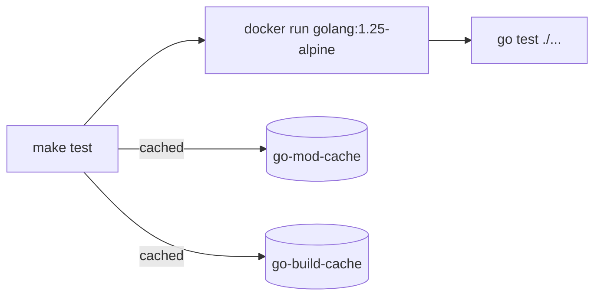

# Makefile Restructure Implementation Plan

> **For Claude:** REQUIRED SUB-SKILL: Use superpowers:executing-plans to implement this plan task-by-task.

**Goal:** Split the monolithic Makefile into category-based files under `make/`, transition all targets to Docker-first execution, and add auto-documenting help.

**Architecture:** A slim root Makefile defines shared Docker variables and includes all `make/*.mk` files via wildcard. Each `.mk` file owns its category's `.PHONY` declarations and targets. A `grep`/`awk`-based help target auto-discovers target descriptions from `## comment` annotations.

**Tech Stack:** GNU Make, Docker (golang:1.25-alpine, sqlc/sqlc, squidfunk/mkdocs-material), POSIX shell

---

### Task 1: Create `make/` Directory and Root Makefile

**Files:**
- Create: `make/.gitkeep` (placeholder, removed after other files exist)
- Modify: `Makefile` (complete rewrite)

**Step 1: Create the `make/` directory**

Run: `mkdir -p make`

**Step 2: Rewrite the root Makefile**

Replace the entire contents of `Makefile` with:

```makefile
# Root Makefile - shared variables, includes, auto-documenting help
#
# All targets run inside Docker containers. Only Docker is required locally.
# See make/*.mk for target definitions.

# Guard: require Docker
DOCKER := $(shell command -v docker 2>/dev/null)
ifndef DOCKER
    $(error Docker is required but not found. Install Docker to use this Makefile)
endif

# Shared variables
APP_NAME   := updater
BIN_DIR    := bin
GO_IMAGE   := golang:1.25-alpine
GO_MOD_CACHE   := $(APP_NAME)-go-mod-cache
GO_BUILD_CACHE := $(APP_NAME)-go-build-cache
GO_DOCKER  := docker run --rm \
    -v "$(CURDIR):/app" \
    -v "$(GO_MOD_CACHE):/go/pkg/mod" \
    -v "$(GO_BUILD_CACHE):/root/.cache/go-build" \
    -w /app \
    -e CGO_ENABLED=0 \
    $(GO_IMAGE)

# Include all category makefiles
include make/*.mk

# Default target
.DEFAULT_GOAL := help

.PHONY: help
help: ## Show this help
	@echo "Usage: make <target>"
	@echo ""
	@awk '/^##@/ {printf "\n\033[1m%s\033[0m\n", substr($$0, 5)}' $(MAKEFILE_LIST)
	@awk '/^[a-zA-Z_-]+:.*##/ {printf "  \033[36m%-18s\033[0m %s\n", $$1, substr($$0, index($$0, "##") + 3)}' $(MAKEFILE_LIST)
```

**Step 3: Verify the Makefile parses without errors**

Run: `make --dry-run help`
Expected: May warn about missing includes (no `.mk` files yet), but no syntax errors.

**Step 4: Commit**

```bash
git add Makefile
git commit -m "refactor: rewrite root Makefile as slim orchestrator with Docker variables"
```

---

### Task 2: Create `make/go.mk` with Docker-first Go Targets

**Files:**
- Create: `make/go.mk`

**Step 1: Create `make/go.mk`**

```makefile
##@ Go Development

.PHONY: build run test fmt vet clean tidy check

build: ## Build the application to bin/updater
	$(GO_DOCKER) go build -o $(BIN_DIR)/$(APP_NAME) ./cmd/$(APP_NAME)

run: ## Run the application
	$(GO_DOCKER) go run ./cmd/$(APP_NAME)

test: ## Run tests
	$(GO_DOCKER) go test ./...

fmt: ## Format code
	$(GO_DOCKER) go fmt ./...

vet: ## Vet code for issues
	$(GO_DOCKER) go vet ./...

clean: ## Clean build artifacts
	rm -rf $(BIN_DIR)

tidy: ## Tidy dependencies
	$(GO_DOCKER) go mod tidy

check: fmt vet test ## Run format, vet, and test
```

**Step 2: Verify targets are discovered**

Run: `make help`
Expected: "Go Development" header with all targets listed.

**Step 3: Run a target to verify Docker execution**

Run: `make vet`
Expected: Docker pulls `golang:1.25-alpine` (first time), runs `go vet ./...`, exits 0.

**Step 4: Commit**

```bash
git add make/go.mk
git commit -m "refactor: add Docker-first Go targets in make/go.mk"
```

---

### Task 3: Create `make/docs.mk` with Documentation Targets

**Files:**
- Create: `make/docs.mk`

**Step 1: Create `make/docs.mk`**

```makefile
##@ Documentation

.PHONY: docs-serve docs-build docs-clean

docs-serve: ## Start MkDocs development server (http://localhost:8000)
	@echo "Starting MkDocs development server with Docker..."
	docker run --rm -it -p 8000:8000 -v "$(CURDIR):/docs" squidfunk/mkdocs-material:latest

docs-build: ## Build documentation site
	@echo "Building documentation site with Docker..."
	docker run --rm -v "$(CURDIR):/docs" squidfunk/mkdocs-material:latest build

docs-clean: ## Clean documentation build artifacts
	@echo "Cleaning documentation build artifacts..."
	rm -rf site
```

**Step 2: Verify targets appear in help**

Run: `make help`
Expected: "Documentation" header with three targets listed.

**Step 3: Commit**

```bash
git add make/docs.mk
git commit -m "refactor: move documentation targets to make/docs.mk"
```

---

### Task 4: Create `make/docker.mk` with Docker Operations Targets

**Files:**
- Create: `make/docker.mk`

**Step 1: Create `make/docker.mk`**

```makefile
##@ Docker Operations

.PHONY: docker-build docker-scan docker-run docker-dev docker-prod \
    docker-obs-up docker-obs-down docker-clean docker-push

docker-build: ## Build secure Docker image
	@echo "Building secure Docker image..."
	./scripts/docker-build.sh

docker-scan: ## Scan Docker image for vulnerabilities
	@echo "Scanning Docker image for vulnerabilities..."
	./scripts/docker-build.sh --scan

docker-run: ## Run container with security defaults
	@echo "Running Docker container with security defaults..."
	docker run --rm -p 8080:8080 \
		--read-only \
		--tmpfs /tmp:noexec,nosuid,size=10m \
		--cap-drop=ALL \
		--security-opt=no-new-privileges:true \
		-e UPDATER_CONFIG_SECTION=development \
		localhost/$(APP_NAME):latest

docker-dev: ## Start development environment with Docker Compose
	@echo "Starting development environment..."
	docker-compose up -d
	@echo "Service available at http://localhost:8080"
	@echo "View logs: docker-compose logs -f"
	@echo "Stop: docker-compose down"

docker-prod: ## Run with production configuration (for testing)
	@echo "Running container with production configuration..."
	@echo "Note: This is for testing production config locally"
	docker run -d --name $(APP_NAME)-prod-test -p 8080:8080 \
		--restart=unless-stopped \
		--read-only \
		--tmpfs /tmp:noexec,nosuid,nodev,size=5m \
		--tmpfs /app/data:noexec,nosuid,size=50m \
		--cap-drop=ALL \
		--security-opt=no-new-privileges:true \
		--memory=256m --cpus="1.0" \
		-e UPDATER_CONFIG_SECTION=production \
		--env-file=.env.example \
		localhost/$(APP_NAME):latest
	@echo "Production test container started"
	@echo "View logs: docker logs -f $(APP_NAME)-prod-test"
	@echo "Stop: docker stop $(APP_NAME)-prod-test && docker rm $(APP_NAME)-prod-test"

docker-obs-up: ## Start observability stack
	@echo "Starting observability stack..."
	docker compose -f docker-compose.yml -f docker-compose.observability.yml up -d
	@echo "Services:"
	@echo "  Updater:    http://localhost:8080"
	@echo "  Metrics:    http://localhost:9090/metrics"
	@echo "  Jaeger UI:  http://localhost:16686"
	@echo "  Prometheus: http://localhost:9091"
	@echo "  Grafana:    http://localhost:3000"

docker-obs-down: ## Stop observability stack
	docker compose -f docker-compose.yml -f docker-compose.observability.yml down

docker-clean: ## Clean Docker artifacts
	@echo "Cleaning Docker artifacts..."
	docker system prune -f
	docker image prune -f

docker-push: ## Build and push Docker image to registry
	@echo "Building and pushing Docker image to registry..."
	./scripts/docker-build.sh --push
```

**Step 2: Verify targets appear in help**

Run: `make help`
Expected: "Docker Operations" header with all nine targets listed.

**Step 3: Commit**

```bash
git add make/docker.mk
git commit -m "refactor: move Docker operations targets to make/docker.mk"
```

---

### Task 5: Create `make/db.mk` with Docker-first Database Targets

**Files:**
- Create: `make/db.mk`

**Step 1: Create `make/db.mk`**

```makefile
##@ Database

SQLC_IMAGE := sqlc/sqlc:latest

.PHONY: sqlc-generate sqlc-vet

sqlc-generate: ## Generate Go code from SQL schemas
	@echo "Generating Go code from SQL schemas..."
	docker run --rm -v "$(CURDIR):/src" -w /src $(SQLC_IMAGE) generate

sqlc-vet: ## Validate SQL schemas and queries
	@echo "Validating SQL schemas and queries..."
	docker run --rm -v "$(CURDIR):/src" -w /src $(SQLC_IMAGE) vet
```

**Step 2: Verify targets appear in help**

Run: `make help`
Expected: "Database" header with two targets listed.

**Step 3: Commit**

```bash
git add make/db.mk
git commit -m "refactor: move database targets to make/db.mk with Docker execution"
```

---

### Task 6: Full Verification

**Step 1: Run `make help` and verify all targets are listed**

Run: `make help`
Expected: All targets grouped under four category headers (Go Development, Documentation, Docker Operations, Database) plus help itself.

**Step 2: Run `make vet` to verify Docker-first Go targets work**

Run: `make vet`
Expected: Runs `go vet ./...` inside Docker container, exits 0.

**Step 3: Run `make test` to verify test execution in Docker**

Run: `make test`
Expected: Runs `go test ./...` inside Docker container, all tests pass.

**Step 4: Run `make test` a second time to verify caching**

Run: `make test`
Expected: Noticeably faster than first run (module and build caches warm).

**Step 5: Run `make build` to verify binary output**

Run: `make build && ls -la bin/updater`
Expected: Binary exists at `bin/updater`.

**Step 6: Commit (if any fixes were needed)**

```bash
git add -A
git commit -m "fix: address issues found during Makefile verification"
```

---

### Task 7: Write Documentation

**Files:**
- Create: `docs/makefile.md`
- Modify: `mkdocs.yml` (add nav entry)
- Modify: `CLAUDE.md` (update Development Commands section and Project Structure)

**Step 1: Create `docs/makefile.md`**

```markdown
# Makefile

The project uses a split Makefile structure with Docker-first execution. Only Docker is required on the host -- no local Go, sqlc, or other tooling needed.

## Structure

```
Makefile              -- Shared variables, includes, auto-documenting help
make/
  go.mk              -- Go development (build, test, fmt, vet, clean, tidy, check)
  docs.mk            -- Documentation (docs-serve, docs-build, docs-clean)
  docker.mk          -- Docker operations (docker-build, docker-run, docker-dev, etc.)
  db.mk              -- Database (sqlc-generate, sqlc-vet)
```

The root `Makefile` includes all `make/*.mk` files automatically. To add a new category, create a new `.mk` file in `make/` -- no changes to the root Makefile needed.

## Docker-first Execution

All Go and database targets run inside Docker containers:



| Category | Container Image |
|----------|----------------|
| Go development | `golang:1.25-alpine` |
| Documentation | `squidfunk/mkdocs-material:latest` |
| Database (sqlc) | `sqlc/sqlc:latest` |
| Docker operations | Host Docker daemon |

## Prerequisites

- **Docker** -- the only local requirement
- **GNU Make** -- included with most systems (on Windows, use Git for Windows which provides `make` and `sh`)

## Caching

Two named Docker volumes persist caches between runs:

| Volume | Purpose |
|--------|---------|
| `updater-go-mod-cache` | Go module downloads |
| `updater-go-build-cache` | Go build cache |

To clear caches (e.g., after a Go version bump):

```bash
docker volume rm updater-go-mod-cache updater-go-build-cache
```

## Adding a New Target

1. Open the appropriate `make/*.mk` file (or create a new one for a new category)
2. Add a category header if creating a new file: `##@ Category Name`
3. Add the target with a `## Description` annotation:

```makefile
new-target: ## Description of what this target does
	command to run
```

4. The target automatically appears in `make help` output

## Available Targets

Run `make help` to see all available targets with descriptions.
```

**Step 2: Add nav entry to `mkdocs.yml`**

Add `- Makefile: makefile.md` after the Observability entry in the nav section of `mkdocs.yml`.

**Step 3: Update CLAUDE.md**

Update the "Project Structure" section to include `make/` directory. Update the "Development Commands" section to note Docker-first execution and the `make/` structure. Update the Gotchas section to note Docker is the only local requirement.

**Step 4: Commit**

```bash
git add docs/makefile.md mkdocs.yml CLAUDE.md
git commit -m "docs: add Makefile documentation and update project references"
```

---

### Task 8: Final Review

**Step 1: Run full check**

Run: `make check`
Expected: `fmt`, `vet`, and `test` all pass inside Docker.

**Step 2: Verify help output is clean**

Run: `make help`
Expected: All targets listed under correct category headers, no duplicates, no stray output.

**Step 3: Verify old Makefile has no leftover targets**

Run: `grep -c '^[a-z]' Makefile`
Expected: Only `help` target defined in root Makefile (count = 1).

**Step 4: Verify docs build**

Run: `make docs-build`
Expected: MkDocs builds successfully, including the new `makefile.md` page.

**Step 5: Final commit if any fixes needed**

```bash
git add -A
git commit -m "fix: final adjustments from Makefile restructure review"
```