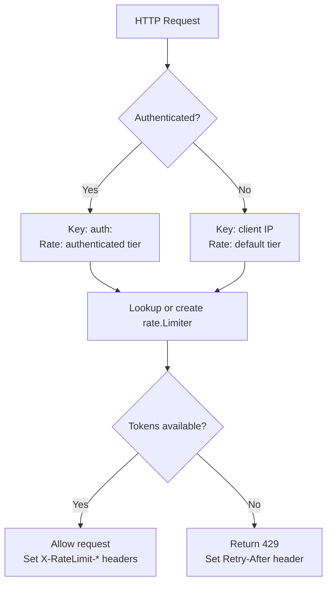

# Rate Limiter Overhaul

**Date**: 2026-02-15
**Status**: Approved

## Problem

The current rate limiter in `internal/api/routes.go` has several production-readiness issues:

- **Memory leak**: The `map[string]time.Time` grows unbounded. No cleanup of stale entries.
- **Incorrect algorithm**: Stores only the last request timestamp per IP. This enforces a minimum inter-request interval, not a rate limit. A client sending 1 request per second would be allowed at 60 rpm, but 2 rapid requests followed by 58 seconds of silence would be rejected on the second request despite being well under the limit.
- **Ignored config**: `BurstSize` and `RequestsPerHour` fields in `RateLimitConfig` are loaded and validated but never used.
- **No response headers**: Clients have no way to know their rate limit status or when to retry.
- **No auth-aware tiers**: All clients share the same limit regardless of authentication status.
- **Tightly coupled**: The implementation is an inline closure in `routes.go`, making it difficult to test or replace.

## Design

### Package Structure

```
internal/ratelimit/
  limiter.go          - Limiter interface and Info type
  memory.go           - MemoryLimiter backed by golang.org/x/time/rate
  memory_test.go      - Unit tests for MemoryLimiter
  middleware.go        - HTTP middleware using the Limiter interface
  middleware_test.go   - Middleware tests
```

### Interface

```go
// Limiter defines the rate limiting contract. Implementations must be
// safe for concurrent use.
type Limiter interface {
    // Allow checks whether a request identified by key should be allowed.
    // Returns whether the request is allowed and rate information for
    // response headers.
    Allow(key string) (allowed bool, info Info)

    // Close stops background goroutines and releases resources.
    Close()
}

// Info contains rate limit state for populating response headers.
type Info struct {
    Limit      int           // Maximum requests per window
    Remaining  int           // Approximate tokens remaining
    ResetAt    time.Time     // When the bucket will be full again
    RetryAfter time.Duration // How long to wait (meaningful only when denied)
}
```

### Keying Strategy

The middleware determines the rate limit key based on authentication context:

- **Anonymous requests**: keyed by client IP address (from `X-Forwarded-For`, `X-Real-IP`, or `RemoteAddr`)
- **Authenticated requests**: keyed by `auth:<key-name>` where `<key-name>` is the API key's configured name

This separation ensures that authenticated clients get their own bucket at the higher tier rate, independent of anonymous traffic from the same IP.

### Algorithm: Token Bucket via `golang.org/x/time/rate`

Each client key gets a `rate.Limiter` configured with:

- **Rate**: `rate.Every(time.Minute / requestsPerMinute)` -- one token added per interval
- **Burst**: `burstSize` -- maximum tokens the bucket can hold

The `MemoryLimiter` stores these in a `sync.Mutex`-guarded map. A background goroutine runs every `CleanupInterval` to evict entries that have not been accessed within 2x the cleanup interval.



### Two-Tier Configuration

```go
type RateLimitConfig struct {
    Enabled                        bool          `yaml:"enabled"`
    RequestsPerMinute              int           `yaml:"requests_per_minute"`
    BurstSize                      int           `yaml:"burst_size"`
    AuthenticatedRequestsPerMinute int           `yaml:"authenticated_requests_per_minute"`
    AuthenticatedBurstSize         int           `yaml:"authenticated_burst_size"`
    CleanupInterval                time.Duration `yaml:"cleanup_interval"`
}
```

Changes from the current config:

| Field | Before | After |
|-------|--------|-------|
| `RequestsPerMinute` | 60 (partially used) | 60 (fully enforced) |
| `BurstSize` | 10 (ignored) | 10 (enforced) |
| `RequestsPerHour` | 1000 (ignored) | Removed |
| `AuthenticatedRequestsPerMinute` | N/A | 120 (new) |
| `AuthenticatedBurstSize` | N/A | 20 (new) |
| `CleanupInterval` | 5m (ignored) | 5m (enforced) |

Default authenticated values are 2x the anonymous values. If set to 0, they default to 2x the anonymous values.

### Response Headers

Every response includes rate limit headers:

| Header | Description | Example |
|--------|-------------|---------|
| `X-RateLimit-Limit` | Requests per minute for this client | `60` |
| `X-RateLimit-Remaining` | Approximate tokens remaining | `42` |
| `X-RateLimit-Reset` | Unix timestamp when bucket is full | `1739664000` |

On 429 responses, an additional header is included:

| Header | Description | Example |
|--------|-------------|---------|
| `Retry-After` | Seconds until a token is available | `3` |

### Integration

1. **Remove** the inline `rateLimitMiddleware` from `internal/api/routes.go`
2. **Create** `MemoryLimiter` in `cmd/updater/updater.go` during server startup
3. **Pass** `ratelimit.Middleware(limiter)` as a `RouteOption` to `SetupRoutes`
4. **Defer** `limiter.Close()` in `main()` to stop the cleanup goroutine on shutdown
5. The middleware reads the `"api_key"` context value (set by `authMiddleware`) to determine which tier applies

### Middleware Order

The rate limiter middleware runs before authentication so that anonymous abuse is caught early. For authenticated requests that pass the rate check, the auth middleware runs next and sets the context value. On subsequent requests from the same authenticated client, the rate limiter middleware sees the auth context and applies the authenticated tier.

**Correction**: Since the rate limiter needs to know whether the request is authenticated to pick the right tier, it must run _after_ auth middleware. The middleware order is:

1. CORS
2. Logging
3. Recovery
4. Auth (optional, sets context)
5. Rate limiting (reads auth context, applies correct tier)

This matches the existing middleware order in `routes.go` where rate limiting already runs after CORS, logging, and recovery. The auth middleware for protected endpoints runs on subrouters, so the rate limiter on the main router will see unauthenticated requests. For the two-tier approach, the middleware will attempt to read auth context if present (via `OptionalAuth` or subrouter auth) and fall back to the anonymous tier.

## Dependencies

- `golang.org/x/time/rate` (new dependency)

## Files Modified

| File | Change |
|------|--------|
| `internal/ratelimit/limiter.go` | New: interface and types |
| `internal/ratelimit/memory.go` | New: MemoryLimiter implementation |
| `internal/ratelimit/memory_test.go` | New: unit tests |
| `internal/ratelimit/middleware.go` | New: HTTP middleware |
| `internal/ratelimit/middleware_test.go` | New: middleware tests |
| `internal/models/config.go` | Modified: update RateLimitConfig, defaults, validation |
| `internal/models/config_test.go` | Modified: update config tests |
| `internal/api/routes.go` | Modified: remove inline rateLimitMiddleware, add RouteOption |
| `internal/api/routes_test.go` | Modified: update route tests if affected |
| `cmd/updater/updater.go` | Modified: create limiter, pass to SetupRoutes, defer Close |
| `go.mod` / `go.sum` | Modified: add golang.org/x/time dependency |
| `docs/rate-limiting.md` | New: documentation page |
| `mkdocs.yml` | Modified: add rate limiting to nav |
