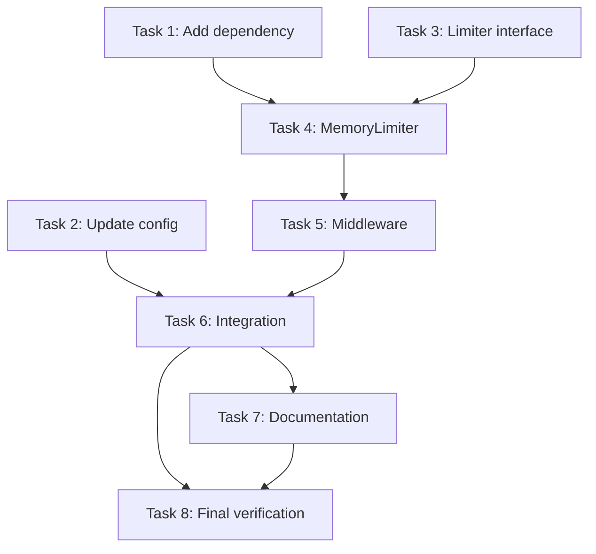

# Rate Limiter Overhaul Implementation Plan

> **For Claude:** REQUIRED SUB-SKILL: Use superpowers:executing-plans to implement this plan task-by-task.

**Goal:** Replace the broken in-memory rate limiter with a proper token-bucket implementation backed by `golang.org/x/time/rate`, with two-tier auth-aware limits, response headers, and stale entry cleanup.

**Architecture:** New `internal/ratelimit/` package with a `Limiter` interface and `MemoryLimiter` implementation. The middleware moves from an inline closure in `routes.go` to this package. The limiter is created in `main()` and injected via `RouteOption`.

**Tech Stack:** `golang.org/x/time/rate`, `gorilla/mux`, `net/http`, `sync`

**Design doc:** `docs/plans/2026-02-15-rate-limiter-design.md`

---

### Task 1: Add `golang.org/x/time` dependency

**Files:**
- Modify: `go.mod`

**Step 1: Add the dependency**

Run: `go get golang.org/x/time/rate`

**Step 2: Verify it was added**

Run: `go mod tidy`
Expected: `golang.org/x/time` appears in `go.mod` require block

**Step 3: Commit**

```bash
git add go.mod go.sum
git commit -m "chore: add golang.org/x/time dependency for rate limiting"
```

---

### Task 2: Update RateLimitConfig model

**Files:**
- Modify: `internal/models/config.go:103-109` (RateLimitConfig struct)
- Modify: `internal/models/config.go:211-217` (NewDefaultConfig rate limit section)
- Modify: `internal/models/config.go:350-361` (SecurityConfig.Validate rate limit validation)

**Step 1: Write the failing test**

Update `internal/models/config_test.go`. Find the `TestNewDefaultConfig` function and update the rate limit assertions. Find `TestRateLimitConfig_Structure` and update it. Add a test for the new authenticated fields.

In `TestNewDefaultConfig` (around line 39-42), the assertions currently check `RequestsPerHour`. Replace them:

```go
// Test security defaults
assert.Empty(t, config.Security.APIKeys)
assert.True(t, config.Security.RateLimit.Enabled)
assert.Equal(t, 60, config.Security.RateLimit.RequestsPerMinute)
assert.Equal(t, 10, config.Security.RateLimit.BurstSize)
assert.Equal(t, 120, config.Security.RateLimit.AuthenticatedRequestsPerMinute)
assert.Equal(t, 20, config.Security.RateLimit.AuthenticatedBurstSize)
assert.Equal(t, 5*time.Minute, config.Security.RateLimit.CleanupInterval)
assert.False(t, config.Security.EnableAuth)
```

In `TestRateLimitConfig_Structure` (around line 897-911), update to remove `RequestsPerHour` and add authenticated fields:

```go
func TestRateLimitConfig_Structure(t *testing.T) {
	rateLimitConfig := RateLimitConfig{
		Enabled:                        true,
		RequestsPerMinute:              120,
		BurstSize:                      20,
		AuthenticatedRequestsPerMinute: 240,
		AuthenticatedBurstSize:         40,
		CleanupInterval:                10 * time.Minute,
	}

	assert.True(t, rateLimitConfig.Enabled)
	assert.Equal(t, 120, rateLimitConfig.RequestsPerMinute)
	assert.Equal(t, 20, rateLimitConfig.BurstSize)
	assert.Equal(t, 240, rateLimitConfig.AuthenticatedRequestsPerMinute)
	assert.Equal(t, 40, rateLimitConfig.AuthenticatedBurstSize)
	assert.Equal(t, 10*time.Minute, rateLimitConfig.CleanupInterval)
}
```

In `TestSecurityConfig_Validate` (the table-driven test around line 355), update the "valid config with rate limiting" test case to remove `RequestsPerHour` and remove the "negative requests per hour" test case. Add test cases for negative authenticated values:

```go
{
	name: "valid config with rate limiting",
	config: SecurityConfig{
		RateLimit: RateLimitConfig{
			Enabled:                        true,
			RequestsPerMinute:              60,
			BurstSize:                      10,
			AuthenticatedRequestsPerMinute: 120,
			AuthenticatedBurstSize:         20,
		},
	},
	expectError: false,
},
```

Remove the `"negative requests per hour"` test case entirely (around line 393-403).

Add new test cases:

```go
{
	name: "negative authenticated requests per minute",
	config: SecurityConfig{
		RateLimit: RateLimitConfig{
			Enabled:                        true,
			AuthenticatedRequestsPerMinute: -1,
		},
	},
	expectError: true,
	errorMsg:    "authenticated requests per minute cannot be negative",
},
{
	name: "negative authenticated burst size",
	config: SecurityConfig{
		RateLimit: RateLimitConfig{
			Enabled:                true,
			AuthenticatedBurstSize: -1,
		},
	},
	expectError: true,
	errorMsg:    "authenticated burst size cannot be negative",
},
```

**Step 2: Run tests to verify they fail**

Run: `go test ./internal/models/ -run "TestNewDefaultConfig|TestRateLimitConfig_Structure|TestSecurityConfig_Validate" -v`
Expected: FAIL -- `RequestsPerHour` field no longer exists, `AuthenticatedRequestsPerMinute` does not exist yet

**Step 3: Update RateLimitConfig struct**

In `internal/models/config.go`, replace the `RateLimitConfig` struct (lines 103-109):

```go
type RateLimitConfig struct {
	Enabled                        bool          `yaml:"enabled" json:"enabled"`
	RequestsPerMinute              int           `yaml:"requests_per_minute" json:"requests_per_minute"`
	BurstSize                      int           `yaml:"burst_size" json:"burst_size"`
	AuthenticatedRequestsPerMinute int           `yaml:"authenticated_requests_per_minute" json:"authenticated_requests_per_minute"`
	AuthenticatedBurstSize         int           `yaml:"authenticated_burst_size" json:"authenticated_burst_size"`
	CleanupInterval                time.Duration `yaml:"cleanup_interval" json:"cleanup_interval"`
}
```

**Step 4: Update NewDefaultConfig**

In `internal/models/config.go`, update the `RateLimit` section in `NewDefaultConfig` (around line 211):

```go
RateLimit: RateLimitConfig{
	Enabled:                        true,
	RequestsPerMinute:              60,
	BurstSize:                      10,
	AuthenticatedRequestsPerMinute: 120,
	AuthenticatedBurstSize:         20,
	CleanupInterval:                5 * time.Minute,
},
```

**Step 5: Update SecurityConfig.Validate**

In `internal/models/config.go`, replace the rate limit validation in `Validate()` (around lines 351-361):

```go
func (sec *SecurityConfig) Validate() error {
	if sec.RateLimit.Enabled {
		if sec.RateLimit.RequestsPerMinute < 0 {
			return errors.New("requests per minute cannot be negative")
		}
		if sec.RateLimit.BurstSize < 0 {
			return errors.New("burst size cannot be negative")
		}
		if sec.RateLimit.AuthenticatedRequestsPerMinute < 0 {
			return errors.New("authenticated requests per minute cannot be negative")
		}
		if sec.RateLimit.AuthenticatedBurstSize < 0 {
			return errors.New("authenticated burst size cannot be negative")
		}
	}

	for _, apiKey := range sec.APIKeys {
		if apiKey.Key == "" {
			return errors.New("API key cannot be empty")
		}
		if apiKey.Name == "" {
			return errors.New("API key name cannot be empty")
		}
	}

	return nil
}
```

**Step 6: Fix compilation errors in other test files**

Several test files reference `RequestsPerHour`. These need updating:

- `internal/config/config_test.go:48` -- remove the `requests_per_hour: 1000` line from the YAML test fixture, and remove the assertion at line 112 (`assert.Equal(t, 1000, config.Security.RateLimit.RequestsPerHour)`). Update the default config assertion at line 178 similarly.
- `internal/integration/integration_test.go:591` -- remove the `requests_per_hour: 2000` line from the YAML fixture, and remove the assertion at line 626.
- `internal/models/config_test.go` -- the "valid config with rate limiting" test case at line 358: remove the `RequestsPerHour` field.

**Step 7: Run tests to verify they pass**

Run: `go test ./internal/models/ ./internal/config/ -v`
Expected: PASS

**Step 8: Commit**

```bash
git add internal/models/config.go internal/models/config_test.go internal/config/config_test.go internal/integration/integration_test.go
git commit -m "refactor: update RateLimitConfig with two-tier auth-aware fields"
```

---

### Task 3: Create Limiter interface and Info type

**Files:**
- Create: `internal/ratelimit/limiter.go`

**Step 1: Create the file**

```go
// Package ratelimit provides rate limiting for HTTP requests using the token
// bucket algorithm. It supports two-tier rate limits (anonymous vs authenticated)
// and includes HTTP middleware that sets standard rate limit response headers.
package ratelimit

import "time"

// Limiter defines the rate limiting contract. Implementations must be safe for
// concurrent use.
type Limiter interface {
	// Allow checks whether a request identified by key should be allowed.
	// Returns whether the request is allowed and rate information for
	// populating response headers.
	Allow(key string) (allowed bool, info Info)

	// Close stops background goroutines and releases resources.
	Close()
}

// Info contains rate limit state for populating response headers.
type Info struct {
	Limit      int           // Maximum requests per window
	Remaining  int           // Approximate tokens remaining
	ResetAt    time.Time     // When the bucket will be full again
	RetryAfter time.Duration // How long to wait (meaningful only when denied)
}
```

**Step 2: Verify it compiles**

Run: `go build ./internal/ratelimit/`
Expected: success (no output)

**Step 3: Commit**

```bash
git add internal/ratelimit/limiter.go
git commit -m "feat: add Limiter interface and Info type for rate limiting"
```

---

### Task 4: Implement MemoryLimiter

**Files:**
- Create: `internal/ratelimit/memory.go`
- Create: `internal/ratelimit/memory_test.go`

**Step 1: Write the failing tests**

Create `internal/ratelimit/memory_test.go`:

```go
package ratelimit

import (
	"fmt"
	"sync"
	"testing"
	"time"

	"github.com/stretchr/testify/assert"
	"github.com/stretchr/testify/require"
)

func TestNewMemoryLimiter(t *testing.T) {
	limiter := NewMemoryLimiter(60, 10, 5*time.Minute)
	defer limiter.Close()

	assert.NotNil(t, limiter)
}

func TestMemoryLimiter_Allow_UnderLimit(t *testing.T) {
	limiter := NewMemoryLimiter(60, 10, 5*time.Minute)
	defer limiter.Close()

	allowed, info := limiter.Allow("192.168.1.1")
	assert.True(t, allowed)
	assert.Equal(t, 60, info.Limit)
	assert.True(t, info.Remaining >= 0)
	assert.False(t, info.ResetAt.IsZero())
}

func TestMemoryLimiter_Allow_ExceedsBurst(t *testing.T) {
	// Burst of 3, rate of 60/min -- 4th rapid request should be denied
	limiter := NewMemoryLimiter(60, 3, 5*time.Minute)
	defer limiter.Close()

	key := "192.168.1.1"

	for i := 0; i < 3; i++ {
		allowed, _ := limiter.Allow(key)
		assert.True(t, allowed, "request %d should be allowed", i+1)
	}

	allowed, info := limiter.Allow(key)
	assert.False(t, allowed)
	assert.True(t, info.RetryAfter > 0)
}

func TestMemoryLimiter_Allow_DifferentKeys(t *testing.T) {
	limiter := NewMemoryLimiter(60, 2, 5*time.Minute)
	defer limiter.Close()

	// Exhaust key1's burst
	for i := 0; i < 2; i++ {
		limiter.Allow("key1")
	}
	allowed1, _ := limiter.Allow("key1")
	assert.False(t, allowed1, "key1 should be denied")

	// key2 should still be allowed
	allowed2, _ := limiter.Allow("key2")
	assert.True(t, allowed2, "key2 should be allowed")
}

func TestMemoryLimiter_Allow_InfoHeaders(t *testing.T) {
	limiter := NewMemoryLimiter(60, 5, 5*time.Minute)
	defer limiter.Close()

	_, info := limiter.Allow("test-key")
	assert.Equal(t, 60, info.Limit)
	assert.True(t, info.Remaining >= 0 && info.Remaining <= 5)
	assert.False(t, info.ResetAt.IsZero())
}

func TestMemoryLimiter_ConcurrentAccess(t *testing.T) {
	limiter := NewMemoryLimiter(1000, 100, 5*time.Minute)
	defer limiter.Close()

	var wg sync.WaitGroup
	for i := 0; i < 50; i++ {
		wg.Add(1)
		go func(id int) {
			defer wg.Done()
			key := fmt.Sprintf("client-%d", id%5)
			for j := 0; j < 20; j++ {
				limiter.Allow(key)
			}
		}(i)
	}
	wg.Wait()
	// No panics or data races -- run with -race flag
}

func TestMemoryLimiter_Close(t *testing.T) {
	limiter := NewMemoryLimiter(60, 10, 100*time.Millisecond)
	limiter.Close()
	// Should not panic on double close or use after close
	limiter.Close()
}

func TestMemoryLimiter_Cleanup(t *testing.T) {
	// Use very short cleanup interval for testing
	limiter := NewMemoryLimiter(60, 10, 50*time.Millisecond)
	defer limiter.Close()

	limiter.Allow("ephemeral-key")

	// Verify the key exists
	limiter.mu.Lock()
	_, exists := limiter.entries["ephemeral-key"]
	limiter.mu.Unlock()
	require.True(t, exists, "key should exist before cleanup")

	// Wait for cleanup to run (2x cleanup interval for the staleness check)
	time.Sleep(200 * time.Millisecond)

	limiter.mu.Lock()
	_, exists = limiter.entries["ephemeral-key"]
	limiter.mu.Unlock()
	assert.False(t, exists, "key should be cleaned up after inactivity")
}
```

**Step 2: Run tests to verify they fail**

Run: `go test ./internal/ratelimit/ -v`
Expected: FAIL -- `NewMemoryLimiter` not defined

**Step 3: Implement MemoryLimiter**

Create `internal/ratelimit/memory.go`:

```go
package ratelimit

import (
	"math"
	"sync"
	"time"

	"golang.org/x/time/rate"
)

// entry holds a rate limiter and its last access time for cleanup.
type entry struct {
	limiter  *rate.Limiter
	lastSeen time.Time
}

// MemoryLimiter is an in-memory rate limiter backed by golang.org/x/time/rate.
// Each unique key gets its own token bucket. A background goroutine periodically
// evicts stale entries that have not been accessed within 2x the cleanup interval.
type MemoryLimiter struct {
	rate            rate.Limit
	burst           int
	limit           int // requests per minute, for Info.Limit
	cleanupInterval time.Duration

	mu      sync.Mutex
	entries map[string]*entry
	done    chan struct{}
	closed  bool
}

// NewMemoryLimiter creates a rate limiter with the given requests-per-minute rate,
// burst size, and cleanup interval. It starts a background goroutine for eviction.
func NewMemoryLimiter(requestsPerMinute int, burst int, cleanupInterval time.Duration) *MemoryLimiter {
	m := &MemoryLimiter{
		rate:            rate.Every(time.Minute / time.Duration(requestsPerMinute)),
		burst:           burst,
		limit:           requestsPerMinute,
		cleanupInterval: cleanupInterval,
		entries:         make(map[string]*entry),
		done:            make(chan struct{}),
	}
	go m.cleanup()
	return m
}

// Allow checks whether a request from the given key should be allowed.
func (m *MemoryLimiter) Allow(key string) (bool, Info) {
	m.mu.Lock()
	e, exists := m.entries[key]
	if !exists {
		e = &entry{
			limiter: rate.NewLimiter(m.rate, m.burst),
		}
		m.entries[key] = e
	}
	e.lastSeen = time.Now()
	m.mu.Unlock()

	allowed := e.limiter.Allow()

	now := time.Now()
	tokens := e.limiter.TokensAt(now)
	remaining := int(math.Max(0, math.Floor(tokens)))

	// Calculate reset time: how long until the bucket is full again
	tokensNeeded := float64(m.burst) - tokens
	var resetAt time.Time
	if tokensNeeded > 0 {
		resetDuration := time.Duration(tokensNeeded / float64(m.rate) * float64(time.Second))
		resetAt = now.Add(resetDuration)
	} else {
		resetAt = now
	}

	info := Info{
		Limit:     m.limit,
		Remaining: remaining,
		ResetAt:   resetAt,
	}

	if !allowed {
		// Calculate retry-after: time until the next token is available
		reservation := e.limiter.Reserve()
		delay := reservation.Delay()
		reservation.Cancel()
		info.RetryAfter = delay
	}

	return allowed, info
}

// Close stops the background cleanup goroutine.
func (m *MemoryLimiter) Close() {
	m.mu.Lock()
	defer m.mu.Unlock()
	if !m.closed {
		m.closed = true
		close(m.done)
	}
}

// cleanup periodically evicts entries that have not been accessed within
// 2x the cleanup interval.
func (m *MemoryLimiter) cleanup() {
	ticker := time.NewTicker(m.cleanupInterval)
	defer ticker.Stop()

	for {
		select {
		case <-m.done:
			return
		case <-ticker.C:
			m.evictStale()
		}
	}
}

// evictStale removes entries older than 2x the cleanup interval.
func (m *MemoryLimiter) evictStale() {
	cutoff := time.Now().Add(-2 * m.cleanupInterval)
	m.mu.Lock()
	defer m.mu.Unlock()
	for key, e := range m.entries {
		if e.lastSeen.Before(cutoff) {
			delete(m.entries, key)
		}
	}
}
```

**Step 4: Run tests to verify they pass**

Run: `go test ./internal/ratelimit/ -v -race`
Expected: PASS

**Step 5: Commit**

```bash
git add internal/ratelimit/memory.go internal/ratelimit/memory_test.go
git commit -m "feat: implement MemoryLimiter with token bucket and cleanup"
```

---

### Task 5: Create rate limit middleware

**Files:**
- Create: `internal/ratelimit/middleware.go`
- Create: `internal/ratelimit/middleware_test.go`

**Step 1: Write the failing tests**

Create `internal/ratelimit/middleware_test.go`:

```go
package ratelimit

import (
	"context"
	"encoding/json"
	"net/http"
	"net/http/httptest"
	"strconv"
	"testing"
	"time"

	"github.com/stretchr/testify/assert"
	"github.com/stretchr/testify/require"

	"updater/internal/models"
)

func okHandler(w http.ResponseWriter, r *http.Request) {
	w.WriteHeader(http.StatusOK)
}

func TestMiddleware_AllowedRequest(t *testing.T) {
	limiter := NewMemoryLimiter(60, 10, 5*time.Minute)
	defer limiter.Close()

	handler := Middleware(limiter, limiter)(http.HandlerFunc(okHandler))

	req := httptest.NewRequest("GET", "/test", nil)
	req.RemoteAddr = "192.168.1.1:12345"
	rr := httptest.NewRecorder()

	handler.ServeHTTP(rr, req)

	assert.Equal(t, http.StatusOK, rr.Code)
	assert.NotEmpty(t, rr.Header().Get("X-RateLimit-Limit"))
	assert.NotEmpty(t, rr.Header().Get("X-RateLimit-Remaining"))
	assert.NotEmpty(t, rr.Header().Get("X-RateLimit-Reset"))
}

func TestMiddleware_DeniedRequest(t *testing.T) {
	limiter := NewMemoryLimiter(60, 2, 5*time.Minute)
	defer limiter.Close()

	handler := Middleware(limiter, limiter)(http.HandlerFunc(okHandler))

	for i := 0; i < 2; i++ {
		req := httptest.NewRequest("GET", "/test", nil)
		req.RemoteAddr = "192.168.1.1:12345"
		rr := httptest.NewRecorder()
		handler.ServeHTTP(rr, req)
		assert.Equal(t, http.StatusOK, rr.Code)
	}

	// Third request should be denied
	req := httptest.NewRequest("GET", "/test", nil)
	req.RemoteAddr = "192.168.1.1:12345"
	rr := httptest.NewRecorder()
	handler.ServeHTTP(rr, req)

	assert.Equal(t, http.StatusTooManyRequests, rr.Code)
	assert.NotEmpty(t, rr.Header().Get("Retry-After"))
	assert.NotEmpty(t, rr.Header().Get("X-RateLimit-Limit"))

	// Verify JSON error body
	var errResp map[string]interface{}
	err := json.NewDecoder(rr.Body).Decode(&errResp)
	require.NoError(t, err)
	assert.Equal(t, "Rate limit exceeded", errResp["error"])
}

func TestMiddleware_AuthenticatedRequest(t *testing.T) {
	anonLimiter := NewMemoryLimiter(60, 2, 5*time.Minute)
	defer anonLimiter.Close()
	authLimiter := NewMemoryLimiter(120, 5, 5*time.Minute)
	defer authLimiter.Close()

	handler := Middleware(anonLimiter, authLimiter)(http.HandlerFunc(okHandler))

	apiKey := &models.APIKey{
		Key:         "test-key",
		Name:        "Test Key",
		Permissions: []string{"read"},
		Enabled:     true,
	}

	// Anonymous requests exhaust burst of 2
	for i := 0; i < 2; i++ {
		req := httptest.NewRequest("GET", "/test", nil)
		req.RemoteAddr = "192.168.1.1:12345"
		rr := httptest.NewRecorder()
		handler.ServeHTTP(rr, req)
		assert.Equal(t, http.StatusOK, rr.Code)
	}

	// Anonymous is now denied
	req := httptest.NewRequest("GET", "/test", nil)
	req.RemoteAddr = "192.168.1.1:12345"
	rr := httptest.NewRecorder()
	handler.ServeHTTP(rr, req)
	assert.Equal(t, http.StatusTooManyRequests, rr.Code)

	// Authenticated request from same IP should still be allowed (different key)
	req = httptest.NewRequest("GET", "/test", nil)
	req.RemoteAddr = "192.168.1.1:12345"
	ctx := context.WithValue(req.Context(), "api_key", apiKey)
	req = req.WithContext(ctx)
	rr = httptest.NewRecorder()
	handler.ServeHTTP(rr, req)
	assert.Equal(t, http.StatusOK, rr.Code)

	// Verify authenticated limit header is 120
	limit, err := strconv.Atoi(rr.Header().Get("X-RateLimit-Limit"))
	require.NoError(t, err)
	assert.Equal(t, 120, limit)
}

func TestMiddleware_XForwardedFor(t *testing.T) {
	limiter := NewMemoryLimiter(60, 10, 5*time.Minute)
	defer limiter.Close()

	handler := Middleware(limiter, limiter)(http.HandlerFunc(okHandler))

	req := httptest.NewRequest("GET", "/test", nil)
	req.RemoteAddr = "10.0.0.1:12345"
	req.Header.Set("X-Forwarded-For", "203.0.113.50, 70.41.3.18")
	rr := httptest.NewRecorder()

	handler.ServeHTTP(rr, req)
	assert.Equal(t, http.StatusOK, rr.Code)
}

func TestMiddleware_XRealIP(t *testing.T) {
	limiter := NewMemoryLimiter(60, 10, 5*time.Minute)
	defer limiter.Close()

	handler := Middleware(limiter, limiter)(http.HandlerFunc(okHandler))

	req := httptest.NewRequest("GET", "/test", nil)
	req.RemoteAddr = "10.0.0.1:12345"
	req.Header.Set("X-Real-IP", "203.0.113.50")
	rr := httptest.NewRecorder()

	handler.ServeHTTP(rr, req)
	assert.Equal(t, http.StatusOK, rr.Code)
}
```

**Step 2: Run tests to verify they fail**

Run: `go test ./internal/ratelimit/ -run "TestMiddleware" -v`
Expected: FAIL -- `Middleware` not defined

**Step 3: Implement the middleware**

Create `internal/ratelimit/middleware.go`:

```go
package ratelimit

import (
	"encoding/json"
	"fmt"
	"log/slog"
	"net/http"
	"strings"

	"updater/internal/models"
)

// Middleware returns HTTP middleware that enforces rate limits. It takes two
// limiters: one for anonymous requests (keyed by IP) and one for authenticated
// requests (keyed by API key name). The middleware reads the "api_key" context
// value set by the auth middleware to determine which limiter to use.
func Middleware(anonymous Limiter, authenticated Limiter) func(http.Handler) http.Handler {
	return func(next http.Handler) http.Handler {
		return http.HandlerFunc(func(w http.ResponseWriter, r *http.Request) {
			key, limiter := resolveKeyAndLimiter(r, anonymous, authenticated)

			allowed, info := limiter.Allow(key)

			// Always set rate limit headers
			w.Header().Set("X-RateLimit-Limit", fmt.Sprintf("%d", info.Limit))
			w.Header().Set("X-RateLimit-Remaining", fmt.Sprintf("%d", info.Remaining))
			w.Header().Set("X-RateLimit-Reset", fmt.Sprintf("%d", info.ResetAt.Unix()))

			if !allowed {
				retryAfterSecs := int(info.RetryAfter.Seconds()) + 1
				w.Header().Set("Retry-After", fmt.Sprintf("%d", retryAfterSecs))
				w.Header().Set("Content-Type", "application/json")
				w.WriteHeader(http.StatusTooManyRequests)

				errorResp := models.NewErrorResponse("Rate limit exceeded", "RATE_LIMIT_EXCEEDED")
				json.NewEncoder(w).Encode(errorResp)

				slog.Warn("Rate limit exceeded",
					"key", key,
					"limit", info.Limit,
					"retry_after", retryAfterSecs,
				)
				return
			}

			next.ServeHTTP(w, r)
		})
	}
}

// resolveKeyAndLimiter determines the rate limit key and which limiter to use
// based on the request's authentication context.
func resolveKeyAndLimiter(r *http.Request, anonymous Limiter, authenticated Limiter) (string, Limiter) {
	if apiKey, ok := r.Context().Value("api_key").(*models.APIKey); ok && apiKey != nil {
		return "auth:" + apiKey.Name, authenticated
	}
	return getClientIP(r), anonymous
}

// getClientIP extracts the client IP from the request, checking proxy headers.
func getClientIP(r *http.Request) string {
	if xff := r.Header.Get("X-Forwarded-For"); xff != "" {
		ips := strings.Split(xff, ",")
		if len(ips) > 0 {
			return strings.TrimSpace(ips[0])
		}
	}

	if xri := r.Header.Get("X-Real-IP"); xri != "" {
		return xri
	}

	return r.RemoteAddr
}
```

**Step 4: Run tests to verify they pass**

Run: `go test ./internal/ratelimit/ -v -race`
Expected: PASS

**Step 5: Commit**

```bash
git add internal/ratelimit/middleware.go internal/ratelimit/middleware_test.go
git commit -m "feat: add rate limit HTTP middleware with auth-aware two-tier support"
```

---

### Task 6: Integrate into routes and main

**Files:**
- Modify: `internal/api/routes.go:240-270` (remove rateLimitMiddleware, add WithRateLimiter RouteOption)
- Modify: `cmd/updater/updater.go:84-89` (create limiter, pass as RouteOption)

**Step 1: Add WithRateLimiter RouteOption to routes.go**

Add a new `RouteOption` constructor and remove the inline `rateLimitMiddleware`. In `internal/api/routes.go`:

Remove the entire `rateLimitMiddleware` function (lines 241-270).

Remove the rate limit application block in `SetupRoutes` (lines 74-77):
```go
// Remove this block:
if config.Security.RateLimit.Enabled {
	router.Use(rateLimitMiddleware(config.Security.RateLimit))
}
```

Add a new `RouteOption` after the existing `WithOTelMiddleware`:

```go
// WithRateLimiter adds rate limiting middleware to the router.
func WithRateLimiter(middleware func(http.Handler) http.Handler) RouteOption {
	return func(r *mux.Router) {
		r.Use(middleware)
	}
}
```

Also remove the now-unused imports: `"sync"` and `"time"` (only if they are no longer used elsewhere in routes.go).

**Step 2: Update cmd/updater/updater.go**

Add `"updater/internal/ratelimit"` to the imports.

After the handlers are created and before `SetupRoutes` is called (around line 84-89), add:

```go
// Initialize rate limiter if enabled
if cfg.Security.RateLimit.Enabled {
	rlCfg := cfg.Security.RateLimit

	// Default authenticated values to 2x anonymous if not set
	authRPM := rlCfg.AuthenticatedRequestsPerMinute
	if authRPM == 0 {
		authRPM = rlCfg.RequestsPerMinute * 2
	}
	authBurst := rlCfg.AuthenticatedBurstSize
	if authBurst == 0 {
		authBurst = rlCfg.BurstSize * 2
	}

	anonLimiter := ratelimit.NewMemoryLimiter(rlCfg.RequestsPerMinute, rlCfg.BurstSize, rlCfg.CleanupInterval)
	authLimiter := ratelimit.NewMemoryLimiter(authRPM, authBurst, rlCfg.CleanupInterval)
	defer anonLimiter.Close()
	defer authLimiter.Close()

	routeOpts = append(routeOpts, api.WithRateLimiter(ratelimit.Middleware(anonLimiter, authLimiter)))
}
```

**Step 3: Run all tests**

Run: `go test ./... -race`
Expected: PASS (the existing `TestRateLimiting` in `security_test.go` will need updating -- see next step)

**Step 4: Update existing rate limit test in security_test.go**

The `TestRateLimiting` test in `internal/api/security_test.go` (around line 690) tests the old inline middleware. Since rate limiting is no longer applied by `SetupRoutes` directly (it is now a `RouteOption`), this test needs to be updated.

Update it to use the new `WithRateLimiter` option:

```go
func TestRateLimiting(t *testing.T) {
	config := &models.Config{
		Security: models.SecurityConfig{
			EnableAuth: false,
			RateLimit: models.RateLimitConfig{
				Enabled:           true,
				RequestsPerMinute: 5,
				BurstSize:         5,
				CleanupInterval:   5 * time.Minute,
			},
		},
	}

	updateService := setupTestUpdateService()
	handlers := NewHandlers(updateService)

	limiter := ratelimit.NewMemoryLimiter(
		config.Security.RateLimit.RequestsPerMinute,
		config.Security.RateLimit.BurstSize,
		config.Security.RateLimit.CleanupInterval,
	)
	defer limiter.Close()

	router := SetupRoutes(handlers, config,
		WithRateLimiter(ratelimit.Middleware(limiter, limiter)),
	)

	clientIP := "192.168.1.100"

	var rateLimitHit bool
	for i := 0; i < 10; i++ {
		req := httptest.NewRequest("GET", "/api/v1/updates/test/check", nil)
		req.RemoteAddr = clientIP + ":12345"
		rr := httptest.NewRecorder()
		router.ServeHTTP(rr, req)

		if rr.Code == http.StatusTooManyRequests {
			rateLimitHit = true
			break
		}
	}

	assert.True(t, rateLimitHit, "Rate limiting should trigger after exceeding limit")
}
```

Add `"updater/internal/ratelimit"` and `"time"` to the imports of `security_test.go`.

**Step 5: Run all tests**

Run: `go test ./... -race`
Expected: PASS

**Step 6: Commit**

```bash
git add internal/api/routes.go internal/api/security_test.go cmd/updater/updater.go
git commit -m "feat: integrate rate limiter into route setup and server startup"
```

---

### Task 7: Write documentation

**Files:**
- Create: `docs/rate-limiting.md`
- Modify: `mkdocs.yml` (add to nav)

**Step 1: Create the documentation page**

Create `docs/rate-limiting.md` covering:
- Overview of the token bucket algorithm
- Configuration reference (all `RateLimitConfig` fields)
- Two-tier rate limits (anonymous vs authenticated)
- Response headers reference
- Example config YAML
- Mermaid diagram showing the request flow (reuse from design doc)

**Step 2: Add to mkdocs.yml nav**

Add `- Rate Limiting: rate-limiting.md` after the Security section in the nav.

**Step 3: Commit**

```bash
git add docs/rate-limiting.md mkdocs.yml
git commit -m "docs: add rate limiting documentation page"
```

---

### Task 8: Final verification

**Step 1: Run full test suite**

Run: `go test ./... -race -count=1`
Expected: All tests PASS

**Step 2: Build the binary**

Run: `make build`
Expected: `bin/updater` built successfully

**Step 3: Run linting and formatting**

Run: `make check`
Expected: PASS (fmt + vet + test all succeed)

**Step 4: Verify no compilation warnings**

Run: `go vet ./...`
Expected: No output (clean)

---

## Task Dependency Graph



## Summary of All Files

| File | Action | Task |
|------|--------|------|
| `go.mod`, `go.sum` | Modify | 1 |
| `internal/models/config.go` | Modify | 2 |
| `internal/models/config_test.go` | Modify | 2 |
| `internal/config/config_test.go` | Modify | 2 |
| `internal/integration/integration_test.go` | Modify | 2 |
| `internal/ratelimit/limiter.go` | Create | 3 |
| `internal/ratelimit/memory.go` | Create | 4 |
| `internal/ratelimit/memory_test.go` | Create | 4 |
| `internal/ratelimit/middleware.go` | Create | 5 |
| `internal/ratelimit/middleware_test.go` | Create | 5 |
| `internal/api/routes.go` | Modify | 6 |
| `internal/api/security_test.go` | Modify | 6 |
| `cmd/updater/updater.go` | Modify | 6 |
| `docs/rate-limiting.md` | Create | 7 |
| `mkdocs.yml` | Modify | 7 |
