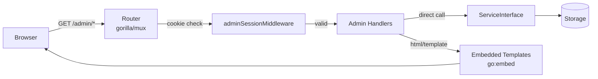

# Admin Frontend Implementation Plan

> **For Claude:** REQUIRED SUB-SKILL: Use superpowers:executing-plans to implement this plan task-by-task.

**Goal:** Add a server-rendered HTMX + Go templates admin UI at `/admin`, embedded in the binary, covering API key login, application CRUD, release management, and a health dashboard.

**Architecture:** Templates live in `internal/api/admin/templates/` and are embedded via `go:embed`. A new `adminSessionMiddleware` validates an HttpOnly session cookie set at login — skipping auth only for `/admin/login` and `/admin/logout`. Admin handlers call `update.ServiceInterface` and `storage.Storage` directly; no HTTP round-trips. Standard HTML forms handle creates/edits (Post-Redirect-Get); HTMX handles deletes inline (row removal without page reload). Full-page navigations receive full HTML; HTMX delete requests receive a 200 OK with empty body.

**Tech Stack:** Go `html/template` (stdlib), `go:embed` (stdlib), HTMX 2.x (unpkg CDN), Tailwind CSS 3.x Play CDN, gorilla/mux subrouter.

---

## File Map

```
internal/api/
  admin/
    templates/
      layout.html                     # "head" and "nav" named templates
      login.html                      # defines "login" named template
      health.html                     # defines "health" named template
      applications.html               # defines "applications" named template
      application.html                # defines "application" named template
      partials/
        flash.html                    # defines "flash" named template
        app-row.html                  # defines "app-row" named template
        release-row.html              # defines "release-row" named template
  handlers_admin.go                   # go:embed + render helper + all admin handlers
  handlers_admin_test.go              # handler tests
  middleware_admin.go                 # adminSessionMiddleware + isValidAdminKey
  middleware_admin_test.go            # middleware tests
  routes.go                           # modified: add admin subrouter
  handlers.go                         # modified: add adminTmpl + securityConfig fields
docs/
  admin-ui.md                         # new documentation page
mkdocs.yml                            # modified: add admin-ui.md to nav
cmd/updater/updater.go                # modified: parse templates + pass options
```

---

### Task 1: Extend the Handlers struct

**Files:**
- Modify: `internal/api/handlers.go`

The `Handlers` struct needs to carry the parsed admin templates and the security config so admin handlers can validate sessions.

**Step 1: Write failing tests**

Add to `internal/api/handlers_test.go`:

```go
func TestNewHandlers_WithAdminTemplates(t *testing.T) {
    tmpl := template.Must(template.New("test").Parse(`{{define "test"}}ok{{end}}`))
    h := NewHandlers(&MockUpdateService{}, WithAdminTemplates(tmpl))
    assert.NotNil(t, h.adminTmpl)
}

func TestNewHandlers_WithSecurityConfig(t *testing.T) {
    cfg := models.SecurityConfig{EnableAuth: true}
    h := NewHandlers(&MockUpdateService{}, WithSecurityConfig(cfg))
    assert.True(t, h.securityConfig.EnableAuth)
}
```

Add `"html/template"` to the imports in that file.

**Step 2: Run tests to verify they fail**

```bash
make test 2>&1 | grep -A3 "FAIL\|undefined"
```

Expected: compile error — `WithAdminTemplates`, `WithSecurityConfig`, `adminTmpl`, `securityConfig` undefined.

**Step 3: Implement**

In `internal/api/handlers.go`, add to the `Handlers` struct and add two options:

```go
import "html/template"

type Handlers struct {
    updateService  update.ServiceInterface
    storage        storage.Storage
    adminTmpl      *template.Template    // new
    securityConfig models.SecurityConfig  // new
}

// WithAdminTemplates sets the parsed admin template set.
func WithAdminTemplates(tmpl *template.Template) HandlersOption {
    return func(h *Handlers) { h.adminTmpl = tmpl }
}

// WithSecurityConfig stores the security config for admin session validation.
func WithSecurityConfig(cfg models.SecurityConfig) HandlersOption {
    return func(h *Handlers) { h.securityConfig = cfg }
}
```

**Step 4: Run tests**

```bash
make test 2>&1 | grep -E "ok|FAIL"
```

Expected: all pass.

**Step 5: Commit**

```bash
git add internal/api/handlers.go internal/api/handlers_test.go
git commit -m "feat(admin): add adminTmpl and securityConfig fields to Handlers"
```

---

### Task 2: Admin session middleware

**Files:**
- Create: `internal/api/middleware_admin.go`
- Create: `internal/api/middleware_admin_test.go`

**Step 1: Write failing tests**

Create `internal/api/middleware_admin_test.go`:

```go
package api

import (
    "net/http"
    "net/http/httptest"
    "testing"
    "updater/internal/models"

    "github.com/stretchr/testify/assert"
)

func okHandler(w http.ResponseWriter, r *http.Request) { w.WriteHeader(http.StatusOK) }

var adminKey = models.APIKey{
    Key:         "secret",
    Name:        "test",
    Permissions: []string{"admin"},
    Enabled:     true,
}

var cfgWithKey = models.SecurityConfig{APIKeys: []models.APIKey{adminKey}}
var cfgNoKeys  = models.SecurityConfig{}

func makeAdminReq(path, cookieVal string) *http.Request {
    req := httptest.NewRequest(http.MethodGet, path, nil)
    if cookieVal != "" {
        req.AddCookie(&http.Cookie{Name: "admin_session", Value: cookieVal})
    }
    return req
}

func TestAdminMiddleware_NoCookie_Redirects(t *testing.T) {
    mw := adminSessionMiddleware(cfgWithKey)
    rec := httptest.NewRecorder()
    mw(http.HandlerFunc(okHandler)).ServeHTTP(rec, makeAdminReq("/admin/applications", ""))
    assert.Equal(t, http.StatusSeeOther, rec.Code)
    assert.Equal(t, "/admin/login", rec.Header().Get("Location"))
}

func TestAdminMiddleware_InvalidKey_Redirects(t *testing.T) {
    mw := adminSessionMiddleware(cfgWithKey)
    rec := httptest.NewRecorder()
    mw(http.HandlerFunc(okHandler)).ServeHTTP(rec, makeAdminReq("/admin/applications", "wrong"))
    assert.Equal(t, http.StatusSeeOther, rec.Code)
}

func TestAdminMiddleware_ValidKey_Passes(t *testing.T) {
    mw := adminSessionMiddleware(cfgWithKey)
    rec := httptest.NewRecorder()
    mw(http.HandlerFunc(okHandler)).ServeHTTP(rec, makeAdminReq("/admin/applications", "secret"))
    assert.Equal(t, http.StatusOK, rec.Code)
}

func TestAdminMiddleware_SkipsLogin(t *testing.T) {
    mw := adminSessionMiddleware(cfgWithKey)
    rec := httptest.NewRecorder()
    mw(http.HandlerFunc(okHandler)).ServeHTTP(rec, makeAdminReq("/admin/login", ""))
    assert.Equal(t, http.StatusOK, rec.Code)
}

func TestAdminMiddleware_SkipsLogout(t *testing.T) {
    mw := adminSessionMiddleware(cfgWithKey)
    rec := httptest.NewRecorder()
    mw(http.HandlerFunc(okHandler)).ServeHTTP(rec, makeAdminReq("/admin/logout", ""))
    assert.Equal(t, http.StatusOK, rec.Code)
}

func TestIsValidAdminKey_NoKeysConfigured_AcceptsAny(t *testing.T) {
    assert.True(t, isValidAdminKey("anything", cfgNoKeys))
}

func TestIsValidAdminKey_EmptyKeyNoKeys_Rejects(t *testing.T) {
    assert.False(t, isValidAdminKey("", cfgNoKeys))
}

func TestIsValidAdminKey_ValidAdminKey(t *testing.T) {
    assert.True(t, isValidAdminKey("secret", cfgWithKey))
}

func TestIsValidAdminKey_NonAdminKey_Rejects(t *testing.T) {
    readOnlyCfg := models.SecurityConfig{APIKeys: []models.APIKey{
        {Key: "readkey", Name: "r", Permissions: []string{"read"}, Enabled: true},
    }}
    assert.False(t, isValidAdminKey("readkey", readOnlyCfg))
}

func TestIsValidAdminKey_DisabledKey_Rejects(t *testing.T) {
    disabledCfg := models.SecurityConfig{APIKeys: []models.APIKey{
        {Key: "secret", Name: "d", Permissions: []string{"admin"}, Enabled: false},
    }}
    assert.False(t, isValidAdminKey("secret", disabledCfg))
}
```

**Step 2: Run tests to verify they fail**

```bash
make test 2>&1 | grep -E "FAIL|undefined"
```

Expected: compile error — `adminSessionMiddleware`, `isValidAdminKey` undefined.

**Step 3: Implement**

Create `internal/api/middleware_admin.go`:

```go
package api

import (
    "net/http"
    "strings"
    "updater/internal/models"

    "github.com/gorilla/mux"
)

// adminSessionMiddleware validates the HttpOnly admin_session cookie.
// Requests to /admin/login and /admin/logout are always passed through.
func adminSessionMiddleware(cfg models.SecurityConfig) mux.MiddlewareFunc {
    return func(next http.Handler) http.Handler {
        return http.HandlerFunc(func(w http.ResponseWriter, r *http.Request) {
            // Login and logout pages are exempt.
            if strings.HasSuffix(r.URL.Path, "/login") || strings.HasSuffix(r.URL.Path, "/logout") {
                next.ServeHTTP(w, r)
                return
            }

            cookie, err := r.Cookie("admin_session")
            if err != nil || !isValidAdminKey(cookie.Value, cfg) {
                // Clear any stale cookie.
                http.SetCookie(w, &http.Cookie{
                    Name:   "admin_session",
                    Value:  "",
                    Path:   "/admin",
                    MaxAge: -1,
                })
                http.Redirect(w, r, "/admin/login", http.StatusSeeOther)
                return
            }

            next.ServeHTTP(w, r)
        })
    }
}

// isValidAdminKey returns true when key is authorised to access the admin UI.
// If no API keys are configured the service is in dev mode and any non-empty
// string is accepted.
func isValidAdminKey(key string, cfg models.SecurityConfig) bool {
    if key == "" {
        return false
    }
    if len(cfg.APIKeys) == 0 {
        return true // dev mode
    }
    for _, ak := range cfg.APIKeys {
        if ak.Key != key || !ak.Enabled {
            continue
        }
        for _, p := range ak.Permissions {
            if p == "admin" || p == "*" {
                return true
            }
        }
    }
    return false
}
```

**Step 4: Run tests**

```bash
make test 2>&1 | grep -E "ok|FAIL"
```

Expected: all pass.

**Step 5: Commit**

```bash
git add internal/api/middleware_admin.go internal/api/middleware_admin_test.go
git commit -m "feat(admin): add adminSessionMiddleware and isValidAdminKey"
```

---

### Task 3: Template files

**Files:**
- Create: `internal/api/admin/templates/layout.html`
- Create: `internal/api/admin/templates/login.html`
- Create: `internal/api/admin/templates/health.html`
- Create: `internal/api/admin/templates/applications.html`
- Create: `internal/api/admin/templates/application.html`
- Create: `internal/api/admin/templates/partials/flash.html`
- Create: `internal/api/admin/templates/partials/app-row.html`
- Create: `internal/api/admin/templates/partials/release-row.html`

No tests for templates directly; they are covered via handler tests in Task 5+.

**Step 1: Create `layout.html`** — shared head and nav fragments used by every page template.

```html
{{define "head"}}
<meta charset="UTF-8">
<meta name="viewport" content="width=device-width, initial-scale=1.0">
<script src="https://unpkg.com/htmx.org@2/dist/htmx.min.js" defer></script>
<script src="https://cdn.tailwindcss.com"></script>
{{end}}

{{define "nav"}}
<nav class="bg-gray-900 text-white px-6 py-3 flex items-center gap-6">
  <span class="font-bold text-lg">Updater Admin</span>
  <a href="/admin/applications" class="hover:underline">Applications</a>
  <a href="/admin/health" class="hover:underline">Health</a>
  <a href="/api/v1/docs" target="_blank" class="hover:underline">API Docs</a>
  <form method="POST" action="/admin/logout" class="ml-auto">
    <button type="submit" class="text-sm hover:underline">Log out</button>
  </form>
</nav>
{{end}}
```

**Step 2: Create `login.html`**

```html
{{define "login"}}
<!DOCTYPE html>
<html lang="en">
<head><title>Login - Updater Admin</title>{{template "head" .}}</head>
<body class="bg-gray-100 flex items-center justify-center min-h-screen">
  <div class="bg-white p-8 rounded shadow w-96">
    <h1 class="text-2xl font-bold mb-6">Admin Login</h1>
    {{if .Error}}
    <p class="text-red-600 mb-4">{{.Error}}</p>
    {{end}}
    <form method="POST" action="/admin/login">
      <label class="block mb-2 font-medium">API Key</label>
      <input type="password" name="api_key"
             class="w-full border rounded px-3 py-2 mb-4 focus:outline-none focus:ring"
             placeholder="Enter your admin API key" autofocus>
      <button type="submit"
              class="w-full bg-blue-600 text-white py-2 rounded hover:bg-blue-700">
        Sign in
      </button>
    </form>
  </div>
</body>
</html>
{{end}}
```

**Step 3: Create `health.html`**

```html
{{define "health"}}
<!DOCTYPE html>
<html lang="en">
<head><title>Health - Updater Admin</title>{{template "head" .}}</head>
<body class="bg-gray-50">
{{template "nav" .}}
<main class="max-w-4xl mx-auto p-6">
  <h1 class="text-2xl font-bold mb-6">Service Health</h1>
  <div class="bg-white rounded shadow p-6 mb-4">
    <p class="text-lg">Status:
      <span class="font-bold {{if eq .Health.Status "healthy"}}text-green-600{{else}}text-red-600{{end}}">
        {{.Health.Status}}
      </span>
    </p>
    <p class="text-gray-500 text-sm mt-1">{{.Health.Timestamp}}</p>
    {{if .Health.Version}}<p class="mt-2">Version: {{.Health.Version}}</p>{{end}}
    {{if .Health.Uptime}}<p>Uptime: {{.Health.Uptime}}</p>{{end}}
  </div>
  {{if .Health.Components}}
  <h2 class="text-xl font-semibold mb-3">Components</h2>
  <div class="space-y-2">
    {{range $name, $comp := .Health.Components}}
    <div class="bg-white rounded shadow p-4 flex justify-between items-center">
      <span class="font-medium">{{$name}}</span>
      <span class="{{if eq $comp.Status "healthy"}}text-green-600{{else}}text-red-600{{end}}">
        {{$comp.Status}}{{if $comp.Message}} — {{$comp.Message}}{{end}}
      </span>
    </div>
    {{end}}
  </div>
  {{end}}
</main>
</body>
</html>
{{end}}
```

**Step 4: Create `applications.html`**

```html
{{define "applications"}}
<!DOCTYPE html>
<html lang="en">
<head><title>Applications - Updater Admin</title>{{template "head" .}}</head>
<body class="bg-gray-50">
{{template "nav" .}}
<main class="max-w-6xl mx-auto p-6">
  <div class="flex items-center justify-between mb-6">
    <h1 class="text-2xl font-bold">Applications</h1>
    <a href="/admin/applications/new"
       class="bg-blue-600 text-white px-4 py-2 rounded hover:bg-blue-700">
      New Application
    </a>
  </div>

  {{if .Flash}}{{template "flash" .Flash}}{{end}}

  <div class="bg-white rounded shadow overflow-hidden">
    <table class="w-full text-sm">
      <thead class="bg-gray-100 text-left">
        <tr>
          <th class="px-4 py-3">ID</th>
          <th class="px-4 py-3">Name</th>
          <th class="px-4 py-3">Platforms</th>
          <th class="px-4 py-3">Updated</th>
          <th class="px-4 py-3"></th>
        </tr>
      </thead>
      <tbody id="app-list" class="divide-y">
        {{range .Applications.Applications}}
          {{template "app-row" .}}
        {{else}}
        <tr><td colspan="5" class="px-4 py-6 text-center text-gray-400">No applications yet.</td></tr>
        {{end}}
      </tbody>
    </table>
  </div>

  {{if .Applications.HasMore}}
  <p class="mt-4 text-gray-500 text-sm">
    Showing {{.Applications.PageSize}} of {{.Applications.TotalCount}} applications.
  </p>
  {{end}}
</main>
</body>
</html>
{{end}}

{{define "new-application-form"}}
<!DOCTYPE html>
<html lang="en">
<head><title>New Application - Updater Admin</title>{{template "head" .}}</head>
<body class="bg-gray-50">
{{template "nav" .}}
<main class="max-w-2xl mx-auto p-6">
  <h1 class="text-2xl font-bold mb-6">New Application</h1>
  {{if .Error}}<p class="text-red-600 mb-4">{{.Error}}</p>{{end}}
  <form method="POST" action="/admin/applications" class="bg-white rounded shadow p-6 space-y-4">
    <div>
      <label class="block font-medium mb-1">ID <span class="text-red-500">*</span></label>
      <input type="text" name="id" value="{{.Form.ID}}"
             class="w-full border rounded px-3 py-2" placeholder="my-app" required>
      <p class="text-gray-400 text-xs mt-1">Alphanumeric, hyphens, underscores. Max 100 chars.</p>
    </div>
    <div>
      <label class="block font-medium mb-1">Name <span class="text-red-500">*</span></label>
      <input type="text" name="name" value="{{.Form.Name}}"
             class="w-full border rounded px-3 py-2" required>
    </div>
    <div>
      <label class="block font-medium mb-1">Description</label>
      <input type="text" name="description" value="{{.Form.Description}}"
             class="w-full border rounded px-3 py-2">
    </div>
    <div>
      <label class="block font-medium mb-1">Platforms <span class="text-red-500">*</span></label>
      <div class="flex gap-4 flex-wrap">
        {{range $p := .Platforms}}
        <label class="flex items-center gap-1">
          <input type="checkbox" name="platforms" value="{{$p}}"> {{$p}}
        </label>
        {{end}}
      </div>
    </div>
    <div class="flex gap-3">
      <button type="submit" class="bg-blue-600 text-white px-6 py-2 rounded hover:bg-blue-700">
        Create
      </button>
      <a href="/admin/applications" class="px-6 py-2 border rounded hover:bg-gray-50">Cancel</a>
    </div>
  </form>
</main>
</body>
</html>
{{end}}
```

**Step 5: Create `application.html`**

```html
{{define "application"}}
<!DOCTYPE html>
<html lang="en">
<head><title>{{.Application.Name}} - Updater Admin</title>{{template "head" .}}</head>
<body class="bg-gray-50">
{{template "nav" .}}
<main class="max-w-6xl mx-auto p-6">
  <div class="flex items-center justify-between mb-4">
    <div>
      <a href="/admin/applications" class="text-blue-600 hover:underline text-sm">← Applications</a>
      <h1 class="text-2xl font-bold mt-1">{{.Application.Name}}</h1>
      <p class="text-gray-500 text-sm">{{.Application.ID}}</p>
    </div>
    <div class="flex gap-2">
      <a href="/admin/applications/{{.Application.ID}}/edit"
         class="border px-4 py-2 rounded hover:bg-gray-50">Edit</a>
      <button
        hx-delete="/admin/applications/{{.Application.ID}}"
        hx-confirm="Delete {{.Application.Name}}? All releases must be removed first."
        hx-target="body"
        hx-push-url="/admin/applications"
        class="bg-red-600 text-white px-4 py-2 rounded hover:bg-red-700">
        Delete
      </button>
    </div>
  </div>

  {{if .Flash}}{{template "flash" .Flash}}{{end}}

  {{if .Application.Description}}
  <p class="text-gray-600 mb-6">{{.Application.Description}}</p>
  {{end}}

  <!-- Stats -->
  {{if .Application.Stats}}
  <div class="grid grid-cols-3 gap-4 mb-6">
    <div class="bg-white rounded shadow p-4">
      <p class="text-gray-500 text-sm">Total Releases</p>
      <p class="text-2xl font-bold">{{.Application.Stats.TotalReleases}}</p>
    </div>
    <div class="bg-white rounded shadow p-4">
      <p class="text-gray-500 text-sm">Latest Version</p>
      <p class="text-2xl font-bold">{{.Application.Stats.LatestVersion}}</p>
    </div>
    <div class="bg-white rounded shadow p-4">
      <p class="text-gray-500 text-sm">Platforms</p>
      <p class="text-2xl font-bold">{{.Application.Stats.PlatformCount}}</p>
    </div>
  </div>
  {{end}}

  <!-- Releases -->
  <div class="flex items-center justify-between mb-3">
    <h2 class="text-xl font-semibold">Releases</h2>
    <a href="/admin/applications/{{.Application.ID}}/releases/new"
       class="bg-green-600 text-white px-4 py-2 rounded text-sm hover:bg-green-700">
      Register Release
    </a>
  </div>

  <div class="bg-white rounded shadow overflow-hidden">
    <table class="w-full text-sm">
      <thead class="bg-gray-100 text-left">
        <tr>
          <th class="px-4 py-3">Version</th>
          <th class="px-4 py-3">Platform</th>
          <th class="px-4 py-3">Arch</th>
          <th class="px-4 py-3">Required</th>
          <th class="px-4 py-3">Released</th>
          <th class="px-4 py-3"></th>
        </tr>
      </thead>
      <tbody id="release-list" class="divide-y">
        {{range .Releases.Releases}}
          {{template "release-row" .}}
        {{else}}
        <tr><td colspan="6" class="px-4 py-6 text-center text-gray-400">No releases yet.</td></tr>
        {{end}}
      </tbody>
    </table>
  </div>
</main>
</body>
</html>
{{end}}

{{define "edit-application-form"}}
<!DOCTYPE html>
<html lang="en">
<head><title>Edit {{.Application.Name}} - Updater Admin</title>{{template "head" .}}</head>
<body class="bg-gray-50">
{{template "nav" .}}
<main class="max-w-2xl mx-auto p-6">
  <a href="/admin/applications/{{.Application.ID}}" class="text-blue-600 hover:underline text-sm">
    ← {{.Application.Name}}
  </a>
  <h1 class="text-2xl font-bold mt-2 mb-6">Edit Application</h1>
  {{if .Error}}<p class="text-red-600 mb-4">{{.Error}}</p>{{end}}
  <form method="POST" action="/admin/applications/{{.Application.ID}}/edit"
        class="bg-white rounded shadow p-6 space-y-4">
    <div>
      <label class="block font-medium mb-1">Name <span class="text-red-500">*</span></label>
      <input type="text" name="name" value="{{.Application.Name}}"
             class="w-full border rounded px-3 py-2" required>
    </div>
    <div>
      <label class="block font-medium mb-1">Description</label>
      <input type="text" name="description" value="{{.Application.Description}}"
             class="w-full border rounded px-3 py-2">
    </div>
    <div>
      <label class="block font-medium mb-1">Platforms <span class="text-red-500">*</span></label>
      <div class="flex gap-4 flex-wrap">
        {{range $p := .Platforms}}
        <label class="flex items-center gap-1">
          <input type="checkbox" name="platforms" value="{{$p}}"
                 {{if hasPlatform $.Application.Platforms $p}}checked{{end}}> {{$p}}
        </label>
        {{end}}
      </div>
    </div>
    <div class="flex gap-3">
      <button type="submit" class="bg-blue-600 text-white px-6 py-2 rounded hover:bg-blue-700">
        Save
      </button>
      <a href="/admin/applications/{{.Application.ID}}"
         class="px-6 py-2 border rounded hover:bg-gray-50">Cancel</a>
    </div>
  </form>
</main>
</body>
</html>
{{end}}

{{define "new-release-form"}}
<!DOCTYPE html>
<html lang="en">
<head><title>New Release - Updater Admin</title>{{template "head" .}}</head>
<body class="bg-gray-50">
{{template "nav" .}}
<main class="max-w-2xl mx-auto p-6">
  <a href="/admin/applications/{{.AppID}}" class="text-blue-600 hover:underline text-sm">
    ← Back to application
  </a>
  <h1 class="text-2xl font-bold mt-2 mb-6">Register Release for {{.AppID}}</h1>
  {{if .Error}}<p class="text-red-600 mb-4">{{.Error}}</p>{{end}}
  <form method="POST" action="/admin/applications/{{.AppID}}/releases"
        class="bg-white rounded shadow p-6 space-y-4">
    <div class="grid grid-cols-2 gap-4">
      <div>
        <label class="block font-medium mb-1">Version <span class="text-red-500">*</span></label>
        <input type="text" name="version" class="w-full border rounded px-3 py-2"
               placeholder="1.0.0" required>
      </div>
      <div>
        <label class="block font-medium mb-1">Platform <span class="text-red-500">*</span></label>
        <select name="platform" class="w-full border rounded px-3 py-2" required>
          <option value="">Select…</option>
          {{range .Platforms}}<option>{{.}}</option>{{end}}
        </select>
      </div>
      <div>
        <label class="block font-medium mb-1">Architecture <span class="text-red-500">*</span></label>
        <select name="architecture" class="w-full border rounded px-3 py-2" required>
          <option value="">Select…</option>
          {{range .Architectures}}<option>{{.}}</option>{{end}}
        </select>
      </div>
      <div>
        <label class="block font-medium mb-1">File Size (bytes)</label>
        <input type="number" name="file_size" class="w-full border rounded px-3 py-2" min="0">
      </div>
    </div>
    <div>
      <label class="block font-medium mb-1">Download URL <span class="text-red-500">*</span></label>
      <input type="url" name="download_url" class="w-full border rounded px-3 py-2" required>
    </div>
    <div class="grid grid-cols-2 gap-4">
      <div>
        <label class="block font-medium mb-1">Checksum <span class="text-red-500">*</span></label>
        <input type="text" name="checksum" class="w-full border rounded px-3 py-2" required>
      </div>
      <div>
        <label class="block font-medium mb-1">Checksum Type <span class="text-red-500">*</span></label>
        <select name="checksum_type" class="w-full border rounded px-3 py-2" required>
          <option>sha256</option><option>sha1</option><option>md5</option>
        </select>
      </div>
    </div>
    <div>
      <label class="block font-medium mb-1">Release Notes</label>
      <textarea name="release_notes" rows="3" class="w-full border rounded px-3 py-2"></textarea>
    </div>
    <div>
      <label class="block font-medium mb-1">Minimum Version</label>
      <input type="text" name="minimum_version" class="w-full border rounded px-3 py-2"
             placeholder="1.0.0">
    </div>
    <label class="flex items-center gap-2">
      <input type="checkbox" name="required"> Mark as required update
    </label>
    <div class="flex gap-3">
      <button type="submit" class="bg-green-600 text-white px-6 py-2 rounded hover:bg-green-700">
        Register
      </button>
      <a href="/admin/applications/{{.AppID}}"
         class="px-6 py-2 border rounded hover:bg-gray-50">Cancel</a>
    </div>
  </form>
</main>
</body>
</html>
{{end}}
```

**Step 6: Create `partials/flash.html`**

```html
{{define "flash"}}
<div class="rounded px-4 py-3 mb-4
  {{if eq .Type "success"}}bg-green-100 text-green-800 border border-green-300
  {{else}}bg-red-100 text-red-800 border border-red-300{{end}}">
  {{.Message}}
</div>
{{end}}
```

**Step 7: Create `partials/app-row.html`**

```html
{{define "app-row"}}
<tr id="app-{{.ID}}" class="hover:bg-gray-50">
  <td class="px-4 py-3 font-mono text-sm">{{.ID}}</td>
  <td class="px-4 py-3">
    <a href="/admin/applications/{{.ID}}" class="text-blue-600 hover:underline">{{.Name}}</a>
  </td>
  <td class="px-4 py-3 text-gray-500">{{range .Platforms}}{{.}} {{end}}</td>
  <td class="px-4 py-3 text-gray-500 text-sm">{{.UpdatedAt}}</td>
  <td class="px-4 py-3 text-right">
    <button
      hx-delete="/admin/applications/{{.ID}}"
      hx-confirm="Delete {{.Name}}? All releases must be removed first."
      hx-target="closest tr"
      hx-swap="delete"
      class="text-red-600 hover:underline text-sm">
      Delete
    </button>
  </td>
</tr>
{{end}}
```

**Step 8: Create `partials/release-row.html`**

```html
{{define "release-row"}}
<tr id="rel-{{.ID}}" class="hover:bg-gray-50">
  <td class="px-4 py-3 font-mono">{{.Version}}</td>
  <td class="px-4 py-3">{{.Platform}}</td>
  <td class="px-4 py-3">{{.Architecture}}</td>
  <td class="px-4 py-3">{{if .Required}}<span class="text-red-600 font-medium">Yes</span>{{else}}No{{end}}</td>
  <td class="px-4 py-3 text-gray-500 text-sm">{{.ReleaseDate}}</td>
  <td class="px-4 py-3 text-right">
    <button
      hx-delete="/admin/applications/{{.ApplicationID}}/releases/{{.Version}}/{{.Platform}}/{{.Architecture}}"
      hx-confirm="Delete release {{.Version}} ({{.Platform}}/{{.Architecture}})?"
      hx-target="closest tr"
      hx-swap="delete"
      class="text-red-600 hover:underline text-sm">
      Delete
    </button>
  </td>
</tr>
{{end}}
```

**Step 9: Commit**

```bash
git add internal/api/admin/
git commit -m "feat(admin): add HTMX + Tailwind template files"
```

---

### Task 4: Admin handlers — embed, data types, render helper

**Files:**
- Create: `internal/api/handlers_admin.go`

**Step 1: Write a failing test that verifies templates parse without error**

Create `internal/api/handlers_admin_test.go`:

```go
package api

import (
    "testing"

    "github.com/stretchr/testify/require"
)

func TestAdminTemplates_ParseWithoutError(t *testing.T) {
    tmpl, err := parseAdminTemplates()
    require.NoError(t, err)
    require.NotNil(t, tmpl)

    expected := []string{
        "login", "health", "applications", "new-application-form",
        "application", "edit-application-form", "new-release-form",
        "flash", "app-row", "release-row",
    }
    for _, name := range expected {
        require.NotNil(t, tmpl.Lookup(name), "template %q not found", name)
    }
}
```

**Step 2: Run test to verify it fails**

```bash
make test 2>&1 | grep -E "FAIL|undefined|parseAdminTemplates"
```

Expected: compile error — `parseAdminTemplates` undefined.

**Step 3: Create `handlers_admin.go` with embed + data structs + render helper**

```go
package api

import (
    "embed"
    "html/template"
    "log/slog"
    "net/http"
    "strings"
    "updater/internal/models"
)

//go:embed admin/templates
var adminTemplateFS embed.FS

// parseAdminTemplates parses all admin templates from the embedded FS.
func parseAdminTemplates() (*template.Template, error) {
    return template.New("").Funcs(template.FuncMap{
        "hasPlatform": func(platforms []string, p string) bool {
            for _, pl := range platforms {
                if pl == p { return true }
            }
            return false
        },
    }).ParseFS(adminTemplateFS,
        "admin/templates/*.html",
        "admin/templates/partials/*.html",
    )
}

// adminBaseData is embedded in every page data struct.
type adminBaseData struct {
    Flash *adminFlashData
}

type adminFlashData struct {
    Type    string // "success" or "error"
    Message string
}

type adminLoginData struct {
    Error string
}

type adminApplicationsData struct {
    adminBaseData
    Applications *models.ListApplicationsResponse
    Platforms    []string
}

type adminNewAppData struct {
    adminBaseData
    Error     string
    Form      models.CreateApplicationRequest
    Platforms []string
}

type adminApplicationData struct {
    adminBaseData
    Application *models.ApplicationInfoResponse
    Releases    *models.ListReleasesResponse
    Platforms   []string
    Error       string
}

type adminEditAppData struct {
    adminBaseData
    Application *models.ApplicationInfoResponse
    Platforms   []string
    Error       string
}

type adminReleaseFormData struct {
    adminBaseData
    AppID         string
    Platforms     []string
    Architectures []string
    Error         string
}

type adminHealthData struct {
    adminBaseData
    Health *models.HealthCheckResponse
}

var allPlatforms     = []string{"windows", "linux", "darwin", "android", "ios"}
var allArchitectures = []string{"amd64", "arm64", "386", "arm"}

// renderAdmin renders a named template, writing 500 on error.
func (h *Handlers) renderAdmin(w http.ResponseWriter, name string, data any) {
    w.Header().Set("Content-Type", "text/html; charset=utf-8")
    if err := h.adminTmpl.ExecuteTemplate(w, name, data); err != nil {
        slog.Error("admin template error", "template", name, "error", err)
        http.Error(w, "internal server error", http.StatusInternalServerError)
    }
}

// flashFromQuery reads a ?flash=<msg>&flash_type=<type> query pair into adminFlashData.
func flashFromQuery(r *http.Request) *adminFlashData {
    msg := r.URL.Query().Get("flash")
    if msg == "" {
        return nil
    }
    ft := r.URL.Query().Get("flash_type")
    if ft == "" {
        ft = "success"
    }
    return &adminFlashData{Type: ft, Message: msg}
}

// addFlash appends flash query params to a redirect URL.
func addFlash(base, msg, flashType string) string {
    sep := "?"
    if strings.Contains(base, "?") {
        sep = "&"
    }
    return base + sep + "flash=" + msg + "&flash_type=" + flashType
}
```

**Step 4: Run tests**

```bash
make test 2>&1 | grep -E "ok|FAIL"
```

Expected: all pass.

**Step 5: Commit**

```bash
git add internal/api/handlers_admin.go internal/api/handlers_admin_test.go
git commit -m "feat(admin): embed templates, define data types and render helper"
```

---

### Task 5: Login and logout handlers

**Files:**
- Modify: `internal/api/handlers_admin.go`
- Modify: `internal/api/handlers_admin_test.go`

**Step 1: Write failing tests**

Add to `handlers_admin_test.go`:

```go
import (
    "html/template"
    "net/http"
    "net/http/httptest"
    "net/url"
    "strings"
    "testing"
    "updater/internal/models"

    "github.com/stretchr/testify/assert"
    "github.com/stretchr/testify/require"
)

func newAdminHandlers(t *testing.T) *Handlers {
    t.Helper()
    tmpl, err := parseAdminTemplates()
    require.NoError(t, err)
    cfg := models.SecurityConfig{
        APIKeys: []models.APIKey{
            {Key: "admin-key", Name: "test", Permissions: []string{"admin"}, Enabled: true},
        },
    }
    return NewHandlers(&MockUpdateService{},
        WithAdminTemplates(tmpl),
        WithSecurityConfig(cfg),
    )
}

func TestAdminLogin_GET_ShowsForm(t *testing.T) {
    h := newAdminHandlers(t)
    rec := httptest.NewRecorder()
    req := httptest.NewRequest(http.MethodGet, "/admin/login", nil)
    h.AdminLogin(rec, req)
    assert.Equal(t, http.StatusOK, rec.Code)
    assert.Contains(t, rec.Header().Get("Content-Type"), "text/html")
    assert.Contains(t, rec.Body.String(), "Admin Login")
}

func TestAdminLogin_POST_ValidKey_Redirects(t *testing.T) {
    h := newAdminHandlers(t)
    form := url.Values{"api_key": {"admin-key"}}
    req := httptest.NewRequest(http.MethodPost, "/admin/login",
        strings.NewReader(form.Encode()))
    req.Header.Set("Content-Type", "application/x-www-form-urlencoded")
    rec := httptest.NewRecorder()
    h.AdminLogin(rec, req)
    assert.Equal(t, http.StatusSeeOther, rec.Code)
    assert.Equal(t, "/admin/applications", rec.Header().Get("Location"))
    // Cookie must be set
    cookies := rec.Result().Cookies()
    var found bool
    for _, c := range cookies {
        if c.Name == "admin_session" {
            assert.Equal(t, "admin-key", c.Value)
            assert.True(t, c.HttpOnly)
            found = true
        }
    }
    assert.True(t, found, "admin_session cookie not set")
}

func TestAdminLogin_POST_InvalidKey_ShowsError(t *testing.T) {
    h := newAdminHandlers(t)
    form := url.Values{"api_key": {"wrong"}}
    req := httptest.NewRequest(http.MethodPost, "/admin/login",
        strings.NewReader(form.Encode()))
    req.Header.Set("Content-Type", "application/x-www-form-urlencoded")
    rec := httptest.NewRecorder()
    h.AdminLogin(rec, req)
    assert.Equal(t, http.StatusUnauthorized, rec.Code)
    assert.Contains(t, rec.Body.String(), "Invalid")
}

func TestAdminLogout_ClearsCookieAndRedirects(t *testing.T) {
    h := newAdminHandlers(t)
    req := httptest.NewRequest(http.MethodPost, "/admin/logout", nil)
    req.AddCookie(&http.Cookie{Name: "admin_session", Value: "admin-key"})
    rec := httptest.NewRecorder()
    h.AdminLogout(rec, req)
    assert.Equal(t, http.StatusSeeOther, rec.Code)
    assert.Equal(t, "/admin/login", rec.Header().Get("Location"))
    for _, c := range rec.Result().Cookies() {
        if c.Name == "admin_session" {
            assert.Equal(t, -1, c.MaxAge)
        }
    }
}
```

**Step 2: Run to verify failure**

```bash
make test 2>&1 | grep -E "FAIL|undefined"
```

Expected: compile error — `AdminLogin`, `AdminLogout` undefined.

**Step 3: Implement handlers**

Add to `handlers_admin.go`:

```go
// AdminLogin handles GET (show form) and POST (submit key) for /admin/login.
func (h *Handlers) AdminLogin(w http.ResponseWriter, r *http.Request) {
    if r.Method == http.MethodGet {
        h.renderAdmin(w, "login", adminLoginData{})
        return
    }

    // POST — validate submitted key.
    if err := r.ParseForm(); err != nil {
        h.renderAdmin(w, "login", adminLoginData{Error: "Invalid form submission"})
        return
    }
    key := r.FormValue("api_key")
    if !isValidAdminKey(key, h.securityConfig) {
        w.WriteHeader(http.StatusUnauthorized)
        h.renderAdmin(w, "login", adminLoginData{Error: "Invalid API key or insufficient permissions"})
        return
    }

    http.SetCookie(w, &http.Cookie{
        Name:     "admin_session",
        Value:    key,
        Path:     "/admin",
        HttpOnly: true,
        SameSite: http.SameSiteStrictMode,
    })
    http.Redirect(w, r, "/admin/applications", http.StatusSeeOther)
}

// AdminLogout clears the session cookie and redirects to login.
func (h *Handlers) AdminLogout(w http.ResponseWriter, r *http.Request) {
    http.SetCookie(w, &http.Cookie{
        Name:   "admin_session",
        Value:  "",
        Path:   "/admin",
        MaxAge: -1,
    })
    http.Redirect(w, r, "/admin/login", http.StatusSeeOther)
}
```

**Step 4: Run tests**

```bash
make test 2>&1 | grep -E "ok|FAIL"
```

Expected: all pass.

**Step 5: Commit**

```bash
git add internal/api/handlers_admin.go internal/api/handlers_admin_test.go
git commit -m "feat(admin): implement login and logout handlers"
```

---

### Task 6: Health handler

**Files:**
- Modify: `internal/api/handlers_admin.go`
- Modify: `internal/api/handlers_admin_test.go`

**Step 1: Write failing test**

Add to `handlers_admin_test.go`:

```go
func TestAdminHealth_ReturnsPage(t *testing.T) {
    h := newAdminHandlers(t)
    req := httptest.NewRequest(http.MethodGet, "/admin/health", nil)
    rec := httptest.NewRecorder()
    h.AdminHealth(rec, req)
    assert.Equal(t, http.StatusOK, rec.Code)
    assert.Contains(t, rec.Body.String(), "Service Health")
}
```

**Step 2: Run to verify failure**

```bash
make test 2>&1 | grep "AdminHealth"
```

**Step 3: Implement**

Add to `handlers_admin.go`:

```go
// AdminHealth renders the health dashboard.
func (h *Handlers) AdminHealth(w http.ResponseWriter, r *http.Request) {
    // Re-use the existing HealthCheck logic by calling storage.Ping directly.
    resp := models.NewHealthCheckResponse(models.StatusHealthy)
    resp.Version = "1.0.0"

    storageStatus := models.StatusHealthy
    storageMsg := "Storage is operational"
    if h.storage != nil {
        if err := h.storage.Ping(r.Context()); err != nil {
            storageStatus = models.StatusUnhealthy
            storageMsg = err.Error()
            resp.Status = models.StatusDegraded
        }
    }
    resp.AddComponent("storage", storageStatus, storageMsg)
    resp.AddComponent("api", models.StatusHealthy, "API is operational")

    h.renderAdmin(w, "health", adminHealthData{Health: resp})
}
```

**Step 4: Run tests**

```bash
make test 2>&1 | grep -E "ok|FAIL"
```

**Step 5: Commit**

```bash
git add internal/api/handlers_admin.go internal/api/handlers_admin_test.go
git commit -m "feat(admin): implement health dashboard handler"
```

---

### Task 7: Applications list and create handlers

**Files:**
- Modify: `internal/api/handlers_admin.go`
- Modify: `internal/api/handlers_admin_test.go`

**Step 1: Write failing tests**

Add to `handlers_admin_test.go`. The `MockUpdateService` from `handlers_test.go` is already in scope since tests are in the same package.

```go
func TestAdminListApplications_RendersPage(t *testing.T) {
    svc := &MockUpdateService{}
    svc.On("ListApplications", mock.Anything, 50, 0).Return(&models.ListApplicationsResponse{
        Applications: []models.ApplicationSummary{},
        TotalCount: 0,
    }, nil)

    tmpl, _ := parseAdminTemplates()
    h := NewHandlers(svc, WithAdminTemplates(tmpl), WithSecurityConfig(models.SecurityConfig{}))

    req := httptest.NewRequest(http.MethodGet, "/admin/applications", nil)
    rec := httptest.NewRecorder()
    h.AdminListApplications(rec, req)

    assert.Equal(t, http.StatusOK, rec.Code)
    assert.Contains(t, rec.Body.String(), "Applications")
    svc.AssertExpectations(t)
}

func TestAdminNewApplicationForm_RendersForm(t *testing.T) {
    h := newAdminHandlers(t)
    req := httptest.NewRequest(http.MethodGet, "/admin/applications/new", nil)
    rec := httptest.NewRecorder()
    h.AdminNewApplicationForm(rec, req)
    assert.Equal(t, http.StatusOK, rec.Code)
    assert.Contains(t, rec.Body.String(), "New Application")
}

func TestAdminCreateApplication_ValidInput_Redirects(t *testing.T) {
    svc := &MockUpdateService{}
    svc.On("CreateApplication", mock.Anything, mock.AnythingOfType("*models.CreateApplicationRequest")).
        Return(&models.CreateApplicationResponse{ID: "my-app", Message: "created"}, nil)

    tmpl, _ := parseAdminTemplates()
    h := NewHandlers(svc, WithAdminTemplates(tmpl), WithSecurityConfig(models.SecurityConfig{}))

    form := url.Values{
        "id": {"my-app"}, "name": {"My App"}, "platforms": {"windows", "linux"},
    }
    req := httptest.NewRequest(http.MethodPost, "/admin/applications",
        strings.NewReader(form.Encode()))
    req.Header.Set("Content-Type", "application/x-www-form-urlencoded")
    rec := httptest.NewRecorder()
    h.AdminCreateApplication(rec, req)

    assert.Equal(t, http.StatusSeeOther, rec.Code)
    assert.Contains(t, rec.Header().Get("Location"), "/admin/applications/my-app")
    svc.AssertExpectations(t)
}

func TestAdminCreateApplication_EmptyID_ShowsError(t *testing.T) {
    h := newAdminHandlers(t)
    form := url.Values{"id": {""}, "name": {"App"}, "platforms": {"windows"}}
    req := httptest.NewRequest(http.MethodPost, "/admin/applications",
        strings.NewReader(form.Encode()))
    req.Header.Set("Content-Type", "application/x-www-form-urlencoded")
    rec := httptest.NewRecorder()
    h.AdminCreateApplication(rec, req)
    assert.Equal(t, http.StatusUnprocessableEntity, rec.Code)
}
```

**Step 2: Run to verify failure**

```bash
make test 2>&1 | grep "FAIL\|undefined"
```

**Step 3: Implement**

Add to `handlers_admin.go`:

```go
// AdminListApplications renders the applications list page.
func (h *Handlers) AdminListApplications(w http.ResponseWriter, r *http.Request) {
    resp, err := h.updateService.ListApplications(r.Context(), 50, 0)
    if err != nil {
        h.renderAdmin(w, "applications", adminApplicationsData{
            adminBaseData: adminBaseData{Flash: &adminFlashData{Type: "error", Message: err.Error()}},
            Platforms:     allPlatforms,
        })
        return
    }
    h.renderAdmin(w, "applications", adminApplicationsData{
        adminBaseData: adminBaseData{Flash: flashFromQuery(r)},
        Applications:  resp,
        Platforms:     allPlatforms,
    })
}

// AdminNewApplicationForm renders the create-application form.
func (h *Handlers) AdminNewApplicationForm(w http.ResponseWriter, r *http.Request) {
    h.renderAdmin(w, "new-application-form", adminNewAppData{Platforms: allPlatforms})
}

// AdminCreateApplication processes the create-application form.
func (h *Handlers) AdminCreateApplication(w http.ResponseWriter, r *http.Request) {
    if err := r.ParseForm(); err != nil {
        w.WriteHeader(http.StatusBadRequest)
        h.renderAdmin(w, "new-application-form", adminNewAppData{Error: "Invalid form", Platforms: allPlatforms})
        return
    }

    id := strings.TrimSpace(r.FormValue("id"))
    name := strings.TrimSpace(r.FormValue("name"))
    if id == "" || name == "" {
        w.WriteHeader(http.StatusUnprocessableEntity)
        h.renderAdmin(w, "new-application-form", adminNewAppData{
            Error:     "ID and Name are required",
            Form:      models.CreateApplicationRequest{ID: id, Name: name},
            Platforms: allPlatforms,
        })
        return
    }

    platforms := r.Form["platforms"]
    if len(platforms) == 0 {
        w.WriteHeader(http.StatusUnprocessableEntity)
        h.renderAdmin(w, "new-application-form", adminNewAppData{
            Error:     "At least one platform is required",
            Form:      models.CreateApplicationRequest{ID: id, Name: name},
            Platforms: allPlatforms,
        })
        return
    }

    req := &models.CreateApplicationRequest{
        ID:          id,
        Name:        name,
        Description: r.FormValue("description"),
        Platforms:   platforms,
    }
    resp, err := h.updateService.CreateApplication(r.Context(), req)
    if err != nil {
        w.WriteHeader(http.StatusUnprocessableEntity)
        h.renderAdmin(w, "new-application-form", adminNewAppData{
            Error: err.Error(), Form: *req, Platforms: allPlatforms,
        })
        return
    }

    http.Redirect(w, r, addFlash("/admin/applications/"+resp.ID, "Application created", "success"),
        http.StatusSeeOther)
}
```

**Step 4: Run tests**

```bash
make test 2>&1 | grep -E "ok|FAIL"
```

**Step 5: Commit**

```bash
git add internal/api/handlers_admin.go internal/api/handlers_admin_test.go
git commit -m "feat(admin): implement applications list and create handlers"
```

---

### Task 8: Application detail, edit, and delete handlers

**Files:**
- Modify: `internal/api/handlers_admin.go`
- Modify: `internal/api/handlers_admin_test.go`

**Step 1: Write failing tests**

Add to `handlers_admin_test.go`. Note: these handlers use `mux.Vars`, so they need the gorilla router.

```go
func serveWithVars(h http.HandlerFunc, vars map[string]string, req *http.Request) *httptest.ResponseRecorder {
    rec := httptest.NewRecorder()
    // Inject mux vars manually for unit tests.
    req = mux.SetURLVars(req, vars)
    h(rec, req)
    return rec
}

func TestAdminGetApplication_RendersPage(t *testing.T) {
    svc := &MockUpdateService{}
    svc.On("GetApplication", mock.Anything, "my-app").Return(&models.ApplicationInfoResponse{
        ID: "my-app", Name: "My App", Platforms: []string{"windows"},
    }, nil)
    svc.On("ListReleases", mock.Anything, mock.AnythingOfType("*models.ListReleasesRequest")).
        Return(&models.ListReleasesResponse{}, nil)

    tmpl, _ := parseAdminTemplates()
    h := NewHandlers(svc, WithAdminTemplates(tmpl), WithSecurityConfig(models.SecurityConfig{}))

    req := httptest.NewRequest(http.MethodGet, "/admin/applications/my-app", nil)
    rec := serveWithVars(h.AdminGetApplication, map[string]string{"app_id": "my-app"}, req)

    assert.Equal(t, http.StatusOK, rec.Code)
    assert.Contains(t, rec.Body.String(), "My App")
    svc.AssertExpectations(t)
}

func TestAdminDeleteApplication_Success_ReturnsOK(t *testing.T) {
    svc := &MockUpdateService{}
    svc.On("DeleteApplication", mock.Anything, "my-app").Return(nil)

    tmpl, _ := parseAdminTemplates()
    h := NewHandlers(svc, WithAdminTemplates(tmpl), WithSecurityConfig(models.SecurityConfig{}))

    req := httptest.NewRequest(http.MethodDelete, "/admin/applications/my-app", nil)
    rec := serveWithVars(h.AdminDeleteApplication, map[string]string{"app_id": "my-app"}, req)

    assert.Equal(t, http.StatusOK, rec.Code)
    svc.AssertExpectations(t)
}

func TestAdminUpdateApplication_ValidForm_Redirects(t *testing.T) {
    svc := &MockUpdateService{}
    svc.On("UpdateApplication", mock.Anything, "my-app",
        mock.AnythingOfType("*models.UpdateApplicationRequest")).
        Return(&models.UpdateApplicationResponse{ID: "my-app", Message: "updated"}, nil)

    tmpl, _ := parseAdminTemplates()
    h := NewHandlers(svc, WithAdminTemplates(tmpl), WithSecurityConfig(models.SecurityConfig{}))

    form := url.Values{"name": {"New Name"}, "platforms": {"windows"}}
    req := httptest.NewRequest(http.MethodPost, "/admin/applications/my-app/edit",
        strings.NewReader(form.Encode()))
    req.Header.Set("Content-Type", "application/x-www-form-urlencoded")
    rec := serveWithVars(h.AdminUpdateApplication, map[string]string{"app_id": "my-app"}, req)

    assert.Equal(t, http.StatusSeeOther, rec.Code)
    svc.AssertExpectations(t)
}
```

**Step 2: Run to verify failure**

```bash
make test 2>&1 | grep "FAIL\|undefined"
```

**Step 3: Implement**

Add to `handlers_admin.go`:

```go
import "github.com/gorilla/mux"

// AdminGetApplication renders the application detail page with its releases.
func (h *Handlers) AdminGetApplication(w http.ResponseWriter, r *http.Request) {
    appID := mux.Vars(r)["app_id"]
    app, err := h.updateService.GetApplication(r.Context(), appID)
    if err != nil {
        http.Error(w, "Application not found", http.StatusNotFound)
        return
    }
    releases, err := h.updateService.ListReleases(r.Context(), &models.ListReleasesRequest{
        ApplicationID: appID, Limit: 100,
    })
    if err != nil {
        releases = &models.ListReleasesResponse{}
    }
    h.renderAdmin(w, "application", adminApplicationData{
        adminBaseData: adminBaseData{Flash: flashFromQuery(r)},
        Application:   app,
        Releases:      releases,
        Platforms:     allPlatforms,
    })
}

// AdminEditApplicationForm renders the edit form pre-filled with current values.
func (h *Handlers) AdminEditApplicationForm(w http.ResponseWriter, r *http.Request) {
    appID := mux.Vars(r)["app_id"]
    app, err := h.updateService.GetApplication(r.Context(), appID)
    if err != nil {
        http.Error(w, "Application not found", http.StatusNotFound)
        return
    }
    h.renderAdmin(w, "edit-application-form", adminEditAppData{
        Application: app, Platforms: allPlatforms,
    })
}

// AdminUpdateApplication processes the edit form (POST /admin/applications/{id}/edit).
func (h *Handlers) AdminUpdateApplication(w http.ResponseWriter, r *http.Request) {
    appID := mux.Vars(r)["app_id"]
    if err := r.ParseForm(); err != nil {
        http.Error(w, "Bad request", http.StatusBadRequest)
        return
    }
    name := strings.TrimSpace(r.FormValue("name"))
    platforms := r.Form["platforms"]
    if name == "" || len(platforms) == 0 {
        app, _ := h.updateService.GetApplication(r.Context(), appID)
        w.WriteHeader(http.StatusUnprocessableEntity)
        h.renderAdmin(w, "edit-application-form", adminEditAppData{
            Application: app, Platforms: allPlatforms,
            Error: "Name and at least one platform are required",
        })
        return
    }
    req := &models.UpdateApplicationRequest{
        Name:        name,
        Description: r.FormValue("description"),
        Platforms:   platforms,
    }
    if _, err := h.updateService.UpdateApplication(r.Context(), appID, req); err != nil {
        app, _ := h.updateService.GetApplication(r.Context(), appID)
        w.WriteHeader(http.StatusUnprocessableEntity)
        h.renderAdmin(w, "edit-application-form", adminEditAppData{
            Application: app, Platforms: allPlatforms, Error: err.Error(),
        })
        return
    }
    http.Redirect(w, r, addFlash("/admin/applications/"+appID, "Application updated", "success"),
        http.StatusSeeOther)
}

// AdminDeleteApplication deletes the application and returns 200 OK (HTMX removes the row).
func (h *Handlers) AdminDeleteApplication(w http.ResponseWriter, r *http.Request) {
    appID := mux.Vars(r)["app_id"]
    if err := h.updateService.DeleteApplication(r.Context(), appID); err != nil {
        http.Error(w, err.Error(), http.StatusConflict)
        return
    }
    w.WriteHeader(http.StatusOK)
}
```

**Step 4: Run tests**

```bash
make test 2>&1 | grep -E "ok|FAIL"
```

**Step 5: Commit**

```bash
git add internal/api/handlers_admin.go internal/api/handlers_admin_test.go
git commit -m "feat(admin): implement application detail, edit, and delete handlers"
```

---

### Task 9: Release management handlers

**Files:**
- Modify: `internal/api/handlers_admin.go`
- Modify: `internal/api/handlers_admin_test.go`

**Step 1: Write failing tests**

Add to `handlers_admin_test.go`:

```go
func TestAdminNewReleaseForm_RendersForm(t *testing.T) {
    h := newAdminHandlers(t)
    req := httptest.NewRequest(http.MethodGet, "/admin/applications/my-app/releases/new", nil)
    rec := serveWithVars(h.AdminNewReleaseForm, map[string]string{"app_id": "my-app"}, req)
    assert.Equal(t, http.StatusOK, rec.Code)
    assert.Contains(t, rec.Body.String(), "Register Release")
    assert.Contains(t, rec.Body.String(), "my-app")
}

func TestAdminCreateRelease_ValidInput_Redirects(t *testing.T) {
    svc := &MockUpdateService{}
    svc.On("RegisterRelease", mock.Anything, mock.AnythingOfType("*models.RegisterReleaseRequest")).
        Return(&models.RegisterReleaseResponse{ID: "rel-1", Message: "created"}, nil)

    tmpl, _ := parseAdminTemplates()
    h := NewHandlers(svc, WithAdminTemplates(tmpl), WithSecurityConfig(models.SecurityConfig{}))

    form := url.Values{
        "version": {"1.0.0"}, "platform": {"windows"}, "architecture": {"amd64"},
        "download_url": {"https://example.com/app.exe"},
        "checksum": {"abc"}, "checksum_type": {"sha256"},
    }
    req := httptest.NewRequest(http.MethodPost, "/admin/applications/my-app/releases",
        strings.NewReader(form.Encode()))
    req.Header.Set("Content-Type", "application/x-www-form-urlencoded")
    rec := serveWithVars(h.AdminCreateRelease, map[string]string{"app_id": "my-app"}, req)

    assert.Equal(t, http.StatusSeeOther, rec.Code)
    assert.Contains(t, rec.Header().Get("Location"), "/admin/applications/my-app")
    svc.AssertExpectations(t)
}

func TestAdminDeleteRelease_Success_ReturnsOK(t *testing.T) {
    svc := &MockUpdateService{}
    svc.On("DeleteRelease", mock.Anything, "my-app", "1.0.0", "windows", "amd64").
        Return(&models.DeleteReleaseResponse{ID: "rel-1", Message: "deleted"}, nil)

    tmpl, _ := parseAdminTemplates()
    h := NewHandlers(svc, WithAdminTemplates(tmpl), WithSecurityConfig(models.SecurityConfig{}))

    req := httptest.NewRequest(http.MethodDelete,
        "/admin/applications/my-app/releases/1.0.0/windows/amd64", nil)
    vars := map[string]string{
        "app_id": "my-app", "version": "1.0.0", "platform": "windows", "arch": "amd64",
    }
    rec := serveWithVars(h.AdminDeleteRelease, vars, req)
    assert.Equal(t, http.StatusOK, rec.Code)
    svc.AssertExpectations(t)
}
```

**Step 2: Run to verify failure**

```bash
make test 2>&1 | grep "FAIL\|undefined"
```

**Step 3: Implement**

Add to `handlers_admin.go`:

```go
// AdminNewReleaseForm renders the release registration form.
func (h *Handlers) AdminNewReleaseForm(w http.ResponseWriter, r *http.Request) {
    h.renderAdmin(w, "new-release-form", adminReleaseFormData{
        AppID: mux.Vars(r)["app_id"], Platforms: allPlatforms, Architectures: allArchitectures,
    })
}

// AdminCreateRelease processes the release registration form.
func (h *Handlers) AdminCreateRelease(w http.ResponseWriter, r *http.Request) {
    appID := mux.Vars(r)["app_id"]
    if err := r.ParseForm(); err != nil {
        http.Error(w, "Bad request", http.StatusBadRequest)
        return
    }
    req := &models.RegisterReleaseRequest{
        ApplicationID: appID,
        Version:       strings.TrimSpace(r.FormValue("version")),
        Platform:      r.FormValue("platform"),
        Architecture:  r.FormValue("architecture"),
        DownloadURL:   strings.TrimSpace(r.FormValue("download_url")),
        Checksum:      strings.TrimSpace(r.FormValue("checksum")),
        ChecksumType:  r.FormValue("checksum_type"),
        ReleaseNotes:  r.FormValue("release_notes"),
        MinimumVersion: r.FormValue("minimum_version"),
        Required:      r.FormValue("required") == "on",
    }
    if req.Version == "" || req.Platform == "" || req.Architecture == "" ||
        req.DownloadURL == "" || req.Checksum == "" {
        w.WriteHeader(http.StatusUnprocessableEntity)
        h.renderAdmin(w, "new-release-form", adminReleaseFormData{
            AppID: appID, Platforms: allPlatforms, Architectures: allArchitectures,
            Error: "Version, Platform, Architecture, Download URL, and Checksum are required",
        })
        return
    }
    if _, err := h.updateService.RegisterRelease(r.Context(), req); err != nil {
        w.WriteHeader(http.StatusUnprocessableEntity)
        h.renderAdmin(w, "new-release-form", adminReleaseFormData{
            AppID: appID, Platforms: allPlatforms, Architectures: allArchitectures,
            Error: err.Error(),
        })
        return
    }
    http.Redirect(w, r, addFlash("/admin/applications/"+appID, "Release registered", "success"),
        http.StatusSeeOther)
}

// AdminDeleteRelease deletes a release and returns 200 OK (HTMX removes the row).
func (h *Handlers) AdminDeleteRelease(w http.ResponseWriter, r *http.Request) {
    vars := mux.Vars(r)
    if _, err := h.updateService.DeleteRelease(r.Context(),
        vars["app_id"], vars["version"], vars["platform"], vars["arch"]); err != nil {
        http.Error(w, err.Error(), http.StatusNotFound)
        return
    }
    w.WriteHeader(http.StatusOK)
}
```

**Step 4: Run tests**

```bash
make test 2>&1 | grep -E "ok|FAIL"
```

**Step 5: Commit**

```bash
git add internal/api/handlers_admin.go internal/api/handlers_admin_test.go
git commit -m "feat(admin): implement release management handlers"
```

---

### Task 10: Register admin routes

**Files:**
- Modify: `internal/api/routes.go`

**Step 1: Write failing route test**

Add to `handlers_admin_test.go`:

```go
func TestAdminRoutes_LoginPublic(t *testing.T) {
    tmpl, _ := parseAdminTemplates()
    svc := &MockUpdateService{}
    h := NewHandlers(svc, WithAdminTemplates(tmpl), WithSecurityConfig(models.SecurityConfig{}))
    router := SetupRoutes(h, &models.Config{})
    server := httptest.NewServer(router)
    defer server.Close()

    resp, err := http.Get(server.URL + "/admin/login")
    require.NoError(t, err)
    resp.Body.Close()
    assert.Equal(t, http.StatusOK, resp.StatusCode)
}

func TestAdminRoutes_ProtectedRedirectsWithoutCookie(t *testing.T) {
    tmpl, _ := parseAdminTemplates()
    svc := &MockUpdateService{}
    h := NewHandlers(svc, WithAdminTemplates(tmpl), WithSecurityConfig(models.SecurityConfig{}))
    router := SetupRoutes(h, &models.Config{})
    server := httptest.NewServer(router)
    defer server.Close()

    client := &http.Client{CheckRedirect: func(req *http.Request, via []*http.Request) error {
        return http.ErrUseLastResponse
    }}
    resp, err := client.Get(server.URL + "/admin/applications")
    require.NoError(t, err)
    resp.Body.Close()
    // In dev mode (no API keys), any non-empty cookie passes; no cookie → redirect.
    assert.Equal(t, http.StatusSeeOther, resp.StatusCode)
}
```

**Step 2: Run to verify failure**

```bash
make test 2>&1 | grep "FAIL\|undefined\|no route"
```

**Step 3: Add admin routes to `routes.go`**

Add this block **before** the auth `if/else` block (after the health routes):

```go
// Admin UI — single subrouter; middleware skips /login and /logout internally.
adminRouter := router.PathPrefix("/admin").Subrouter()
adminRouter.Use(adminSessionMiddleware(config.Security))
adminRouter.HandleFunc("/login", handlers.AdminLogin).Methods("GET", "POST")
adminRouter.HandleFunc("/logout", handlers.AdminLogout).Methods("POST")
adminRouter.HandleFunc("", func(w http.ResponseWriter, r *http.Request) {
    http.Redirect(w, r, "/admin/applications", http.StatusSeeOther)
}).Methods("GET")
adminRouter.HandleFunc("/health", handlers.AdminHealth).Methods("GET")
adminRouter.HandleFunc("/applications", handlers.AdminListApplications).Methods("GET")
adminRouter.HandleFunc("/applications/new", handlers.AdminNewApplicationForm).Methods("GET")
adminRouter.HandleFunc("/applications", handlers.AdminCreateApplication).Methods("POST")
adminRouter.HandleFunc("/applications/{app_id}", handlers.AdminGetApplication).Methods("GET")
adminRouter.HandleFunc("/applications/{app_id}/edit", handlers.AdminEditApplicationForm).Methods("GET")
adminRouter.HandleFunc("/applications/{app_id}/edit", handlers.AdminUpdateApplication).Methods("POST")
adminRouter.HandleFunc("/applications/{app_id}", handlers.AdminDeleteApplication).Methods("DELETE")
adminRouter.HandleFunc("/applications/{app_id}/releases/new", handlers.AdminNewReleaseForm).Methods("GET")
adminRouter.HandleFunc("/applications/{app_id}/releases", handlers.AdminCreateRelease).Methods("POST")
adminRouter.HandleFunc("/applications/{app_id}/releases/{version}/{platform}/{arch}",
    handlers.AdminDeleteRelease).Methods("DELETE")
```

Note: the edit form uses POST instead of PUT because standard HTML forms only support GET/POST. HTMX delete uses the DELETE method via XHR.

**Step 4: Run all tests**

```bash
make test 2>&1 | grep -E "ok|FAIL"
```

Expected: all pass.

**Step 5: Commit**

```bash
git add internal/api/routes.go internal/api/handlers_admin_test.go
git commit -m "feat(admin): register admin routes with session middleware"
```

---

### Task 11: Wire up in main and update UpdateApplicationRequest

**Files:**
- Modify: `cmd/updater/updater.go`

**Step 1: Parse templates and pass options**

In `updater.go`, after the `observability.Setup` call, add:

```go
// Parse admin UI templates from embedded FS.
adminTmpl, err := api.ParseAdminTemplates()
if err != nil {
    slog.Error("Failed to parse admin templates", "error", err)
    os.Exit(1)
}
```

Change `parseAdminTemplates` to be exported (`ParseAdminTemplates`) in `handlers_admin.go`.

Update the `handlers` line:

```go
handlers := api.NewHandlers(updateService,
    api.WithStorage(activeStorage),
    api.WithAdminTemplates(adminTmpl),
    api.WithSecurityConfig(cfg.Security),
)
```

**Step 2: Build to verify no compile errors**

```bash
make build 2>&1
```

Expected: clean build.

**Step 3: Run all tests**

```bash
make test 2>&1 | grep -E "ok|FAIL"
```

Expected: all pass.

**Step 4: Commit**

```bash
git add cmd/updater/updater.go internal/api/handlers_admin.go
git commit -m "feat(admin): wire admin templates and security config into main"
```

---

### Task 12: Documentation

**Files:**
- Create: `docs/admin-ui.md`
- Modify: `mkdocs.yml`

**Step 1: Create `docs/admin-ui.md`**

```markdown
# Admin UI

The updater service ships with a browser-based admin interface at `/admin`. It is
server-rendered using Go's `html/template` package with HTMX for inline delete
actions, styled with Tailwind CSS (Play CDN). No JavaScript build step is required.

## Access

Navigate to `http://localhost:8080/admin` in a browser. You will be redirected to
the login page.

## Authentication

Enter an API key configured with `admin` permission in your server configuration.
In development mode (no API keys configured) any non-empty string is accepted.

The key is stored in an HttpOnly, SameSite=Strict session cookie scoped to `/admin`.
It is never visible to JavaScript.

## Pages

| Path | Description |
|------|-------------|
| `/admin/login` | Login form |
| `/admin/applications` | Application list with inline delete |
| `/admin/applications/new` | Create application form |
| `/admin/applications/{id}` | Application detail + release list |
| `/admin/applications/{id}/edit` | Edit application form |
| `/admin/applications/{id}/releases/new` | Register a release |
| `/admin/health` | Service health dashboard |

## Architecture



Templates are embedded via `go:embed` at compile time. HTMX is loaded from the
unpkg CDN; an internet connection is required for the interactive delete behaviour.
Core page navigation works without JavaScript.
```

**Step 2: Add to `mkdocs.yml` nav**

Find the `nav:` section and add under API:

```yaml
  - API:
    - Reference: api.md
    - OpenAPI Spec: openapi.md
    - Admin UI: admin-ui.md
```

**Step 3: Commit**

```bash
git add docs/admin-ui.md mkdocs.yml
git commit -m "docs: add admin UI documentation page"
```

---

## Testing the Complete Feature

After all tasks are done:

**1. Build and start:**

```bash
make docker-obs-up
```

**2. Open the admin UI:**

```
http://localhost:8080/admin
```

Login with key `dev-admin-key-12345678901234567890` (from `docker-compose.yml` env).

**3. Verify:**

- [ ] Login redirects to Applications page
- [ ] Applications page lists apps (empty initially)
- [ ] New Application form creates an app and redirects back with flash message
- [ ] Application detail shows stats and empty releases table
- [ ] Register Release form creates a release and shows it in the table
- [ ] Delete release button removes the row without page reload
- [ ] Health page shows storage and API status
- [ ] Logout clears cookie and returns to login
- [ ] Accessing `/admin/applications` without cookie redirects to login

**4. Run full test suite:**

```bash
make test
```

Expected: all green.
