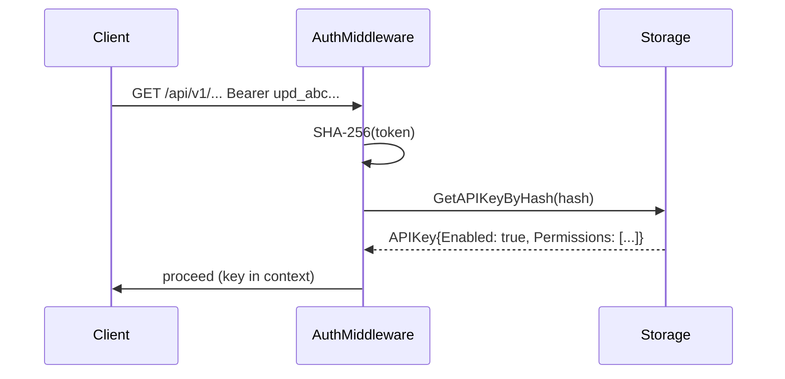

# Admin Key Management — Design

**Date:** 2026-02-16
**Status:** Approved
**Roadmap item:** 1.1 Admin REST API

## Overview

Replace config-file-based API key management with a storage-backed system exposing CRUD endpoints under `/api/v1/admin/keys`. A single bootstrap key may be provided in config; it is seeded into storage on first startup and thereafter behaves like any other key.

## Goals

- API keys are manageable at runtime with no service restart.
- Raw key values are never stored; a SHA-256 hash is stored instead.
- The bootstrap key in config is the only key that ever comes from config; all others are created via the API.
- Key changes take effect immediately.

## Non-Goals

- Multi-tenant key scoping (deferred to Phase 2).
- Key expiry or rotation policies.
- Separate keystore backend (keys use whichever storage backend is active).

## Model

A new `APIKey` model replaces the current `APIKey` struct in `models/config.go`.

```go
type APIKey struct {
    ID          string    // UUID v4
    Name        string    // Human-readable label
    KeyHash     string    // SHA-256 hex of the raw key (never returned in responses)
    Prefix      string    // First 8 characters of the raw key (display only)
    Permissions []string  // Subset of: read, write, admin
    Enabled     bool
    CreatedAt   time.Time
    UpdatedAt   time.Time
}
```

### Key Format

Raw keys follow the format `upd_<32 URL-safe base64 chars>`, providing 192 bits of entropy. The `upd_` prefix makes keys identifiable by secret scanning tools (gitleaks is already configured in CI).

### Hashing

SHA-256 of the raw key is stored as a lowercase hex string. The raw key is generated in memory, returned once in the creation response, and never persisted. On authentication, the presented Bearer token is hashed and matched against `key_hash` in storage.

### Config Changes

`SecurityConfig` is simplified: the `APIKeys []APIKey` slice is removed and replaced with a single `BootstrapKey string` field.

```yaml
security:
  enable_auth: true
  bootstrap_key: "upd_..."  # optional; seeded into storage on first startup
```

## Storage Layer

Five new methods are added to the `Storage` interface:

```go
CreateAPIKey(ctx context.Context, key *models.APIKey) error
GetAPIKeyByHash(ctx context.Context, hash string) (*models.APIKey, error)
ListAPIKeys(ctx context.Context) ([]*models.APIKey, error)
UpdateAPIKey(ctx context.Context, key *models.APIKey) error
DeleteAPIKey(ctx context.Context, id string) error
```

### Backend Implementations

| Backend | Storage mechanism |
|---------|------------------|
| Memory | In-memory map keyed by ID; secondary map keyed by `KeyHash` for O(1) auth lookups |
| JSON | New top-level `"api_keys"` array in `releases.json` |
| SQLite | New `api_keys` table; sqlc queries in `internal/storage/sqlc/sqlite/` |
| PostgreSQL | New `api_keys` table; sqlc queries in `internal/storage/sqlc/postgres/` |

`GetAPIKeyByHash` is the hot path (every authenticated request). SQL backends index `key_hash`; the memory backend uses a secondary map.

## Bootstrap Seeding

Executed once in `cmd/updater/main.go` after the storage provider is initialised:

```
if config.Security.BootstrapKey == "" → skip
hash = SHA-256(config.Security.BootstrapKey)
if storage.GetAPIKeyByHash(ctx, hash) found → skip (idempotent)
storage.CreateAPIKey(ctx, &APIKey{
    Name:        "bootstrap",
    KeyHash:     hash,
    Prefix:      key[:8],
    Permissions: ["admin"],
    Enabled:     true,
})
```

After seeding, the bootstrap key is a normal key in storage. It can be renamed, disabled, or deleted through the API.

## Auth Middleware

The existing loop over `config.Security.APIKeys` in `authMiddleware` is replaced with:

1. Extract the Bearer token from the `Authorization` header.
2. Compute SHA-256.
3. Call `storage.GetAPIKeyByHash(ctx, hash)`.
4. If not found or `Enabled == false`, return 401.
5. Store the resolved `*models.APIKey` in the request context.

Config no longer participates in runtime authentication after startup.

## REST Endpoints

All four endpoints require `admin` permission.

| Method | Path | Description |
|--------|------|-------------|
| `GET` | `/api/v1/admin/keys` | List all keys (metadata only; no hash, no raw key) |
| `POST` | `/api/v1/admin/keys` | Create a key; raw key returned once in response |
| `PATCH` | `/api/v1/admin/keys/{id}` | Update name, permissions, or enabled state |
| `DELETE` | `/api/v1/admin/keys/{id}` | Revoke a key |

### Request / Response Shapes

**POST `/api/v1/admin/keys`** request:

```json
{
  "name": "CI Publisher",
  "permissions": ["write"]
}
```

Response (201):

```json
{
  "id": "uuid",
  "name": "CI Publisher",
  "key": "upd_aB3xZ9qR...",
  "prefix": "upd_aB3x",
  "permissions": ["write"],
  "enabled": true,
  "created_at": "2026-02-16T00:00:00Z"
}
```

**GET `/api/v1/admin/keys`** response (200):

```json
[
  {
    "id": "uuid",
    "name": "CI Publisher",
    "prefix": "upd_aB3x",
    "permissions": ["write"],
    "enabled": true,
    "created_at": "2026-02-16T00:00:00Z",
    "updated_at": "2026-02-16T00:00:00Z"
  }
]
```

**PATCH `/api/v1/admin/keys/{id}`** request (all fields optional):

```json
{
  "name": "CI Publisher v2",
  "permissions": ["write"],
  "enabled": false
}
```

### Audit Logging

Every mutation (create, update, delete) emits a structured log event:

```go
slog.Info("api key mutated",
    "event", "security_audit",
    "action", "create|update|delete",
    "key_id", id,
    "key_name", name,
    "actor_key_id", actorID,
)
```

## Admin UI

A new "API Keys" section is added to the admin web UI:

| Route | Description |
|-------|-------------|
| `GET /admin/keys` | Key list: name, prefix, permissions, enabled, created date |
| `GET /admin/keys/new` | Create key form |
| `POST /admin/keys` | Process creation; display raw key once with copy button and "will not be shown again" warning |
| `DELETE /admin/keys/{id}` | Revoke (HTMX inline, no page reload) |
| `POST /admin/keys/{id}/toggle` | Enable/disable toggle (HTMX inline) |

No separate edit page; name and permissions are updated via inline forms calling the PATCH endpoint.

## OpenAPI Spec

`internal/api/openapi/openapi.yaml` is updated to document all four endpoints with full request/response schemas and security requirements.

## Data Flow



```mermaid
sequenceDiagram
    participant AdminClient
    participant KeyHandler
    participant Storage

    AdminClient->>KeyHandler: POST /api/v1/admin/keys {name, permissions}
    KeyHandler->>KeyHandler: generate raw key
    KeyHandler->>KeyHandler: SHA-256(raw key)
    KeyHandler->>Storage: CreateAPIKey(hash, prefix, ...)
    Storage-->>KeyHandler: ok
    KeyHandler-->>AdminClient: 201 {id, key (raw), prefix, ...}
    note over KeyHandler,AdminClient: raw key not stored; returned once only
```

## Testing

- Unit tests for the SHA-256 hashing helper
- Unit tests for each storage backend's key CRUD methods
- Table-driven handler tests for all four endpoints (auth, permission checks, response shapes)
- Integration test: create key via POST, authenticate with it, revoke it, confirm 401
- Bootstrap seeding test: seed once, restart (call seed again), confirm no duplicate