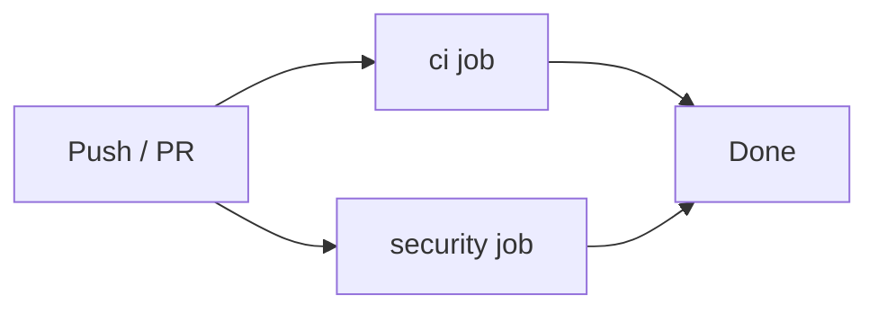

# GitHub CI Pipeline Design

**Date:** 2026-02-16

## Overview

A GitHub Actions CI pipeline that validates every push to `main` and every PR targeting `main`. All checks mirror the local development workflow via Docker, ensuring parity between local and CI environments.

## Goals

- Run the full test suite on every PR and push to main
- Enforce formatting, vet, and OpenAPI spec validity
- Enforce a coverage ratchet: coverage must never decrease
- Run static security analysis (gosec) with threshold-based failure
- Surface security findings in the GitHub Security tab

## Workflow Structure

Two parallel jobs in `.github/workflows/ci.yml`:



**Triggers:**
- `push` to `main`
- `pull_request` targeting `main`

## Job: ci

Runs on `ubuntu-latest` using Docker-in-Docker (all Make targets run inside Docker).

| Step | Command | Fails on |
|------|---------|----------|
| Format check | `make fmt-check` | Any unformatted file |
| Vet | `make vet` | Any vet error |
| Test | `make test` | Any test failure |
| Coverage | `make cover` + threshold check | Coverage below `.github/coverage-threshold` |
| OpenAPI validate | `make openapi-validate` | Invalid OpenAPI spec |

## Job: security

Runs on `ubuntu-latest` with native Go 1.25.0 (no Docker needed for gosec).

Requires `permissions: security-events: write` for SARIF upload.

| Step | Detail |
|------|--------|
| Install gosec | `go install github.com/securego/gosec/v2/cmd/gosec@latest` |
| Generate SARIF | `gosec -no-fail -fmt sarif -out gosec.sarif ./...` |
| Upload to Security tab | `github/codeql-action/upload-sarif` with `gosec.sarif` |
| Enforce threshold | `gosec -severity high -confidence medium ./...` — fails on High severity + Medium or High confidence findings |

SARIF is always uploaded (even when findings exist) so developers can inspect findings in the GitHub Security tab regardless of build outcome.

## Coverage Ratchet

Coverage is enforced via a committed threshold file:

- **File:** `.github/coverage-threshold` — contains a single float, e.g. `78.4`
- **CI:** reads the file, parses coverage from `make cover` output, fails if current < threshold
- **Developer workflow:** update the file in the PR when coverage increases — the diff makes improvements explicit and reviewable
- **Initial value:** set to the current coverage percentage on first run

## New Make Targets

Three new targets added to support CI and local parity:

### `make fmt-check`

Checks formatting without modifying files. Uses `gofmt -l` and fails if any files need formatting.

```makefile
fmt-check: ## Check formatting (non-destructive)
    docker run --rm -v $(PWD):/app -w /app golang:1.25 \
        sh -c 'test -z "$(gofmt -l .)"'
```

### `make cover`

Runs tests with coverage and prints a parseable total line.

```makefile
cover: ## Run tests with coverage report
    docker run --rm -v $(PWD):/app -w /app golang:1.25 \
        go test -coverprofile=coverage.out ./... && \
        go tool cover -func=coverage.out | grep ^total
```

Outputs: `total: (statements)  78.4%`

### `make security`

Runs gosec locally using the official Docker image, matching CI threshold.

```makefile
security: ## Run gosec security scanner
    docker run --rm \
        -v $(PWD):/app \
        -w /app \
        securego/gosec:latest \
        -severity high -confidence medium ./...
```

## Security Scan Thresholds

| Dimension | Threshold |
|-----------|-----------|
| Severity | High only |
| Confidence | Medium and above |

Findings below threshold appear in the GitHub Security tab but do not fail the build. Specific false positives can be suppressed inline with `// #nosec G###` comments.

## Files Created or Modified

| File | Change |
|------|--------|
| `.github/workflows/ci.yml` | New — GitHub Actions workflow |
| `.github/coverage-threshold` | New — coverage ratchet baseline |
| `make/go.mk` | Modified — add `fmt-check`, `cover`, `security` targets |
| `mkdocs.yml` | Modified — add CI design doc to Plans nav |