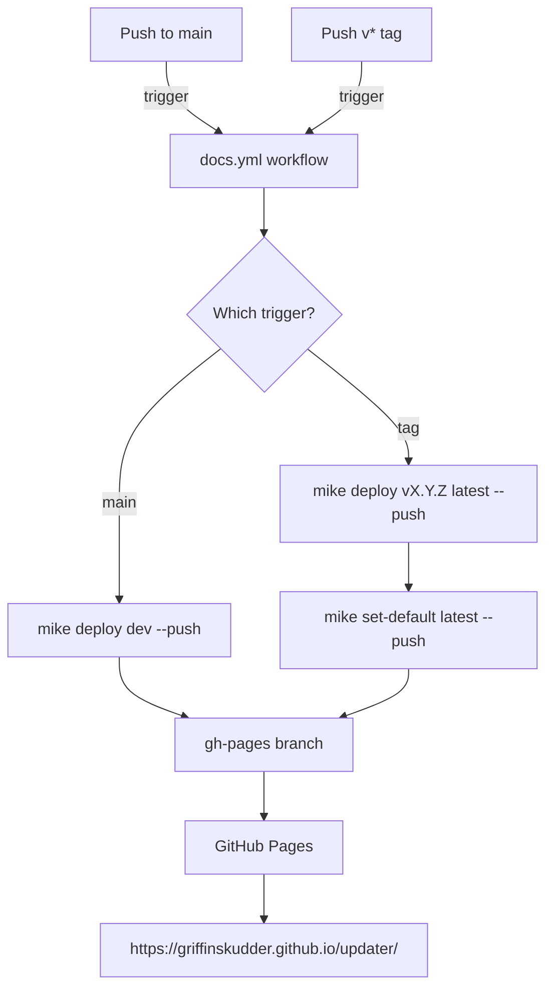

# GitHub Pages with Versioned Docs — Design

**Date:** 2026-02-16
**Status:** Approved

## Overview

Publish the MkDocs documentation site to GitHub Pages with versioned docs managed by `mike`. Development docs are published on every push to `main` under the `dev` label. Tagged releases publish under their version number (e.g., `v1.2.0`) and update a `latest` alias that serves as the site default.

## Goals

- Visitors landing on the docs site without a version in the URL see the latest stable release.
- The `dev` label always reflects the current state of `main`.
- Each `v*` tag produces a permanent, browsable version of the docs.
- No local tooling required beyond what already exists; deployment runs entirely in CI.

## Approach

`mike` manages multiple doc versions on a single `gh-pages` branch. MkDocs Material has native support for `mike` via its version picker UI. This is the standard, supported approach for versioned MkDocs sites.

## Components

### GitHub Actions Workflow

New file: `.github/workflows/docs.yml`

**Triggers:**

| Event | Condition | Action |
|---|---|---|
| `push` | branch `main` | Deploy as `dev` |
| `push` | tag matching `v*` | Deploy as version + update `latest` alias |

**Permissions:** `contents: write` (to push to `gh-pages` branch).

**Steps:**

1. `actions/checkout@v4` with `fetch-depth: 0` — mike requires full git history to manage `gh-pages`.
2. `actions/setup-python@v5`
3. `pip install mkdocs-material mike`
4. Configure git user identity for the commit mike makes to `gh-pages`.
5. On `main` push: `mike deploy --push --update-aliases dev`
6. On `v*` tag push: `mike deploy --push --update-aliases $VERSION latest` then `mike set-default --push latest`

### MkDocs Configuration

One change to `mkdocs.yml`:

- Set `site_url` to `https://griffinskudder.github.io/updater/`. The field is currently empty, which breaks mike's URL resolution when switching between versions.

`extra.version.provider: mike` and `extra.version.default: latest` are already present — no further changes needed.

### GitHub Pages Repository Setting

One-time manual configuration: set Pages source to the `gh-pages` branch, root `/`, in *Settings → Pages → Source*. Mike creates and manages the `gh-pages` branch automatically on first deploy.

## Data Flow

## Versioning Scheme

| Label | Source | Default? |
|---|---|---|
| `dev` | `main` branch | No |
| `vX.Y.Z` | `vX.Y.Z` tag | No |
| `latest` | Alias → most recent `vX.Y.Z` | Yes |

## Out of Scope

- Version retention policy (all versions are kept indefinitely).
- Custom domain configuration.
- PR preview deployments.