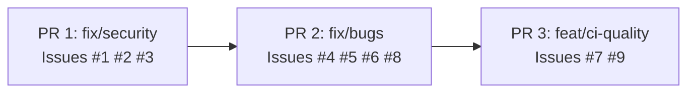

# Issue Fixes Design

**Date:** 2026-02-16
**Scope:** All 9 open GitHub issues (#1-#9)
**Approach:** Three focused PRs delivered in priority order: security first, behavioural bugs second, CI quality third.

---

## Overview

Nine confirmed issues were filed against the codebase covering security bugs, behavioural bugs, a performance problem, and CI gaps. This document records the agreed design for fixing all nine in three sequential pull requests.



---

## PR 1 — `fix/security` (closes #1, #2, #3)

### Problem summary

| Issue | Location | Problem |
|-------|----------|---------|
| #1 | `internal/storage/json.go:66,135` | Directory created with `0644` (non-traversable); data file world-readable |
| #2 | `internal/api/handlers_admin.go:146-163` | Login cookie missing `Secure: true`; logout cookie attributes inconsistent |
| #3 | `internal/api/handlers_admin.go:120` | Flash redirect URL built by string concatenation without URL-encoding |

### Changes

**`internal/storage/json.go`**

- Line 66: `os.MkdirAll(..., 0644)` → `os.MkdirAll(..., 0700)`
  - `0700` = owner read/write/execute; no access for group or world.
  - Without the execute bit the directory cannot be entered by anyone, making the storage provider non-functional on a fresh deployment.
- Line 135: `os.WriteFile(..., 0644)` → `os.WriteFile(..., 0600)`
  - `0600` = owner read/write only; data file is not world-readable on multi-user systems.

**`internal/api/handlers_admin.go`**

Login cookie (lines 146-152) — add `Secure: true`:
```go
http.SetCookie(w, &http.Cookie{
    Name:     "admin_session",
    Value:    key,
    Path:     "/admin",
    HttpOnly: true,
    Secure:   true,
    SameSite: http.SameSiteStrictMode,
})
```

Logout cookie (lines 158-163) — match all attributes so browsers recognise it as the same cookie:
```go
http.SetCookie(w, &http.Cookie{
    Name:     "admin_session",
    Value:    "",
    Path:     "/admin",
    MaxAge:   -1,
    HttpOnly: true,
    Secure:   true,
    SameSite: http.SameSiteStrictMode,
})
```

`addFlash` (line 115-121) — replace string concatenation with `url.Values`:
```go
func addFlash(base, msg, flashType string) string {
    u, err := url.Parse(base)
    if err != nil {
        return base
    }
    q := u.Query()
    q.Set("flash", msg)
    q.Set("flash_type", flashType)
    u.RawQuery = q.Encode()
    return u.String()
}
```

Add `"net/url"` to the import block.

### Tests

- `TestAddFlash_EncodesSpecialCharacters`: verify `&`, `=`, and `#` in message are percent-encoded and do not inject extra query parameters.
- `TestAdminLogin_Cookie`: assert response sets cookie with `Secure=true`, `HttpOnly`, `SameSite=Strict`.
- `TestAdminLogout_Cookie`: assert logout cookie has identical `Path`, `HttpOnly`, `Secure`, `SameSite` to the login cookie.

---

## PR 2 — `fix/bugs` (closes #4, #5, #6, #8)

### Problem summary

| Issue | Location | Problem |
|-------|----------|---------|
| #4 | `Dockerfile:7` | Build image `golang:1.26-alpine` does not match `go.mod` which declares `go 1.25.0` |
| #5 | `Dockerfile:60` | Static-binary check exits 0 on failure (`\|\| echo`) instead of failing the build |
| #6 | `internal/storage/json.go:83-124` | TOCTOU race: cache checked under `RLock`, released, then `os.Stat` runs unprotected before `WLock` is acquired |
| #8 | `.github/workflows/ci.yml` | Tests run without `-race`; concurrent components (storage, rate limiter) have undetected races |

### Changes

**`Dockerfile`**

Line 7:
```dockerfile
FROM golang:1.25-alpine AS builder
```

Line 60:
```sh
ldd updater 2>&1 | grep -q "not a dynamic executable" || \
  (echo "FAILED: binary is not statically linked" && exit 1)
```

**`internal/storage/json.go` — `loadData()` TOCTOU fix**

Consolidate all shared-state access under a single write lock. The double-checked locking pattern re-validates cache state immediately after acquiring the write lock, eliminating the race window:

```go
func (j *JSONStorage) loadData() error {
    // Fast path: cache valid (read lock).
    j.mu.RLock()
    if j.data != nil && time.Now().Before(j.cacheExpiry) {
        j.mu.RUnlock()
        return nil
    }
    j.mu.RUnlock()

    // Slow path: acquire write lock and re-check.
    j.mu.Lock()
    defer j.mu.Unlock()

    // Re-validate: another goroutine may have loaded while we waited.
    if j.data != nil && time.Now().Before(j.cacheExpiry) {
        return nil
    }

    // All shared-state reads and writes from here are under the write lock.
    info, err := os.Stat(j.filePath)
    if err != nil {
        return fmt.Errorf("failed to stat file: %w", err)
    }

    if j.data != nil && !info.ModTime().After(j.lastModified) {
        j.cacheExpiry = time.Now().Add(j.cacheTTL)
        return nil
    }

    fileData, err := os.ReadFile(j.filePath)
    if err != nil {
        return fmt.Errorf("failed to read file: %w", err)
    }

    var data JSONData
    if err := json.Unmarshal(fileData, &data); err != nil {
        return fmt.Errorf("failed to unmarshal JSON: %w", err)
    }

    j.data = &data
    j.lastModified = info.ModTime()
    j.cacheExpiry = time.Now().Add(j.cacheTTL)
    return nil
}
```

**`.github/workflows/ci.yml`**

Add a race-detection step in the `ci` job, after the coverage step:
```yaml
- name: Race detector
  run: go test -race ./...
```

This is kept separate from the coverage step to avoid interfering with the coverage threshold calculation.

### Tests

- `TestLoadData_ConcurrentAccess` in `internal/storage/json_test.go`: launch 20 goroutines all calling `loadData` on the same `JSONStorage` instance concurrently. Assert that no goroutine returns an error and that `j.data` is non-nil afterward. This test is designed to be run with `-race` to catch the original data race.

---

## PR 3 — `feat/ci-quality` (closes #7, #9)

### Problem summary

| Issue | Location | Problem |
|-------|----------|---------|
| #7 | `internal/update/service.go:350-357` | Manual O(n²) bubble sort where `sort.Slice` (O(n log n)) would be simpler and faster |
| #9 | `.github/workflows/ci.yml` | `internal/integration/integration_test.go` exists but is never run in CI |

### Changes

**`internal/update/service.go` — `sortReleases`**

Replace the nested bubble-sort loops with a single stdlib call. The `less` closure and the `sortOrder` reversal logic above it are unchanged:

```go
sort.Slice(releases, less)
```

The `"sort"` package is already imported in the file.

**`.github/workflows/ci.yml`**

Add an integration test step in the `ci` job, after the race detector step:
```yaml
- name: Integration tests
  run: go test -v ./internal/integration/...
```

No build tags are required. The integration tests use `httptest.NewServer` and operate entirely in-process; no external services are needed.

A pre-implementation check confirms the integration tests pass with `make test` before the CI step is added.

### Tests

- No new tests required. The existing service-layer tests exercise `sortReleases` output and will catch regressions. The integration tests are already written.

---

## Implementation Order

1. Branch `fix/security` from `main` — implement PR 1 changes and tests, open PR, merge.
2. Branch `fix/bugs` from `main` (post-merge) — implement PR 2 changes and tests, open PR, merge.
3. Branch `feat/ci-quality` from `main` (post-merge) — implement PR 3 changes, confirm integration tests pass, open PR, merge.

## Non-Goals

- No new features are introduced.
- No refactoring beyond the minimal change required to fix each issue.
- No changes to the OpenAPI spec (no API surface is modified).