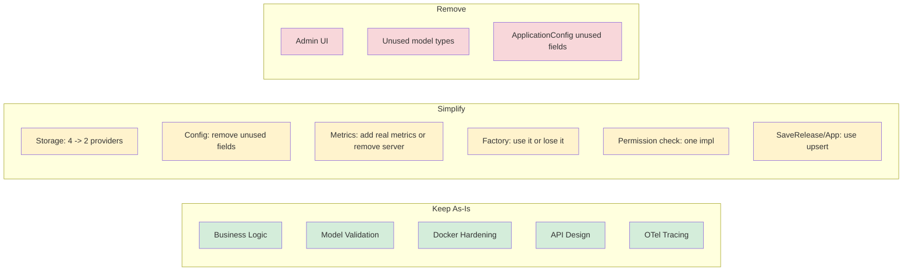

# Architecture Review: Over-Engineering Assessment

**Date:** 2026-03-02 (updated from 2026-02-27)
**Scope:** Full codebase review — every production file read
**Codebase:** ~21,800 lines of Go (12,400 test, 9,400 production, ~1,300 sqlc-generated)

## Summary

The core business logic is simple and well-implemented: clients ask "is there a
newer version?" and get back download metadata. The surrounding infrastructure
has grown beyond what the domain complexity warrants.

**Verdict:** Moderately over-engineered. The architecture itself is sound but
scope has expanded beyond current needs, and several structures are defined but
never consumed.

## What is Well-Engineered

### Business Logic (`internal/update/`)

652 lines of production code, 1,225 lines of tests. Semver comparison, release
filtering, pre-release handling, minimum-version enforcement, pagination. No
unnecessary abstractions. 1.9:1 test-to-code ratio. This is the heart of the
service and it is appropriately scoped.

### Rate Limiting Removal

The CLAUDE.md still references a custom token bucket in `internal/ratelimit/`,
but that directory no longer exists. Rate limiting has been correctly delegated
to the reverse proxy. This was a good architectural decision.

### Model Validation

Multi-layer validation: struct-level `Validate()` methods, request
`Normalize()` + `Validate()`, and cascading config validation. Thorough without
being excessive. 1.8:1 test-to-code ratio on models.

### Docker and Deployment Hardening

Distroless image, non-root user, read-only filesystem, capability dropping, a
dedicated health check binary (`cmd/healthcheck/`), resource limits in
Kubernetes manifests. Proportionate security for a service that manages software
distribution.

### API Design

Clean REST API with versioned paths (`/api/v1`), proper error types
(`ServiceError` mapped to HTTP status codes), consistent JSON response formats,
and an OpenAPI 3.0.3 specification. The middleware chain (auth -> permissions ->
handler) is straightforward.

## Areas of Concern

### 1. Admin UI (High)

**580 lines** of handler code (`handlers_admin.go`), HTML templates with HTMX
partials, and cookie-based session authentication alongside the API's Bearer
token auth.

Impact:

- 18 admin-specific handler functions that parallel the 15 REST API handlers
- A second authentication mechanism (cookie sessions vs Bearer tokens), including
  a separate `adminSessionMiddleware` and `isValidAdminKey` function
- Template rendering, flash messages, form handling
- `allPlatforms` and `allArchitectures` slice literals duplicated from `models`

The admin UI roughly doubles the API layer's surface area. For an update service
managed by developers, Swagger UI (already served at `/api/v1/docs`) covers
interactive API exploration. A custom web UI is hard to justify.

**Recommendation:** Remove the admin UI entirely, or break it into a separate
repository so it does not add complexity to the API server.

### 2. Four Storage Providers (Medium)

The storage interface has **18 methods** implemented **4 times**:

| Provider   | LOC | Use Case                |
|------------|-----|-------------------------|
| Memory     | 356 | Testing only            |
| JSON       | 510 | Simple deployments      |
| PostgreSQL | 587 | Production at scale     |
| SQLite     | 657 | Lightweight production  |

Plus **~1,300 lines** of sqlc-generated code across both database providers,
plus `dbconvert.go` (113 lines of marshal/unmarshal helpers that exist partly
because two different DB drivers use different type conventions).

The Memory provider is justified as a test double. JSON and SQLite serve the
same niche (simple, file-based single-node deployment). Maintaining both means
two SQL schemas, two sqlc configurations, and parallel type-conversion code —
including thin wrapper functions like `unmarshalPlatformsFromString` that exist
solely because SQLite returns `string` where Postgres returns `[]byte`.

**Recommendation:** Drop JSON or SQLite (SQLite is the better file-based option
as it supports concurrent readers and atomic writes). Keep PostgreSQL for
production. This removes an entire sqlc target and ~550–650 lines.

### 3. Factory Pattern Is Unused in Production (Medium)

`internal/storage/factory.go` defines a `Factory` struct with `Create()`,
`ValidateConfig()`, and `GetSupportedProviders()`. `initializeStorage()` in
`cmd/updater/updater.go` implements the same switch statement independently,
bypassing the factory entirely. The factory is only exercised in tests.

There is also a dual-config problem: `storage.Config` (in `interface.go`) and
`models.StorageConfig` (in `models/config.go`) both describe storage
configuration. The factory converts between them; main.go constructs
`storage.Config` directly, which makes `models.StorageConfig` a transport-only
type and `storage.Config` partially redundant.

**Recommendation:** Either use the factory in main (and delete `initializeStorage`),
or delete the factory and consolidate on a single config type. There is no reason
to maintain both.

### 4. Unused Configuration Surface Area (Medium)

The config system defines ~50 fields across 12 structs. Several are fully
defined, validated, and tested but never consumed:

- **CacheConfig, RedisConfig, MemoryConfig** (~11 fields): No caching layer
  exists anywhere in the handlers or service. The config, its defaults, and its
  validation are pure scaffolding for a feature that does not exist.
- **LoggingConfig rotation fields** (`max_size`, `max_backups`, `max_age`,
  `compress`): Defined in config but the logger package (`internal/logger/`)
  never reads them. No log rotation library is imported.
- **ApplicationConfig** (9 fields): `UpdateCheckURL`, `NotificationURL`,
  `AnalyticsEnabled`, `AutoUpdate`, `UpdateInterval`, `RequiredUpdate`,
  `AllowPrerelease`, `MinVersion`, `MaxVersion`. These are stored and returned in
  API responses, but the update service never reads any of them to alter
  behavior. `ApplicationConfig` is a data bag with no runtime effect. The only
  field that actually matters for the service is `Platforms` on `Application`
  itself, which is checked in `SupportsPlatform()`.

**Recommendation:** Remove CacheConfig, RedisConfig, MemoryConfig. Remove unused
log rotation fields. Either remove ApplicationConfig or implement the fields that
matter (e.g., `AllowPrerelease` per application, `MinVersion` enforcement).

### 5. Unused Model Types (Low-Medium)

Several types are defined but never instantiated or returned by any handler:

| Type | File | Issue |
|------|------|-------|
| `ReleaseMetadata` | `models/release.go:100` | Defined but nothing creates or reads it |
| `ReleaseFilter` | `models/release.go:80` | `ListReleasesRequest` is used instead |
| `ReleaseStats` | `models/release.go:297` | `ApplicationStats` is used instead |
| `StatsResponse` | `models/response.go:183` | No endpoint returns it |
| `ActivityItem` | `models/response.go:192` | No endpoint returns it |
| `ValidationErrorResponse` | `models/response.go:199` | `NewValidationErrorResponse` exists but is never called |
| `HealthCheckRequest` | `models/request.go:115` | No handler parses it |

**Recommendation:** Delete all of these. They are dead code that makes the
models package harder to understand.

### 6. Observability Infrastructure Without Application Metrics (Low-Medium)

A Prometheus metrics server starts on a dedicated port (9090) and the OTel
`MeterProvider` is configured. The storage instrumentation wrapper
(`internal/observability/storage.go`, 240 lines) records latency histograms and
error counters for every storage call. But **zero application-level metrics are
emitted** — no request counters, no update-check latency, no version
distribution histograms.

The result is a metrics endpoint that publishes Go runtime metrics and
storage-operation latency, but nothing about the service's own behavior.

**Recommendation:** Either add meaningful application metrics (HTTP request
count/latency, update-check hits/misses) to justify the infrastructure, or
remove the Prometheus server and keep only the `/health` endpoint. The OTel
tracing wrapper is useful to retain if distributed tracing is actively used.

### 7. Permission Checking Duplication (Low)

`models.APIKey.HasPermission()` and `api.SecurityContext.HasPermission()` both
implement the same permission hierarchy (admin > write > read). They differ
slightly in style but implement identical logic. `SecurityContext` exists solely
to wrap `*models.APIKey` with a slightly different call signature.

**Recommendation:** Remove `SecurityContext.HasPermission` and call
`APIKey.HasPermission` directly from middleware, or remove `SecurityContext`
entirely and use `*models.APIKey` from the request context.

### 8. SaveApplication / SaveRelease Do a SELECT Before Every Write (Low)

Both Postgres and SQLite implementations of `SaveApplication` and `SaveRelease`
issue a `GET` query to decide between `INSERT` and `UPDATE`. This is a
read-then-write pattern that adds an extra round-trip on every save and has
a TOCTOU window (between the check and the write, another request could
create the record). Databases support `INSERT ... ON CONFLICT DO UPDATE`
(upsert) natively.

**Recommendation:** Replace the SELECT + conditional INSERT/UPDATE pattern with
a single SQL `UPSERT` in each provider. This simplifies the code and removes the
race condition.

## Quantified Impact

If the recommendations above were followed:

| Change | LOC Removed (est.) | Effect |
|--------|-----------------:|--------|
| Remove admin UI | ~800 | Eliminates parallel auth, 18 handlers, templates |
| Drop JSON or SQLite provider | ~550–650 | One fewer provider + sqlc target |
| Remove factory or use it consistently | ~80 | Eliminates dead code and config duplication |
| Remove unused config (cache, log rotation) | ~150 | Fewer structs, simpler validation |
| Remove unused model types | ~80 | Cleaner models package |
| Remove ApplicationConfig unused fields | ~60 | Config reflects reality |
| Fix permission duplication | ~30 | One source of truth |
| **Total** | **~1,750–1,850** | **~19–20% of production code** |

## CLAUDE.md Corrections Needed

1. States rate limiting uses "Token bucket algorithm (`internal/ratelimit/`)" --
   this directory does not exist.
2. Does not mention the admin UI.
3. Mentions `CacheConfig` / cache without noting it is entirely unused.

## Conclusion

The core architecture (layered design, clean interfaces, good test coverage) is
sound. The over-engineering is in **scope creep and dead code**: features and
infrastructure were built before they were needed (caching config, admin UI,
multiple storage backends for the same tier, unused model types). The
`ApplicationConfig` struct is the clearest example: 9 fields stored and
validated but none of them alter service behavior.

The service would benefit most from trimming unused code and converging on fewer,
better-supported paths. The highest-value changes are removing the admin UI and
consolidating to two storage providers (Memory + PostgreSQL, or Memory + SQLite).

