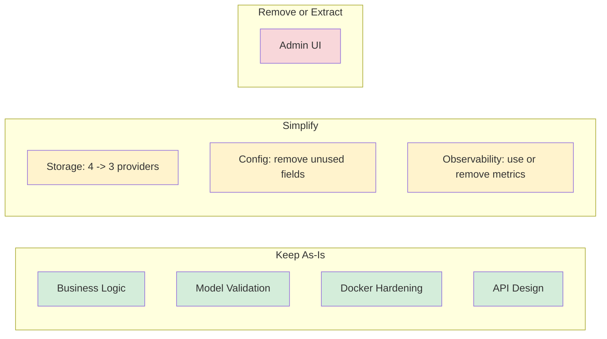

# Architecture Review: Over-Engineering Assessment

**Date:** 2026-02-27
**Scope:** Full codebase review
**Codebase:** ~21,800 lines of Go (12,400 test, 9,400 production)

## Summary

The core business logic is simple and well-implemented: clients ask "is there a
newer version?" and get back download metadata. The surrounding infrastructure
has grown beyond what the domain complexity warrants. The biggest concerns are
the admin UI, unused configuration surface area, and the 4-provider storage
layer.

**Verdict:** Moderately over-engineered. The architecture itself is sound but
scope has expanded beyond current needs.

## What is Well-Engineered

### Business Logic (`internal/update/`)

652 lines of production code, 1,225 lines of tests. Semver comparison, release
filtering, pagination. No unnecessary abstractions. 1.9:1 test-to-code ratio.
This is the heart of the service and it is appropriately scoped.

### Rate Limiting Removal

The CLAUDE.md still references a custom token bucket in `internal/ratelimit/`,
but that directory no longer exists. Rate limiting has been correctly delegated
to the reverse proxy. This was a good architectural decision: the service
focuses on business logic, not infrastructure.

### Model Validation

Multi-layer validation: struct-level `Validate()` methods, request
`Normalize()` + `Validate()`, and cascading config validation. Thorough without
being excessive. 1.8:1 test-to-code ratio on models.

### Docker and Deployment Hardening

Distroless image, non-root user, read-only filesystem, capability dropping,
seccomp profile, resource limits in Kubernetes manifests. Proportionate security
for a service that manages software distribution.

### API Design

Clean REST API with versioned paths (`/api/v1`), proper error types
(`ServiceError` mapped to HTTP status codes), consistent JSON response formats,
and a 53 KB OpenAPI 3.0.3 specification. The middleware chain (auth ->
permissions -> handler) is straightforward.

## Areas of Concern

### 1. Admin UI (High)

**580 lines** of handler code (`handlers_admin.go`), **11 HTML templates** with
HTMX partials, and cookie-based session authentication alongside the API's
Bearer token auth.

Impact:

- 18 admin-specific handler functions that duplicate the 15 REST API handlers
- A second authentication mechanism (cookie sessions vs Bearer tokens)
- Template rendering, flash messages, form handling
- This is a parallel interface to the same underlying storage layer

The admin UI roughly doubles the API layer's surface area. For an update service
likely managed by developers comfortable with `curl`, a generic API client, or
Swagger UI (already served at `/api/v1/docs`), a custom web UI is hard to
justify.

**Recommendation:** Consider removing the admin UI entirely. Swagger UI already
covers interactive API exploration. If a UI is genuinely needed, break it into
a separate service or repository to avoid coupling it to the API server.

### 2. Four Storage Providers (Medium)

The storage interface has **18 methods** implemented **4 times**:

| Provider   | LOC | Use Case                |
|------------|-----|-------------------------|
| Memory     | 356 | Testing only            |
| JSON       | 510 | Simple deployments      |
| PostgreSQL | 587 | Production at scale     |
| SQLite     | 657 | Lightweight production  |

Plus **1,287 lines** of sqlc-generated code across both database providers.

The Memory provider is justified as a test double. But JSON, PostgreSQL, **and**
SQLite is one too many. JSON and SQLite serve the same niche (simple,
single-node deployment), and maintaining both database providers means duplicate
SQL schemas, duplicate sqlc configurations, and duplicate type conversion code.

**Recommendation:** Drop one of JSON or SQLite as the "simple" backend. Keep
PostgreSQL as the "production" backend. This cuts the storage layer by roughly
30% and removes an entire sqlc target.

### 3. Unused Configuration Surface Area (Medium)

The config system defines **48 fields** across 12 structs. Several are defined,
validated, and tested but never consumed by application code:

- **CacheConfig** with Redis and Memory sub-configs (11 fields total): fully
  defined with validation, defaults, and tests, but no caching logic exists
  anywhere in the handlers or service layer. This is pure infrastructure for a
  feature that does not exist.
- **LoggingConfig file rotation fields** (`max_size`, `max_backups`, `max_age`,
  `compress`): defined in config but the logger never reads them. No log
  rotation library is integrated.
- **ReleaseMetadata** type (`internal/models/release.go:100`): struct is defined
  but never instantiated or referenced anywhere in the codebase.

**Recommendation:** Remove CacheConfig, RedisConfig, and MemoryConfig until
caching is actually needed. Remove the unused log rotation fields. Remove
ReleaseMetadata.

### 4. Observability Infrastructure Without Metrics (Low-Medium)

The Prometheus metrics server starts on a separate port and the exporter is
configured, but **zero application-level metrics are emitted**. The storage
instrumentation wrapper (`internal/observability/storage.go`, 240 lines) wraps
every storage call with OpenTelemetry spans and duration histograms.

**Recommendation:** Either add meaningful application metrics (request counts,
update-check latency, version distribution) to justify the Prometheus
infrastructure, or strip it back to just the `/health` endpoint. The storage
tracing wrapper is reasonable to keep if distributed tracing is actively used
in production.

### 5. Documentation Volume (Low)

Roughly 611 KB of documentation across 15+ markdown files, auto-generated model
references, database schema diagrams, a full MkDocs site with Material theme,
and a roadmap. The docs-build pipeline has 3 pre-build steps (OpenAPI
validation, gomarkdoc, tbls).

This is disproportionate for 9,400 lines of production code. Not necessarily a
problem since good docs are valuable, but the maintenance burden scales with the
documentation surface area.

## Quantified Impact

If the recommendations above were followed:

| Change                                | LOC Removed (est.) | Effect                                                         |
|---------------------------------------|--------------------:|----------------------------------------------------------------|
| Remove admin UI                       |                ~800 | Eliminates parallel auth, 18 handlers, template rendering      |
| Drop one storage provider (JSON or SQLite) |           ~550-650 | One fewer provider + sqlc target                               |
| Remove unused config (cache, log rotation) |             ~150 | Fewer config structs, simpler validation                       |
| Remove unused types (ReleaseMetadata) |                 ~15 | Minor cleanup                                                  |
| **Total**                             |      **~1,500-1,600** | **~17% of production code**                                  |

## CLAUDE.md Corrections Needed

The CLAUDE.md should be updated to reflect current reality:

1. States rate limiting uses "Token bucket algorithm (`internal/ratelimit/`)" --
   this directory does not exist. Rate limiting was removed and delegated to the
   reverse proxy.
2. Does not mention the admin UI, which is a significant feature adding
   substantial surface area.
3. Mentions cache config without noting it is entirely unused.

## Conclusion

The core architecture (layered design, clean interfaces, good test coverage) is
sound. The over-engineering is not in the architecture itself but in **scope
creep**: features and infrastructure were built before they were needed (caching
config, admin UI, multiple storage backends for the same deployment tier). The
service would benefit from trimming unused code and converging on fewer,
better-supported paths.

