# Architecture Cleanup Design

**Date:** 2026-03-02
**Based on:** [Architecture Review](2026-02-27-architecture-review.md)
**Approach:** Bottom-up -- smallest/safest changes first, escalating to structural changes

## Decisions

| Item | Decision |
|------|----------|
| Admin UI | Remove entirely (HTML/cookie UI only; REST API admin endpoints stay) |
| Storage providers | Keep SQLite, drop JSON. Memory stays as test double, PostgreSQL stays for production. |
| Factory pattern | Remove factory.go. Keep direct provider construction in main.go. Consolidate config types. |
| Unused config | Remove all: CacheConfig, RedisConfig, MemoryConfig, log rotation fields, unused ApplicationConfig fields |
| Unused model types | Delete all 7 unreferenced types |
| Observability | Add application-level Prometheus metrics (HTTP requests, update checks, releases registered) |
| Permission duplication | Remove SecurityContext, use models.APIKey.HasPermission directly |
| Upsert pattern | Replace SELECT + conditional INSERT/UPDATE with SQL UPSERT in both providers |

## Execution Order

### Step 1: Delete Unused Model Types

Remove 7 types that are defined but never instantiated or returned:

| Type | File | Action |
|------|------|--------|
| `ReleaseMetadata` | `models/release.go` | Delete type and any methods |
| `ReleaseFilter` | `models/release.go` | Delete type (ListReleasesRequest used instead) |
| `ReleaseStats` | `models/release.go` | Delete type (ApplicationStats used instead) |
| `StatsResponse` | `models/response.go` | Delete type |
| `ActivityItem` | `models/response.go` | Delete type |
| `ValidationErrorResponse` | `models/response.go` | Delete type and `NewValidationErrorResponse` constructor |
| `HealthCheckRequest` | `models/request.go` | Delete type |

Validation: `make test` must pass. Any compilation error means a type is actually used.

Update OpenAPI spec and `docs/models/` if these types appear there.

### Step 2: Fix Permission Duplication

- Remove `SecurityContext` struct from `internal/api/`
- Middleware stores/retrieves `*models.APIKey` directly from request context
- `RequirePermission` middleware calls `apiKey.HasPermission(required)`
- All handler code that reads `SecurityContext` switches to `*models.APIKey`

Risk: Touches the auth middleware chain. All authenticated endpoints affected.

Validation: Permission hierarchy tests in `security_test.go` must pass.

### Step 3: Remove Unused Config Fields

**Remove entirely:**
- `CacheConfig`, `RedisConfig`, `MemoryConfig` structs
- `cache` section from config parsing, validation, environment variables, defaults

**Remove from LoggingConfig:**
- `MaxSize`, `MaxBackups`, `MaxAge`, `Compress` (no log rotation library exists)

**Remove from ApplicationConfig:**
- `UpdateCheckURL`, `NotificationURL`, `AnalyticsEnabled`, `AutoUpdate`, `UpdateInterval`, `RequiredUpdate`, `AllowPrerelease`, `MinVersion`, `MaxVersion`
- If ApplicationConfig is empty after removal, remove the struct and `Config` field from `Application`

**Cascading updates:**
- Config examples (`examples/config.yaml`, `configs/`)
- Config validation and `NewDefaultConfig()`
- Config tests and integration test YAML blocks
- OpenAPI spec schemas
- Environment variable docs in `ARCHITECTURE.md`
- Storage schemas/sqlc if ApplicationConfig is stored in DB columns

Breaking change: ApplicationConfig fields removed from API responses.

### Step 4: Remove Factory Pattern

- Delete `internal/storage/factory.go` and `internal/storage/factory_test.go`
- Delete `storage.Config` type (if separate from `models.StorageConfig`)
- `models.StorageConfig` becomes the single config type
- Test code using `factory.Create()` switches to direct provider construction

### Step 5: Drop JSON Storage Provider

- Delete `internal/storage/json.go` and `internal/storage/json_test.go`
- Remove "json" from storage type switch statements and config validation
- Change default storage type from "json" to "sqlite"
- Keep `data/releases.json` as example data only
- Update documentation, config examples, integration tests

Migration path for existing deployments: switch `storage.type` to `sqlite`.

### Step 6: Replace SELECT + INSERT/UPDATE with Upserts

**PostgreSQL and SQLite:**
- Replace `SaveApplication` and `SaveRelease` read-then-write patterns with `INSERT ... ON CONFLICT DO UPDATE`
- Update sqlc query files in `internal/storage/sqlc/queries/postgres/` and `sqlite/`
- Simplify provider code: single-query save instead of conditional branching
- Run `make sqlc-generate` after query changes

Eliminates TOCTOU race condition between check and write.

### Step 7: Remove Admin UI

**Delete:**
- `internal/api/handlers_admin.go` (~580 lines)
- `internal/api/admin/templates/` directory
- `adminSessionMiddleware` and `isValidAdminKey`
- Admin cookie session logic
- Admin UI routes from `routes.go`
- Admin-specific test cases

**Keep:**
- REST API admin endpoints (`/api/v1/admin/keys`)
- Bearer token authentication

**Cleanup:**
- Remove `allPlatforms` / `allArchitectures` duplicated slices if admin-UI-only
- Update documentation and OpenAPI spec

### Step 8: Add Application Metrics

**New Prometheus metrics:**

| Metric | Type | Labels | Description |
|--------|------|--------|-------------|
| `updater_http_requests_total` | Counter | `method`, `path`, `status` | Total HTTP requests |
| `updater_http_request_duration_seconds` | Histogram | `method`, `path` | Request latency |
| `updater_update_checks_total` | Counter | `app_id`, `result` | Update check outcomes (hit/miss/error) |
| `updater_releases_registered_total` | Counter | `app_id` | New releases registered |
| `updater_active_applications` | Gauge | | Number of registered applications |

**Implementation:**
- Extend `internal/observability/metrics.go` with metric definitions
- Add metrics middleware in `internal/api/middleware.go` (wraps ResponseWriter for status/latency)
- Emit business metrics from handler layer or `internal/update/service.go`
- Existing storage instrumentation unchanged

**Documentation:** Update `docs/observability.md` with metrics reference table.

## Estimated Impact

| Step | LOC Removed (est.) | LOC Added (est.) |
|------|-----------------:|----------------:|
| 1. Unused model types | ~80 | 0 |
| 2. Permission duplication | ~30 | 0 |
| 3. Unused config | ~210 | 0 |
| 4. Factory pattern | ~80 | 0 |
| 5. JSON provider | ~550 | 0 |
| 6. Upsert pattern | ~40 | ~20 |
| 7. Admin UI | ~800 | 0 |
| 8. Application metrics | 0 | ~150 |
| **Total** | **~1,790** | **~170** |

Net reduction: ~1,620 lines (~17% of production code).

## CLAUDE.md Updates Required

After completion:
1. Remove references to `internal/ratelimit/` (already gone but still documented)
2. Add mention of admin UI removal
3. Remove CacheConfig references
4. Update storage provider list (Memory, SQLite, PostgreSQL -- no JSON)
5. Update factory pattern documentation (removed)

```mermaid
gantt
    title Architecture Cleanup Sequence
    dateFormat X
    axisFormat %s

    section Safe Removals
    Delete unused model types       :1, 2
    Fix permission duplication      :2, 3
    Remove unused config            :3, 4

    section Structural Changes
    Remove factory pattern          :4, 5
    Drop JSON provider              :5, 6
    Upsert pattern                  :6, 7

    section Major Changes
    Remove admin UI                 :7, 8
    Add application metrics         :8, 9
```

