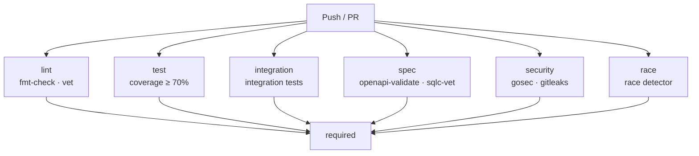

# CI Pipeline Hardening Design

**Date:** 2026-03-08
**Issue:** [#72 CI pipeline hardening](https://github.com/griffinskudder/updater/issues/72)

## Problem

The CI pipeline established in February 2026 covers the core quality gates but has three gaps:

1. **No caching.** The `ci` job uses `make` targets that run Go inside Docker containers. Docker named volumes (`updater-go-mod-cache`, `updater-go-build-cache`) do not persist between GitHub Actions runs, so Go modules and the build cache are re-downloaded on every CI run. This makes each run slower than necessary.

2. **No SQL schema validation.** The `make sqlc-vet` target validates SQL queries against schemas, but it has no CI counterpart. A schema change that breaks a query can reach `main` undetected.

3. **No CI reference documentation.** The existing design and implementation docs describe the original setup but do not document the current pipeline state, local equivalents, or branch protection guidance.

Additionally, the existing `ci` job runs all steps sequentially. Unrelated checks (formatting, coverage, OpenAPI validation) block each other unnecessarily.

## Goals

- Add Go module caching to reduce CI run time.
- Add `sqlc-vet` to catch SQL query/schema mismatches on every PR.
- Parallelize unrelated checks across separate jobs.
- Write a reference doc for the CI pipeline.

## Architecture Decision: Native Go in CI

### Options considered

**Option A (chosen): Native Go + targeted `make` calls.**
Use `actions/setup-go` (which automatically caches `$GOPATH/pkg/mod` and `~/.cache/go/build`) for Go commands, and call `make` targets only for non-Go Docker-based tools (Redocly, sqlc).

**Option B: Keep Docker-based `make` targets.**
Call `make fmt-check`, `make vet`, etc. directly. No caching because Docker named volumes are ephemeral on runners. Ensures exact Makefile/CI parity.

**Option C: Makefile-aware native mode.**
Modify the Makefile to detect `CI=true` and skip the Docker wrapper. Adds Makefile complexity.

### Decision

Option A. The core concern with native Go is Makefile divergence — if a flag changes in a `make` target, CI must also be updated. This is mitigated by two measures:

1. Each CI step carries a comment identifying the equivalent make target (e.g. `# Equivalent to: make vet`).
2. The CI commands are the exact underlying commands from the Makefile Docker wrappers — only the `docker run ... golang:1.25-alpine` prefix is removed. Flags, patterns, and thresholds are identical.

The `spec` job (`openapi-validate`, `sqlc-vet`) continues to call `make` targets directly because these use separate Docker images (Redocly, sqlc) for which native caching is not applicable. Docker is available on GitHub Actions ubuntu runners.

### Coverage scope

The `test` job mirrors `make cover` exactly: `-tags integration` is applied to both the `go list` package enumeration and the `go test` run, so coverage includes integration tests. The `integration` job runs the same integration tests independently to provide a separate pass/fail check in the PR status checks UI.

## Job Structure

The six parallel jobs feed into a `required` aggregator job (`if: always()`). Branch protection only needs to require `required`, rather than each individual job. The release workflow checks all CI status checks dynamically by commit SHA, so adding new jobs is automatically enforced without changing the release workflow.

## Makefile Sync Strategy

The Makefile remains the canonical local development interface. The CI workflow is the execution layer for the same checks in a cached, parallel environment.

Rules for keeping them in sync:

- Go commands in CI must mirror the Makefile's underlying commands exactly (same flags, same patterns).
- Non-Go tools (Redocly, sqlc, gosec, gitleaks) must use the same flags and thresholds as the Makefile targets.
- Each CI step must include a `# Equivalent to: make <target>` comment.
- When a Makefile target changes, the corresponding CI step must be updated in the same PR.

## Files to Create or Modify

| File | Change |
|------|--------|
| `.github/workflows/ci.yml` | Replace single `ci` job with six parallel jobs; add `actions/setup-go` caching; add `sqlc-vet` step |
| `docs/ci.md` | New reference page |
| `docs/plans/2026-03-08-ci-hardening-design.md` | This file |
| `docs/plans/2026-03-08-ci-hardening-implementation.md` | Implementation notes |
| `mkdocs.yml` | Add `ci.md` to nav; add hardening plan docs to Design Docs section |
