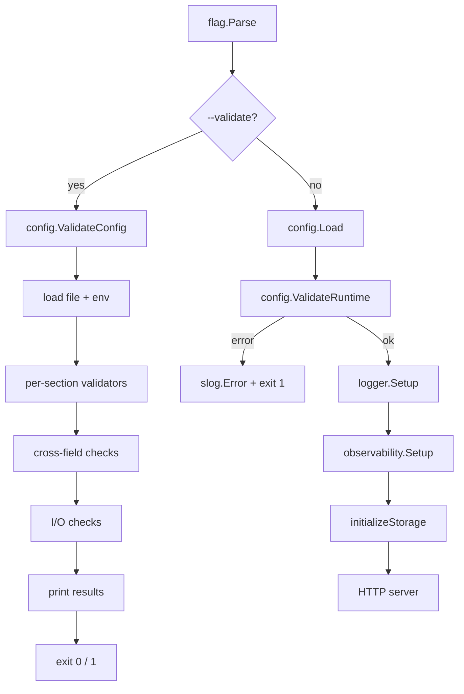

# Production Configuration Validation

Date: 2026-03-08
Issue: #73

## Overview

Add startup-time validation that catches misconfigurations early with clear, actionable error messages, and a `--validate` CLI flag for pre-flight config checks without starting the server.

## Problem

The existing `Config.Validate()` fails on the first sub-struct error, so operators must fix and restart repeatedly to see all problems. File-level checks (TLS cert validity, log directory writability) are not performed until the server actually starts, causing cryptic runtime failures rather than early, structured diagnostics.

## Design

Validation is split into two layers:



### Layer 1: Pure validation (`models.Config.Validate`)

All sub-struct validators (`ServerConfig`, `StorageConfig`, `SecurityConfig`, `LoggingConfig`, `MetricsConfig`, `ObservabilityConfig`) accumulate errors using `errors.Join` rather than returning on the first failure. `Config.Validate` collects errors from all sub-structs before returning, so every misconfiguration in every section is visible in a single error.

New checks added:

| Check | Location |
|-------|----------|
| Server port and metrics port must differ | `Config.Validate` (cross-field) |
| OTLP endpoint must be a valid `host:port` string | `ObservabilityConfig.Validate` |

### Layer 2: I/O validation (`config.ValidateRuntime`)

File-system checks that cannot be done in pure validation:

| Check | Condition |
|-------|-----------|
| TLS cert file readable and valid PEM | `server.tls_enabled: true` |
| TLS key file readable, cert/key pair valid | `server.tls_enabled: true` |
| Log directory exists and is writable | `logging.output: file` |

`ValidateRuntime` runs on every normal startup after `config.Load`, before any subsystem initialises.

### `--validate` flag

`--validate` loads config (file + environment) and runs all checks — including I/O — without starting the server, then exits.

```
$ updater --config config.yaml --validate
ok   config.server
ok   config.storage
ok   config.security
ok   config.logging
ok   config.metrics
ok   config.observability
ok   config.cross-field
FAIL runtime.tls: cannot read TLS cert file "/etc/tls/cert.pem": open /etc/tls/cert.pem: no such file or directory
ok   runtime.log-dir
```

`--validate-format json` produces machine-readable output for CI/CD pipelines:

```json
[
  {"name":"config.server","ok":true},
  {"name":"runtime.tls","ok":false,"message":"cannot read TLS cert file ..."}
]
```

Exit code 0 means all checks passed; exit code 1 means at least one check failed.

## Files Modified

| File | Change |
|------|--------|
| `internal/models/config.go` | All validators accumulate errors; new `net` import; cross-field port conflict and OTLP host:port checks |
| `internal/models/config_test.go` | Tests for accumulation, port conflict, OTLP endpoint format |
| `internal/config/config.go` | `CheckResult`, `ValidateConfig`, `ValidateRuntime`, `validateTLS`, `validateLogDir` |
| `internal/config/config_test.go` | Tests for `ValidateRuntime` and `ValidateConfig` including TLS cert generation helper |
| `cmd/updater/updater.go` | `--validate` and `--validate-format` flags; `printValidateResults`; `ValidateRuntime` call in startup |
