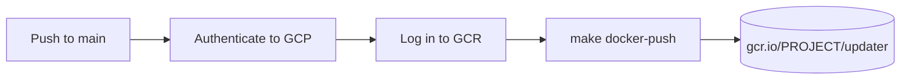

# Publishing

The `publish` CI workflow builds the Docker image and pushes it to [Google Container Registry (GCR)](https://cloud.google.com/container-registry) on every push to `main`.

## Workflow overview



The workflow runs on `ubuntu-latest` and produces two tags:

| Tag | Example |
|-----|---------|
| Git short SHA | `gcr.io/my-project/updater:abc1234` |
| `latest` | `gcr.io/my-project/updater:latest` |

## Authentication

The workflow uses [Workload Identity Federation (WIF)](https://cloud.google.com/iam/docs/workload-identity-federation) rather than a long-lived service account key. This means no credentials are stored as secrets — the GitHub OIDC token is exchanged for a short-lived GCP access token at runtime.

Required secrets:

| Secret | Description |
|--------|-------------|
| `GCP_WORKLOAD_IDENTITY_PROVIDER` | Full WIF provider resource name (see below) |
| `GCP_SERVICE_ACCOUNT` | Service account email used to impersonate |
| `GCP_PROJECT_ID` | GCP project that hosts the GCR registry |

## GCP setup

The one-time GCP setup creates a Workload Identity Pool wired to the GitHub OIDC provider and grants the service account permission to push to GCR.

### 1. Enable required APIs

```bash
gcloud services enable iamcredentials.googleapis.com \
    containerregistry.googleapis.com \
    --project=PROJECT_ID
```

### 2. Create a Workload Identity Pool

```bash
gcloud iam workload-identity-pools create github \
    --project=PROJECT_ID \
    --location=global \
    --display-name="GitHub Actions"
```

### 3. Create a provider for GitHub OIDC

```bash
gcloud iam workload-identity-pools providers create-oidc github-actions \
    --project=PROJECT_ID \
    --location=global \
    --workload-identity-pool=github \
    --display-name="GitHub Actions OIDC" \
    --issuer-uri="https://token.actions.githubusercontent.com" \
    --attribute-mapping="google.subject=assertion.sub,attribute.repository=assertion.repository" \
    --attribute-condition="assertion.repository=='griffinskudder/updater'"
```

The `--attribute-condition` restricts access to this repository only.

### 4. Create a service account

```bash
gcloud iam service-accounts create gcr-publisher \
    --project=PROJECT_ID \
    --display-name="GCR Publisher"
```

### 5. Grant the service account permission to push to GCR

GCR stores images in a Cloud Storage bucket named `artifacts.PROJECT_ID.appspot.com`. The service account needs `roles/storage.admin` on that bucket.

```bash
gsutil iam ch \
    serviceAccount:gcr-publisher@PROJECT_ID.iam.gserviceaccount.com:roles/storage.admin \
    gs://artifacts.PROJECT_ID.appspot.com
```

### 6. Allow GitHub to impersonate the service account

Replace `PROJECT_NUMBER` with your numeric project number (visible in the GCP console).

```bash
gcloud iam service-accounts add-iam-policy-binding \
    gcr-publisher@PROJECT_ID.iam.gserviceaccount.com \
    --project=PROJECT_ID \
    --role=roles/iam.workloadIdentityUser \
    --member="principalSet://iam.googleapis.com/projects/PROJECT_NUMBER/locations/global/workloadIdentityPools/github/attribute.repository/griffinskudder/updater"
```

### 7. Retrieve the provider resource name

```bash
gcloud iam workload-identity-pools providers describe github-actions \
    --project=PROJECT_ID \
    --location=global \
    --workload-identity-pool=github \
    --format="value(name)"
```

Use the output as the `GCP_WORKLOAD_IDENTITY_PROVIDER` secret value.

## GitHub secrets

Set the three secrets in the repository settings under **Settings > Secrets and variables > Actions**:

```
GCP_WORKLOAD_IDENTITY_PROVIDER = projects/PROJECT_NUMBER/locations/global/workloadIdentityPools/github/providers/github-actions
GCP_SERVICE_ACCOUNT            = gcr-publisher@PROJECT_ID.iam.gserviceaccount.com
GCP_PROJECT_ID                 = PROJECT_ID
```

## Image naming

The `make docker-push` target delegates to `scripts/docker-build.sh --push`, which reads the `DOCKER_REGISTRY` environment variable. The workflow sets:

```
DOCKER_REGISTRY=gcr.io/GCP_PROJECT_ID
```

Resulting image names:

```
gcr.io/PROJECT_ID/updater:abc1234
gcr.io/PROJECT_ID/updater:latest
```

The version tag is the short Git commit SHA produced by `git rev-parse --short HEAD`.
