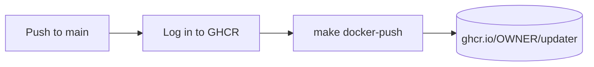

# Publishing

The `publish` CI workflow builds the Docker image and pushes it to the [GitHub Container Registry (GHCR)](https://docs.github.com/en/packages/working-with-a-github-packages-registry/working-with-the-container-registry) on every push to `main`.

## Workflow overview



The workflow uses the built-in `GITHUB_TOKEN` for authentication — no secrets or GCP setup required.

The workflow runs on `ubuntu-latest` and produces two tags:

| Tag | Example |
|-----|---------|
| Git short SHA | `ghcr.io/griffinskudder/updater:abc1234` |
| `latest` | `ghcr.io/griffinskudder/updater:latest` |

## Permissions

The workflow requests the minimum required permissions:

| Permission | Reason |
|------------|--------|
| `contents: read` | Checkout the repository |
| `packages: write` | Push images to GHCR |

No additional secrets or service accounts are needed.

## Image visibility

By default, packages pushed by a workflow inherit the visibility of the repository (public for public repos, private for private repos). Visibility can be changed in the repository's **Packages** settings on GitHub.

## Image naming

The `make docker-push` target delegates to `scripts/docker-build.sh --push`, which reads the `DOCKER_REGISTRY` environment variable. The workflow sets:

```
DOCKER_REGISTRY=ghcr.io/OWNER
```

Resulting image names:

```
ghcr.io/griffinskudder/updater:abc1234
ghcr.io/griffinskudder/updater:latest
```

The version tag is the short Git commit SHA produced by `git rev-parse --short HEAD`.
