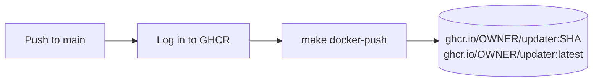
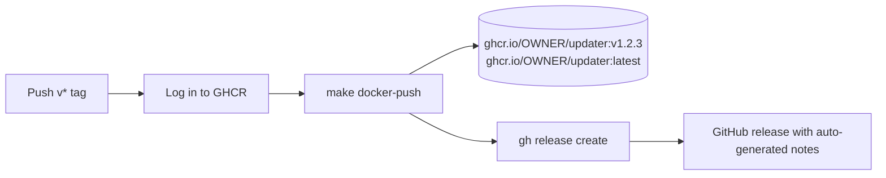

# Publishing

The `publish` CI workflow builds the Docker image and pushes it to the [GitHub Container Registry (GHCR)](https://docs.github.com/en/packages/working-with-a-github-packages-registry/working-with-the-container-registry) on every push to `main` and on every `v*` tag. Tagged pushes also create a GitHub release.

## Triggers

| Event | Job | Result |
|-------|-----|--------|
| Push to `main` | `publish` | Image tagged with short SHA and `latest` |
| Push of `v*` tag | `release` | Image tagged with version and `latest`, GitHub release created |

## Workflows

### Push to main



### Tag push



Both jobs use the built-in `GITHUB_TOKEN` for authentication — no secrets or external service accounts are needed.

## Permissions

| Job | Permission | Reason |
|-----|------------|--------|
| `publish` | `contents: read` | Checkout the repository |
| `publish` | `packages: write` | Push images to GHCR |
| `release` | `contents: write` | Create GitHub releases |
| `release` | `packages: write` | Push images to GHCR |

## Image naming

The `make docker-push` target delegates to `scripts/docker-build.sh --push`, which reads `DOCKER_REGISTRY` and `VERSION` from the environment.

### Push to main

`VERSION` is not set, so the script defaults to `git rev-parse --short HEAD`:

```
ghcr.io/griffinskudder/updater:abc1234
ghcr.io/griffinskudder/updater:latest
```

### Tag push

`VERSION` is set to `github.ref_name` (e.g. `v1.2.3`):

```
ghcr.io/griffinskudder/updater:v1.2.3
ghcr.io/griffinskudder/updater:latest
```

## Creating a release

Push a tag that starts with `v` to trigger the `release` job:

```bash
git tag v1.2.3
git push origin v1.2.3
```

The job will:

1. Build and push the image tagged `v1.2.3` and `latest`.
2. Create a GitHub release named `v1.2.3` with auto-generated notes summarising the pull requests merged since the previous tag.

## Image visibility

By default, packages pushed by a workflow inherit the visibility of the repository. Visibility can be changed in **Settings > Packages** on GitHub.
