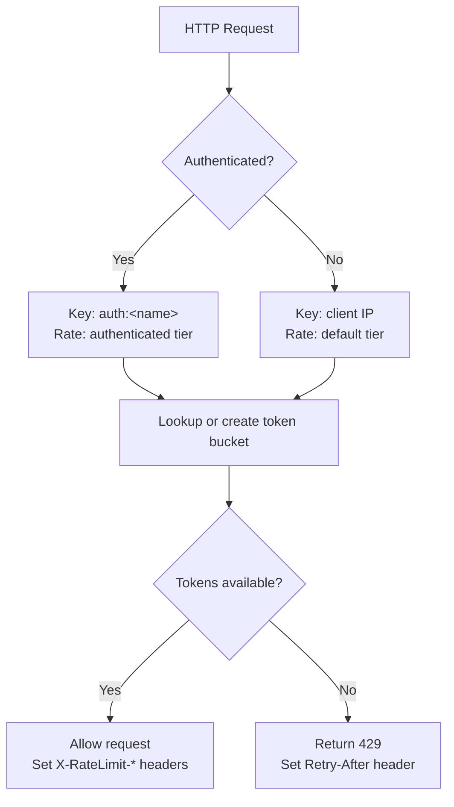

# Rate Limiting

The updater service includes built-in rate limiting to protect against abuse and ensure fair resource allocation. The implementation uses the **token bucket algorithm** backed by `golang.org/x/time/rate`, with separate rate limit tiers for anonymous and authenticated clients.

## How It Works

The token bucket algorithm maintains a bucket of tokens for each client. Each request consumes one token. Tokens are replenished at a steady rate (determined by `requests_per_minute`). If the bucket is empty, the request is denied with a `429 Too Many Requests` response.

The `burst_size` controls the maximum number of tokens the bucket can hold, allowing short bursts of traffic above the steady-state rate.



## Two-Tier Rate Limits

The rate limiter supports two tiers based on authentication status:

| Tier | Key | Default Rate | Default Burst |
|------|-----|-------------|---------------|
| Anonymous | Client IP address | 60 req/min | 10 |
| Authenticated | API key name | 120 req/min | 20 |

Anonymous requests are keyed by the client's IP address, extracted from `X-Forwarded-For`, `X-Real-IP`, or `RemoteAddr` (in that priority order).

Authenticated requests are keyed by the API key's configured name (prefixed with `auth:`), giving each API key its own independent rate limit bucket at the higher tier.

## Configuration

Rate limiting is configured under the `security.rate_limit` section:

```yaml
security:
  rate_limit:
    enabled: true
    requests_per_minute: 60
    burst_size: 10
    authenticated_requests_per_minute: 120
    authenticated_burst_size: 20
    cleanup_interval: 5m
```

### Configuration Reference

| Field | Type | Default | Description |
|-------|------|---------|-------------|
| `enabled` | bool | `true` | Enable or disable rate limiting |
| `requests_per_minute` | int | `60` | Token replenishment rate for anonymous clients |
| `burst_size` | int | `10` | Maximum burst size for anonymous clients |
| `authenticated_requests_per_minute` | int | `120` | Token replenishment rate for authenticated clients |
| `authenticated_burst_size` | int | `20` | Maximum burst size for authenticated clients |
| `cleanup_interval` | duration | `5m` | How often to evict stale client entries |

If `authenticated_requests_per_minute` or `authenticated_burst_size` is set to `0`, it defaults to 2x the anonymous value.

## Response Headers

Every response includes rate limit information headers:

| Header | Description | Example |
|--------|-------------|---------|
| `X-RateLimit-Limit` | Maximum requests per minute for this client | `60` |
| `X-RateLimit-Remaining` | Approximate tokens remaining in the bucket | `42` |
| `X-RateLimit-Reset` | Unix timestamp when the bucket will be full | `1739664000` |

When a request is denied (429), an additional header is included:

| Header | Description | Example |
|--------|-------------|---------|
| `Retry-After` | Seconds until a token becomes available | `3` |

The 429 response body is a JSON error:

```json
{
  "error": "error",
  "message": "Rate limit exceeded",
  "code": "RATE_LIMIT_EXCEEDED",
  "timestamp": "2026-02-15T12:00:00Z"
}
```

## Architecture

The rate limiting implementation lives in `internal/ratelimit/` with a clean separation of concerns:

```
internal/ratelimit/
  limiter.go      - Limiter interface and Info type
  memory.go       - MemoryLimiter (token bucket + cleanup)
  middleware.go   - HTTP middleware
```

### Limiter Interface

The `Limiter` interface allows swapping implementations (e.g., Redis-backed for multi-instance deployments):

```go
type Limiter interface {
    Allow(key string) (allowed bool, info Info)
    Close()
}
```

### Memory Management

The `MemoryLimiter` starts a background goroutine that periodically evicts entries that have not been accessed within 2x the `cleanup_interval`. This prevents unbounded memory growth from unique client IPs.

### Middleware Integration

The rate limiter is injected into the router as a `RouteOption` during server startup:

```go
anonLimiter := ratelimit.NewMemoryLimiter(rpm, burst, cleanupInterval)
authLimiter := ratelimit.NewMemoryLimiter(authRPM, authBurst, cleanupInterval)
defer anonLimiter.Close()
defer authLimiter.Close()

router := api.SetupRoutes(handlers, cfg,
    api.WithRateLimiter(ratelimit.Middleware(anonLimiter, authLimiter)),
)
```

## Example Configuration

### Development (Permissive)

```yaml
security:
  rate_limit:
    enabled: true
    requests_per_minute: 600
    burst_size: 100
    authenticated_requests_per_minute: 1200
    authenticated_burst_size: 200
    cleanup_interval: 10m
```

### Production (Restrictive)

```yaml
security:
  rate_limit:
    enabled: true
    requests_per_minute: 30
    burst_size: 5
    authenticated_requests_per_minute: 120
    authenticated_burst_size: 20
    cleanup_interval: 5m
```

### Disabled

```yaml
security:
  rate_limit:
    enabled: false
```
