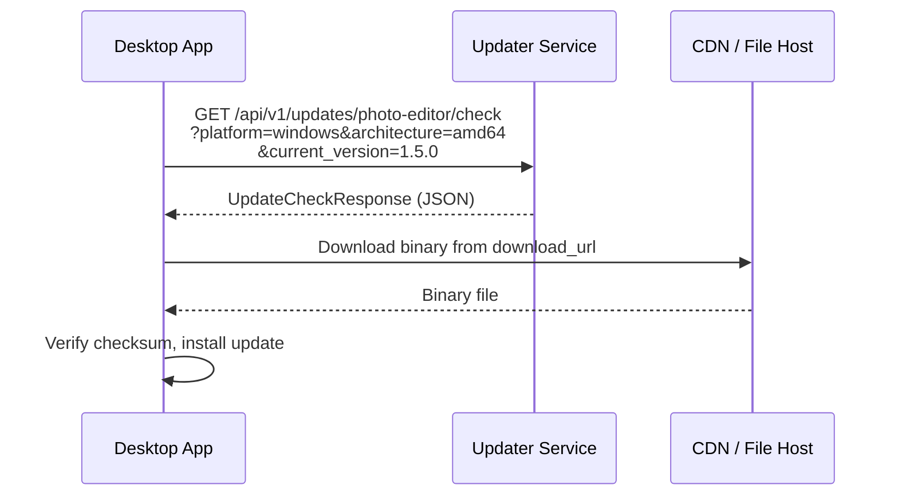
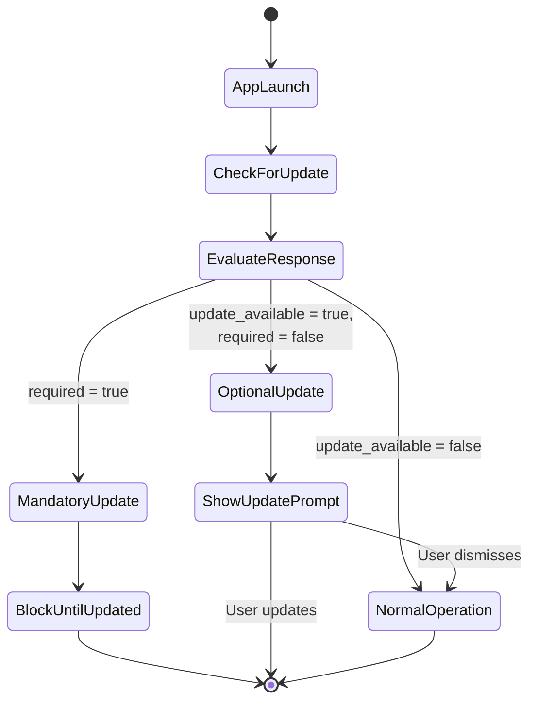
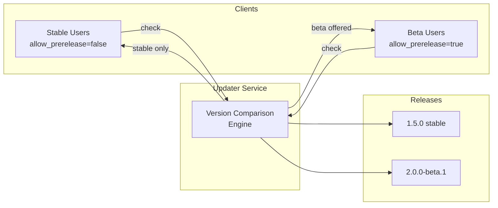
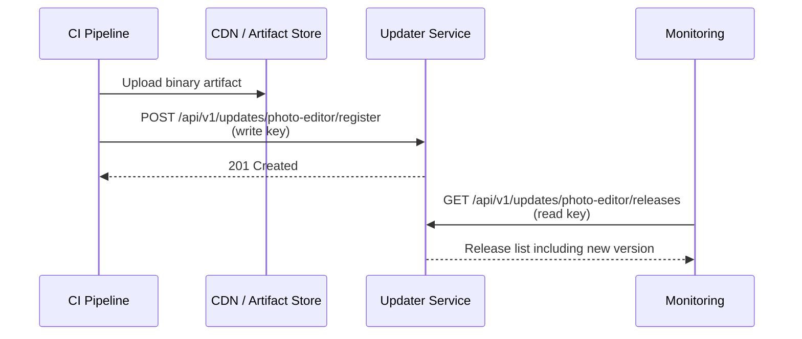
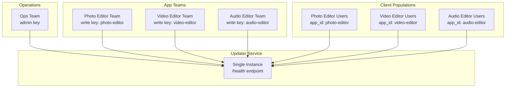

# Use Cases

The updater service solves a common problem: delivering software updates reliably to desktop applications across platforms. This page walks through five realistic scenarios that demonstrate how the service fits into real-world workflows. Each scenario identifies a pain point, shows the relevant API interactions, and highlights the features that address the problem. Whether you are evaluating the service for a single application or planning a multi-app deployment, these examples provide a concrete starting point.

## Delivering Updates to a Cross-Platform Desktop Application

### The Problem

Teams maintaining desktop applications for Windows, macOS, and Linux face a recurring challenge: each platform needs version-comparison logic, download metadata, and integrity verification. Without a central service, teams often maintain hand-edited JSON files or per-platform update scripts that drift out of sync.

### How the Updater Service Solves It

The service accepts platform and architecture as query parameters, performs server-side version comparison, and returns structured metadata including download URL, checksum, and file size. The application downloads the binary directly from existing CDN infrastructure -- the updater service handles routing, not file hosting.



### Example: Checking for Updates Across Platforms

=== "Windows (amd64)"

    ```bash
    curl "https://updates.example.com/api/v1/updates/photo-editor/check\
    ?platform=windows&architecture=amd64&current_version=1.5.0"
    ```

=== "macOS (arm64)"

    ```bash
    curl "https://updates.example.com/api/v1/updates/photo-editor/check\
    ?platform=darwin&architecture=arm64&current_version=1.5.0"
    ```

=== "Linux (amd64)"

    ```bash
    curl "https://updates.example.com/api/v1/updates/photo-editor/check\
    ?platform=linux&architecture=amd64&current_version=1.5.0"
    ```

### Example Response

```json
{
  "update_available": true,
  "latest_version": "2.0.0",
  "current_version": "1.5.0",
  "download_url": "https://cdn.example.com/photo-editor/2.0.0/photo-editor-windows-amd64.exe",
  "checksum": "a1b2c3d4e5f6a1b2c3d4e5f6a1b2c3d4e5f6a1b2c3d4e5f6a1b2c3d4e5f6a1b2",
  "checksum_type": "sha256",
  "file_size": 52428800,
  "release_notes": "New RAW processing engine with 3x faster export times.",
  "release_date": "2026-02-10T14:30:00Z",
  "required": false,
  "minimum_version": ""
}
```

### Key Points

- **Platform routing is server-side.** The client sends its platform and architecture; the service determines which release to offer. No client-side branching logic needed.
- **Checksum and file size are delivered with every response.** Clients can verify integrity before installation and show accurate download progress.
- **Download files stay on existing infrastructure.** The service stores metadata and `download_url` references; it does not proxy or host binaries.

---

## Enforcing a Critical Security Patch

### The Problem

A vulnerability is discovered in a shipped version of the application. Users on affected versions must be updated immediately -- they should not be able to dismiss or skip the update.

### How the Updater Service Solves It

The `required` field is a first-class attribute on every release. When a release is registered with `required: true`, the check endpoint returns that flag to affected clients. The `minimum_version` field scopes which versions are affected: clients already running a version at or above the minimum receive no update prompt.



### Example: Registering a Required Security Patch

```bash
curl -X POST "https://updates.example.com/api/v1/updates/photo-editor/register" \
  -H "Authorization: Bearer ${RELEASE_API_KEY}" \
  -H "Content-Type: application/json" \
  -d '{
    "application_id": "photo-editor",
    "version": "1.5.1",
    "platform": "windows",
    "architecture": "amd64",
    "download_url": "https://cdn.example.com/photo-editor/1.5.1/photo-editor-windows-amd64.exe",
    "checksum": "b2c3d4e5f6a1b2c3d4e5f6a1b2c3d4e5f6a1b2c3d4e5f6a1b2c3d4e5f6a1b2c3",
    "checksum_type": "sha256",
    "file_size": 52430000,
    "release_notes": "Security fix for CVE-2026-12345. All users on 1.x must update.",
    "required": true,
    "minimum_version": "1.0.0"
  }'
```

### Example: Affected Client Receives the Patch

A client running version 1.2.0 (below the patched version) receives the required update:

```bash
curl "https://updates.example.com/api/v1/updates/photo-editor/check\
?platform=windows&architecture=amd64&current_version=1.2.0"
```

```json
{
  "update_available": true,
  "latest_version": "1.5.1",
  "current_version": "1.2.0",
  "download_url": "https://cdn.example.com/photo-editor/1.5.1/photo-editor-windows-amd64.exe",
  "checksum": "b2c3d4e5f6a1b2c3d4e5f6a1b2c3d4e5f6a1b2c3d4e5f6a1b2c3d4e5f6a1b2c3",
  "checksum_type": "sha256",
  "file_size": 52430000,
  "release_notes": "Security fix for CVE-2026-12345. All users on 1.x must update.",
  "release_date": "2026-02-12T09:00:00Z",
  "required": true,
  "minimum_version": "1.0.0"
}
```

### Example: Current Client Sees No Update

A client already running version 2.0.0 is unaffected:

```bash
curl "https://updates.example.com/api/v1/updates/photo-editor/check\
?platform=windows&architecture=amd64&current_version=2.0.0"
```

```json
{
  "update_available": false,
  "current_version": "2.0.0",
  "required": false
}
```

### Key Points

- **`required` is a first-class field on the release.** It is returned directly in the check response so clients can enforce mandatory update UI without extra logic.
- **`minimum_version` scopes which versions are affected.** Only clients running versions below the minimum receive the required update.
- **The check endpoint is public.** No API key is needed to check for updates, ensuring every client can reach the security patch. Write operations (registering the release) require authentication.
- **Audit logging captures the registration.** Security-sensitive operations are logged with `"event": "security_audit"` for compliance and forensic purposes.

---

## Progressive Rollout with Pre-Release Channels

### The Problem

A team wants beta testers to receive version 2.0.0-beta.1 while stable-channel users remain on version 1.5.0. Running a separate server or maintaining a parallel data store for the beta channel adds unwanted operational complexity.

### How the Updater Service Solves It

Semantic versioning pre-release labels (e.g., `-beta.1`, `-rc.1`) are the gating mechanism. The `allow_prerelease` query parameter controls whether a client sees pre-release versions. Both populations query the same service and the same data store.



### Example: Registering a Beta Release

```bash
curl -X POST "https://updates.example.com/api/v1/updates/photo-editor/register" \
  -H "Authorization: Bearer ${RELEASE_API_KEY}" \
  -H "Content-Type: application/json" \
  -d '{
    "application_id": "photo-editor",
    "version": "2.0.0-beta.1",
    "platform": "windows",
    "architecture": "amd64",
    "download_url": "https://cdn.example.com/photo-editor/2.0.0-beta.1/photo-editor-windows-amd64.exe",
    "checksum": "c3d4e5f6a1b2c3d4e5f6a1b2c3d4e5f6a1b2c3d4e5f6a1b2c3d4e5f6a1b2c3d4",
    "checksum_type": "sha256",
    "file_size": 53500000,
    "release_notes": "Beta: New collaboration features. Please report issues."
  }'
```

### Example: Stable User Sees No Update

```bash
curl "https://updates.example.com/api/v1/updates/photo-editor/check\
?platform=windows&architecture=amd64&current_version=1.5.0&allow_prerelease=false"
```

```json
{
  "update_available": false,
  "current_version": "1.5.0",
  "required": false
}
```

### Example: Beta User Receives the Beta

```bash
curl "https://updates.example.com/api/v1/updates/photo-editor/check\
?platform=windows&architecture=amd64&current_version=1.5.0&allow_prerelease=true"
```

```json
{
  "update_available": true,
  "latest_version": "2.0.0-beta.1",
  "current_version": "1.5.0",
  "download_url": "https://cdn.example.com/photo-editor/2.0.0-beta.1/photo-editor-windows-amd64.exe",
  "checksum": "c3d4e5f6a1b2c3d4e5f6a1b2c3d4e5f6a1b2c3d4e5f6a1b2c3d4e5f6a1b2c3d4",
  "checksum_type": "sha256",
  "file_size": 53500000,
  "release_notes": "Beta: New collaboration features. Please report issues.",
  "release_date": "2026-02-14T10:00:00Z",
  "required": false
}
```

### Key Points

- **The semver pre-release label is the gating mechanism.** No separate channel configuration or data set is needed. The version string itself carries the channel semantics.
- **No separate servers or data stores.** Both stable and beta users query the same service instance and the same storage backend.
- **When stable 2.0.0 ships, both populations converge automatically.** Once 2.0.0 (without a pre-release label) is registered, it becomes the latest stable version for all users.

---

## Automating Release Publishing from CI/CD

### The Problem

After a successful build, someone must manually update a hosted metadata file or run a script to publish the new release. This manual step is error-prone, delays releases, and does not fit naturally into automated pipelines. The CI system needs a scoped credential that can register releases but cannot manage API keys or application configuration.

### How the Updater Service Solves It

The write permission allows registering releases and listing them but does not grant administrative access. A dedicated API key scoped to write permission can be stored as a CI secret. A separate read-only key can be used by monitoring or dashboards to verify the release was published.



### Example: Security Configuration with Scoped Keys

```yaml
security:
  enable_auth: true
  api_keys:
    - key: "${CI_RELEASE_KEY}"
      name: "CI Release Publisher"
      permissions: ["read", "write"]
      enabled: true

    - key: "${MONITOR_KEY}"
      name: "Release Monitor"
      permissions: ["read"]
      enabled: true
```

### Example: CI Pipeline Registers a Release

```bash
curl -X POST "https://updates.example.com/api/v1/updates/photo-editor/register" \
  -H "Authorization: Bearer ${CI_RELEASE_KEY}" \
  -H "Content-Type: application/json" \
  -d '{
    "application_id": "photo-editor",
    "version": "2.1.0",
    "platform": "windows",
    "architecture": "amd64",
    "download_url": "https://cdn.example.com/photo-editor/2.1.0/photo-editor-windows-amd64.exe",
    "checksum": "d4e5f6a1b2c3d4e5f6a1b2c3d4e5f6a1b2c3d4e5f6a1b2c3d4e5f6a1b2c3d4e5",
    "checksum_type": "sha256",
    "file_size": 54000000,
    "release_notes": "Performance improvements and bug fixes."
  }'
```

### Example: Monitoring Confirms the Release

```bash
curl "https://updates.example.com/api/v1/updates/photo-editor/releases" \
  -H "Authorization: Bearer ${MONITOR_KEY}"
```

```json
{
  "releases": [
    {
      "id": "rel_abc123",
      "version": "2.1.0",
      "platform": "windows",
      "architecture": "amd64",
      "download_url": "https://cdn.example.com/photo-editor/2.1.0/photo-editor-windows-amd64.exe",
      "checksum": "d4e5f6a1b2c3d4e5f6a1b2c3d4e5f6a1b2c3d4e5f6a1b2c3d4e5f6a1b2c3d4e5",
      "checksum_type": "sha256",
      "file_size": 54000000,
      "release_notes": "Performance improvements and bug fixes.",
      "release_date": "2026-02-15T08:00:00Z",
      "required": false
    }
  ],
  "total_count": 1,
  "page": 1,
  "page_size": 50,
  "has_more": false
}
```

### Key Points

- **Write permission cannot manage keys or application configuration.** The CI key can register and list releases but cannot modify security settings or create applications. This follows the principle of least privilege.
- **Each platform/architecture combination is a separate register call.** This fits naturally into CI matrix builds where each job publishes its own artifact.
- **A read-only key enables monitoring and auditing.** Dashboards and alerting systems can verify releases without write access.

---

## Operating a Shared Update Service for Multiple Applications

### The Problem

An organization maintains several desktop applications. Running separate update infrastructure per application (separate servers, separate configuration, separate monitoring) creates operational overhead that scales linearly with the number of applications.

### How the Updater Service Solves It

The `app_id` path segment in every URL provides namespace isolation. A single service instance serves all applications. Scoped API keys restrict each team to managing only their own releases while an admin key handles cross-cutting operations.



### Example: Security Configuration with Per-Team Keys

```yaml
security:
  enable_auth: true
  api_keys:
    - key: "${OPS_ADMIN_KEY}"
      name: "Operations Admin"
      permissions: ["admin"]
      enabled: true

    - key: "${PHOTO_EDITOR_KEY}"
      name: "Photo Editor CI"
      permissions: ["read", "write"]
      enabled: true

    - key: "${VIDEO_EDITOR_KEY}"
      name: "Video Editor CI"
      permissions: ["read", "write"]
      enabled: true

    - key: "${AUDIO_EDITOR_KEY}"
      name: "Audio Editor CI"
      permissions: ["read", "write"]
      enabled: true
```

### Example: Each Application Has Its Own Namespace

=== "Photo Editor"

    ```bash
    curl "https://updates.example.com/api/v1/updates/photo-editor/check\
    ?platform=windows&architecture=amd64&current_version=2.0.0"
    ```

=== "Video Editor"

    ```bash
    curl "https://updates.example.com/api/v1/updates/video-editor/check\
    ?platform=darwin&architecture=arm64&current_version=3.1.0"
    ```

=== "Audio Editor"

    ```bash
    curl "https://updates.example.com/api/v1/updates/audio-editor/check\
    ?platform=linux&architecture=amd64&current_version=1.0.0"
    ```

### Example: PostgreSQL Storage for Production Scale

```yaml
storage:
  provider: "postgres"
  postgres:
    connection_string: "${DATABASE_URL}"
    max_open_conns: 25
    max_idle_conns: 5
    conn_max_lifetime: "5m"
```

### Key Points

- **`app_id` in the URL path provides namespace isolation.** Each application's releases are independent. A single service instance serves any number of applications without configuration changes per application.
- **Scoped write keys restrict teams to their own releases.** Each team receives a key with write permission. The admin key is reserved for the operations team for cross-cutting management.
- **PostgreSQL is recommended for multi-app production deployments.** It provides concurrent access, connection pooling, and scales well with multiple applications and high query volumes.
- **A single `/health` endpoint covers the entire service.** Operations teams monitor one health check per deployment rather than one per application.

---

## Summary

| Scenario | Key Feature | Recommended Storage | Auth Required |
|----------|-------------|---------------------|---------------|
| Cross-platform desktop app | Platform/arch routing | JSON or SQLite | No (check endpoint is public) |
| Critical security patch | `required` flag | Any | Write (to register the release) |
| Pre-release channels | Semver pre-release filtering | Any | Write (to register the release) |
| CI/CD integration | Scoped write API key | SQLite or PostgreSQL | Write (to register the release) |
| Multi-app shared service | `app_id` namespacing | PostgreSQL | Admin + scoped write |
